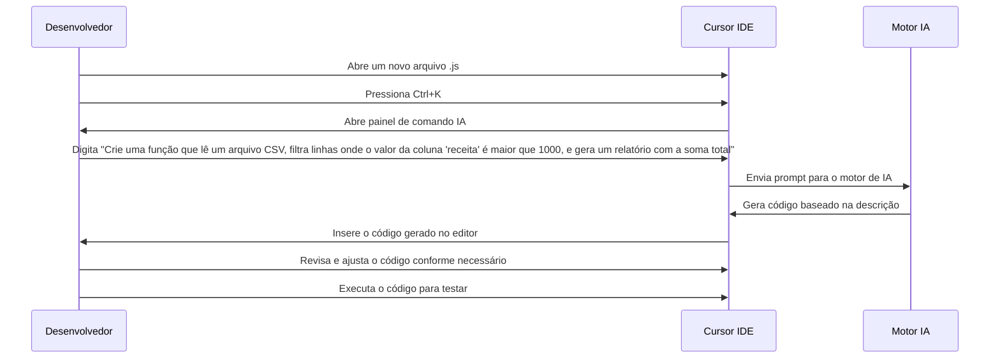

# 🚀 Caso de Uso 1: Geração de Código a partir de Descrições em Linguagem Natural

## 📋 Descrição

Um dos recursos mais poderosos do Cursor IDE é sua capacidade de gerar código funcional a partir de descrições em linguagem natural. Este caso de uso demonstra como desenvolvedores podem economizar tempo transformando ideias descritas em texto simples em código pronto para uso.

## 🎯 Cenário

Um desenvolvedor precisa criar uma função JavaScript que analisa um arquivo CSV, processa os dados e gera um relatório. Em vez de escrever o código do zero, o desenvolvedor pode simplesmente descrever o que precisa, e o Cursor IDE gera o código automaticamente.

## 🔄 Fluxo de Trabalho



## 💻 Exemplo de Implementação

Descrição fornecida pelo desenvolvedor:
```
Crie uma função que lê um arquivo CSV, filtra linhas onde o valor da coluna 'receita' é maior que 1000, e gera um relatório com a soma total
```

Código gerado pelo Cursor IDE:
```javascript
const fs = require('fs');
const csv = require('csv-parser');

/**
 * Processa um arquivo CSV e gera um relatório com base nos valores de receita.
 * @param {string} filePath - Caminho para o arquivo CSV
 * @returns {Promise<Object>} - Objeto contendo o relatório com a soma total
 */
function processarDadosCSV(filePath) {
  return new Promise((resolve, reject) => {
    const results = [];
    
    fs.createReadStream(filePath)
      .pipe(csv())
      .on('data', (data) => {
        // Converte a coluna 'receita' para número
        const receita = parseFloat(data.receita);
        
        // Filtra apenas registros com receita > 1000
        if (receita > 1000) {
          results.push({ ...data, receita });
        }
      })
      .on('end', () => {
        // Calcula a soma total das receitas
        const somaTotal = results.reduce((total, item) => total + item.receita, 0);
        
        // Gera o relatório
        const relatorio = {
          totalRegistros: results.length,
          somaTotal: somaTotal,
          media: somaTotal / results.length,
          registrosFiltrados: results
        };
        
        resolve(relatorio);
      })
      .on('error', (error) => {
        reject(error);
      });
  });
}

// Exemplo de uso da função
async function main() {
  try {
    const relatorio = await processarDadosCSV('./dados_vendas.csv');
    console.log('Relatório gerado:');
    console.log(`Total de registros: ${relatorio.totalRegistros}`);
    console.log(`Soma total: ${relatorio.somaTotal.toFixed(2)}`);
    console.log(`Média: ${relatorio.media.toFixed(2)}`);
  } catch (error) {
    console.error('Erro ao processar o arquivo:', error);
  }
}

main();
```

## 💡 Dicas

1. **Seja específico:** Quanto mais detalhada for sua descrição, melhor será o código gerado.
2. **Itere rapidamente:** Use o Cursor para gerar um código inicial e depois refine com comandos adicionais.
3. **Combine com edição manual:** Após gerar o código, você pode editar manualmente para ajustar detalhes específicos.
4. **Aprenda com o código gerado:** Observe as práticas e padrões que o Cursor implementa para aprimorar seu próprio estilo de codificação.

## 🔗 Recursos Adicionais

- [Documentação do Cursor IDE](https://cursor.sh/docs)
- [Tutoriais sobre comandos de geração de código](https://cursor.sh/tutorials)
- [Melhores práticas para prompts eficientes](https://cursor.sh/best-practices)


