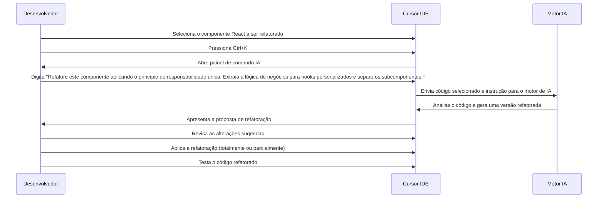

# 🔄 Caso de Uso 2: Refatoração Inteligente de Código

## 📋 Descrição

A refatoração de código é uma prática essencial para manter a qualidade e a sustentabilidade do software. O Cursor IDE oferece recursos avançados de refatoração assistida por IA, permitindo que desenvolvedores melhorem a estrutura de código existente com facilidade, mantendo a funcionalidade original.

## 🎯 Cenário

Um desenvolvedor está trabalhando em um projeto legado e precisa refatorar um componente React que cresceu demasiadamente, violando o princípio de responsabilidade única. O código está funcional, mas difícil de manter e estender.

## 🔄 Fluxo de Trabalho



## 💻 Exemplo de Implementação

### Código Original:

```jsx
import React, { useState, useEffect } from 'react';
import axios from 'axios';

function UserDashboard() {
  const [users, setUsers] = useState([]);
  const [loading, setLoading] = useState(true);
  const [error, setError] = useState(null);
  const [selectedUser, setSelectedUser] = useState(null);
  const [userPosts, setUserPosts] = useState([]);
  const [filterText, setFilterText] = useState('');
  const [sortOrder, setSortOrder] = useState('asc');

  // Fetch users
  useEffect(() => {
    setLoading(true);
    axios.get('https://api.example.com/users')
      .then(response => {
        setUsers(response.data);
        setLoading(false);
      })
      .catch(err => {
        setError('Failed to fetch users');
        setLoading(false);
      });
  }, []);

  // Fetch user posts when a user is selected
  useEffect(() => {
    if (selectedUser) {
      setLoading(true);
      axios.get(`https://api.example.com/users/${selectedUser.id}/posts`)
        .then(response => {
          setUserPosts(response.data);
          setLoading(false);
        })
        .catch(err => {
          setError('Failed to fetch user posts');
          setLoading(false);
        });
    }
  }, [selectedUser]);

  // Handle user selection
  const handleUserSelect = (user) => {
    setSelectedUser(user);
  };

  // Filter users based on filter text
  const filteredUsers = users.filter(user => 
    user.name.toLowerCase().includes(filterText.toLowerCase())
  );

  // Sort users by name
  const sortedUsers = [...filteredUsers].sort((a, b) => {
    if (sortOrder === 'asc') {
      return a.name.localeCompare(b.name);
    } else {
      return b.name.localeCompare(a.name);
    }
  });

  // Toggle sort order
  const toggleSortOrder = () => {
    setSortOrder(sortOrder === 'asc' ? 'desc' : 'asc');
  };

  return (
    <div className="dashboard">
      <div className="sidebar">
        <h2>Users</h2>
        <input 
          type="text" 
          placeholder="Filter users..." 
          value={filterText}
          onChange={(e) => setFilterText(e.target.value)}
        />
        <button onClick={toggleSortOrder}>
          Sort {sortOrder === 'asc' ? '↑' : '↓'}
        </button>
        {loading && <p>Loading...</p>}
        {error && <p className="error">{error}</p>}
        <ul className="user-list">
          {sortedUsers.map(user => (
            <li 
              key={user.id} 
              className={selectedUser && selectedUser.id === user.id ? 'selected' : ''}
              onClick={() => handleUserSelect(user)}
            >
              {user.name}
            </li>
          ))}
        </ul>
      </div>
      <div className="main-content">
        {selectedUser ? (
          <div>
            <h1>{selectedUser.name}'s Posts</h1>
            {loading ? (
              <p>Loading posts...</p>
            ) : (
              <div className="posts">
                {userPosts.length > 0 ? (
                  userPosts.map(post => (
                    <div key={post.id} className="post">
                      <h3>{post.title}</h3>
                      <p>{post.body}</p>
                    </div>
                  ))
                ) : (
                  <p>No posts found for this user.</p>
                )}
              </div>
            )}
          </div>
        ) : (
          <p>Select a user to view their posts.</p>
        )}
      </div>
    </div>
  );
}

export default UserDashboard;
```

### Código Refatorado pelo Cursor IDE:

```jsx
import React, { useState } from 'react';
import useUsers from './hooks/useUsers';
import useUserPosts from './hooks/useUserPosts';
import UserList from './components/UserList';
import PostList from './components/PostList';
import './UserDashboard.css';

function UserDashboard() {
  const [selectedUser, setSelectedUser] = useState(null);
  const [filterText, setFilterText] = useState('');
  const [sortOrder, setSortOrder] = useState('asc');
  
  // Custom hooks extraídos
  const { users, loading: usersLoading, error: usersError } = useUsers();
  const { 
    posts: userPosts, 
    loading: postsLoading, 
    error: postsError 
  } = useUserPosts(selectedUser?.id);

  // Filtragem e ordenação
  const filteredUsers = users.filter(user => 
    user.name.toLowerCase().includes(filterText.toLowerCase())
  );

  const sortedUsers = [...filteredUsers].sort((a, b) => {
    return sortOrder === 'asc' 
      ? a.name.localeCompare(b.name)
      : b.name.localeCompare(a.name);
  });

  const toggleSortOrder = () => {
    setSortOrder(sortOrder === 'asc' ? 'desc' : 'asc');
  };

  return (
    <div className="dashboard">
      <div className="sidebar">
        <h2>Users</h2>
        <UserFilters 
          filterText={filterText} 
          setFilterText={setFilterText}
          sortOrder={sortOrder}
          toggleSortOrder={toggleSortOrder}
        />
        
        <UserList 
          users={sortedUsers}
          selectedUserId={selectedUser?.id}
          onSelectUser={setSelectedUser}
          loading={usersLoading}
          error={usersError}
        />
      </div>
      
      <div className="main-content">
        <PostList
          selectedUser={selectedUser}
          posts={userPosts}
          loading={postsLoading}
          error={postsError}
        />
      </div>
    </div>
  );
}

// Componente para filtros e ordenação
function UserFilters({ filterText, setFilterText, sortOrder, toggleSortOrder }) {
  return (
    <div className="user-filters">
      <input 
        type="text" 
        placeholder="Filter users..." 
        value={filterText}
        onChange={(e) => setFilterText(e.target.value)}
      />
      <button onClick={toggleSortOrder}>
        Sort {sortOrder === 'asc' ? '↑' : '↓'}
      </button>
    </div>
  );
}

export default UserDashboard;
```

### Hooks extraídos:

```jsx
// hooks/useUsers.js
import { useState, useEffect } from 'react';
import axios from 'axios';

export default function useUsers() {
  const [users, setUsers] = useState([]);
  const [loading, setLoading] = useState(true);
  const [error, setError] = useState(null);

  useEffect(() => {
    setLoading(true);
    axios.get('https://api.example.com/users')
      .then(response => {
        setUsers(response.data);
        setLoading(false);
      })
      .catch(err => {
        setError('Failed to fetch users');
        setLoading(false);
      });
  }, []);

  return { users, loading, error };
}

// hooks/useUserPosts.js
import { useState, useEffect } from 'react';
import axios from 'axios';

export default function useUserPosts(userId) {
  const [posts, setPosts] = useState([]);
  const [loading, setLoading] = useState(false);
  const [error, setError] = useState(null);

  useEffect(() => {
    if (!userId) return;
    
    setLoading(true);
    axios.get(`https://api.example.com/users/${userId}/posts`)
      .then(response => {
        setPosts(response.data);
        setLoading(false);
      })
      .catch(err => {
        setError('Failed to fetch user posts');
        setLoading(false);
      });
  }, [userId]);

  return { posts, loading, error };
}
```

### Componentes extraídos:

```jsx
// components/UserList.js
import React from 'react';

function UserList({ users, selectedUserId, onSelectUser, loading, error }) {
  if (loading) return <p>Loading...</p>;
  if (error) return <p className="error">{error}</p>;
  
  return (
    <ul className="user-list">
      {users.map(user => (
        <li 
          key={user.id} 
          className={selectedUserId === user.id ? 'selected' : ''}
          onClick={() => onSelectUser(user)}
        >
          {user.name}
        </li>
      ))}
    </ul>
  );
}

export default UserList;

// components/PostList.js
import React from 'react';

function PostList({ selectedUser, posts, loading, error }) {
  if (!selectedUser) {
    return <p>Select a user to view their posts.</p>;
  }

  if (loading) return <p>Loading posts...</p>;
  if (error) return <p className="error">{error}</p>;
  
  return (
    <div>
      <h1>{selectedUser.name}'s Posts</h1>
      <div className="posts">
        {posts.length > 0 ? (
          posts.map(post => (
            <div key={post.id} className="post">
              <h3>{post.title}</h3>
              <p>{post.body}</p>
            </div>
          ))
        ) : (
          <p>No posts found for this user.</p>
        )}
      </div>
    </div>
  );
}

export default PostList;
```

## 💡 Dicas

1. **Seja específico sobre princípios de design:** Mencione princípios como SRP (Single Responsibility Principle), DRY (Don't Repeat Yourself), ou padrões específicos para obter melhores resultados.
2. **Refatore incrementalmente:** Em bases de código grandes, refatore um componente ou módulo de cada vez.
3. **Verifique a funcionalidade após a refatoração:** Certifique-se de que o código refatorado mantém a funcionalidade original.
4. **Utilize testes existentes:** Se houver testes disponíveis, use-os para verificar se a refatoração não quebrou nada.

## 🔗 Recursos Adicionais

- [Documentação de refatoração do Cursor IDE](https://cursor.sh/docs/refactoring)
- [Melhores práticas de refatoração com IA](https://cursor.sh/blog/refactoring-best-practices)
- [Guia para Clean Code em React](https://cursor.sh/blog/clean-code-react)


