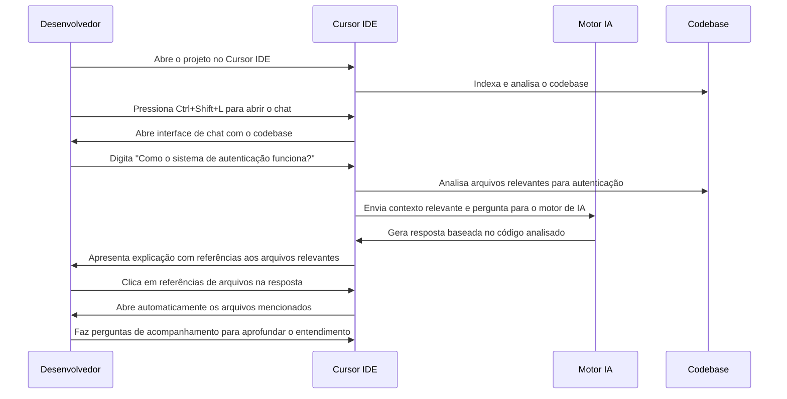

# 💬 Caso de Uso 3: Chat com o Codebase

## 📋 Descrição

Uma das características mais inovadoras do Cursor IDE é a possibilidade de "conversar" com seu codebase. Esta funcionalidade permite que os desenvolvedores façam perguntas em linguagem natural sobre o código, obtenham explicações sobre partes complexas e recebam assistência contextualizada, sem precisar abandonar o ambiente de desenvolvimento.

## 🎯 Cenário

Um desenvolvedor recém-integrado a um projeto existente precisa entender rapidamente como um sistema complexo funciona. Em vez de passar horas analisando o código manualmente ou interromper colegas de equipe, o desenvolvedor pode usar o Cursor para fazer perguntas sobre o codebase e entender sua estrutura e funcionalidade.

## 🔄 Fluxo de Trabalho



## 💻 Exemplo de Interação

### Pergunta do Desenvolvedor:
```
Como o sistema de autenticação funciona neste projeto? Quais são os principais arquivos e fluxos?
```

### Resposta do Cursor:
```
O sistema de autenticação deste projeto usa JWT (JSON Web Tokens) com uma arquitetura de microserviços. Aqui estão os principais componentes:

1. **Arquivos principais:**
   - `src/auth/AuthService.js` - Serviço central que gerencia a autenticação
   - `src/auth/middleware/authMiddleware.js` - Middleware para proteger rotas
   - `src/auth/controllers/LoginController.js` - Gerencia login de usuários
   - `src/auth/models/User.js` - Modelo de dados do usuário
   - `src/auth/utils/tokenUtils.js` - Utilitários para gerenciar tokens JWT

2. **Fluxo de autenticação:**
   - O usuário envia credenciais para `/api/auth/login` que é processado por `LoginController.js`
   - O controller valida as credenciais contra o banco de dados
   - Se válido, `tokenUtils.js` gera um JWT contendo o ID do usuário e permissões
   - O token é enviado ao cliente e armazenado (geralmente em localStorage)
   - Para acessos subsequentes a rotas protegidas, o cliente envia o token no header 'Authorization'
   - O `authMiddleware.js` intercepta requisições, valida o token e extrai informações do usuário

3. **Renovação de tokens:**
   - Tokens expiram após 1 hora (configurado em `src/config/auth.js`)
   - Quando próximo da expiração, o client pode chamar `/api/auth/refresh` para obter um novo token
   - Um refresh token separado com vida útil mais longa é usado para este processo

Você quer que eu explique alguma parte específica em mais detalhes?
```

### Pergunta de acompanhamento:
```
Sim, pode me explicar como o authMiddleware.js funciona? Como ele protege as rotas?
```

### Resposta do Cursor:
```
O `authMiddleware.js` é responsável por proteger rotas da API verificando tokens JWT antes de permitir o acesso. Aqui está como ele funciona:

```javascript
// src/auth/middleware/authMiddleware.js
const jwt = require('jsonwebtoken');
const { JWT_SECRET } = require('../../config/auth');
const User = require('../models/User');

const authMiddleware = async (req, res, next) => {
  try {
    // 1. Extrai o token do header de autorização
    const authHeader = req.headers.authorization;
    if (!authHeader || !authHeader.startsWith('Bearer ')) {
      return res.status(401).json({ message: 'Token de autenticação não fornecido' });
    }
    
    const token = authHeader.split(' ')[1];
    
    // 2. Verifica e decodifica o token
    const decoded = jwt.verify(token, JWT_SECRET);
    
    // 3. Encontra o usuário pelo ID no token
    const user = await User.findById(decoded.userId);
    if (!user) {
      return res.status(401).json({ message: 'Usuário não encontrado' });
    }
    
    // 4. Adiciona o usuário ao objeto de requisição para uso posterior
    req.user = {
      id: user._id,
      email: user.email,
      role: user.role,
      permissions: decoded.permissions
    };
    
    // 5. Passa para o próximo middleware ou controlador
    next();
  } catch (error) {
    if (error.name === 'TokenExpiredError') {
      return res.status(401).json({ message: 'Token expirado' });
    }
    if (error.name === 'JsonWebTokenError') {
      return res.status(401).json({ message: 'Token inválido' });
    }
    return res.status(500).json({ message: 'Erro interno do servidor' });
  }
};

module.exports = authMiddleware;
```

Este middleware é aplicado a rotas protegidas usando:

```javascript
// Em src/routes/protectedRoutes.js
const router = require('express').Router();
const authMiddleware = require('../auth/middleware/authMiddleware');

// Aplica o middleware a todas as rotas abaixo
router.use(authMiddleware);

// Rotas protegidas
router.get('/profile', profileController.getProfile);
router.put('/profile', profileController.updateProfile);
// ... outras rotas protegidas ...

module.exports = router;
```

O middleware realiza estas tarefas principais:
1. Extrai o token JWT do header 'Authorization'
2. Verifica se o token é válido e não está expirado usando a chave secreta
3. Decodifica o token para obter o ID do usuário e permissões
4. Busca o usuário completo no banco de dados
5. Adiciona os dados do usuário ao objeto de requisição (req.user)
6. Permite que a requisição prossiga para o próximo handler

Isso garante que apenas usuários autenticados com tokens válidos possam acessar as rotas protegidas, e também disponibiliza os dados do usuário para lógica de autorização subsequente.
```

## 💡 Dicas

1. **Use o recurso de menção (@)**: Você pode mencionar arquivos específicos usando @ para direcionar suas perguntas a partes específicas do código.
2. **Seja específico em suas perguntas**: Quanto mais específica for sua pergunta, mais precisa será a resposta.
3. **Use perguntas em série**: Comece com perguntas gerais e vá afunilando para detalhes específicos.
4. **Combine com navegação de código**: Use os links de referência nas respostas para navegar diretamente para os arquivos relevantes.
5. **Solicite exemplos**: Peça ao Cursor para mostrar exemplos de uso quando não estiver claro como utilizar uma função ou componente.

## 🔗 Recursos Adicionais

- [Documentação do recurso de Chat com Codebase](https://cursor.sh/docs/chat)
- [Dicas para formular perguntas eficientes](https://cursor.sh/blog/effective-questions)
- [Como usar o Cursor IDE para onboarding de desenvolvedores](https://cursor.sh/blog/developer-onboarding)


