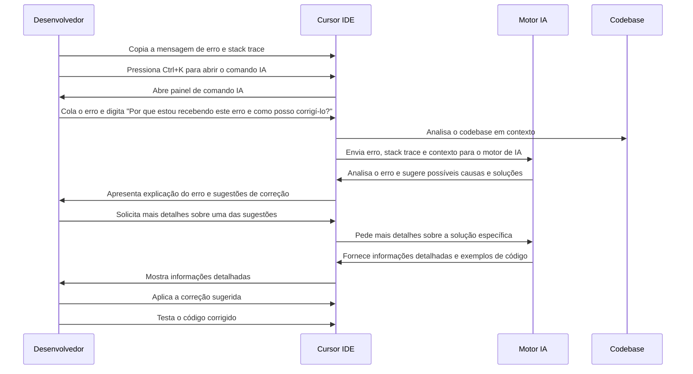

# 🐞 Caso de Uso 4: Debug Assistido por IA

## 📋 Descrição

A depuração é uma das tarefas mais desafiadoras e que consome mais tempo no desenvolvimento de software. O Cursor IDE revoluciona este processo com recursos de debug assistido por IA, que ajudam os desenvolvedores a identificar, entender e corrigir bugs de forma mais rápida e eficiente.

## 🎯 Cenário

Um desenvolvedor está enfrentando um erro complexo em uma aplicação React/Node.js que está ocorrendo intermitentemente em produção, mas é difícil de reproduzir localmente. Os logs de erro contêm uma pilha de execução (stack trace) e mensagens de erro, mas a causa raiz não é imediatamente óbvia.

## 🔄 Fluxo de Trabalho



## 💻 Exemplo de Interação

### Erro reportado pelo desenvolvedor:
```
Uncaught TypeError: Cannot read properties of undefined (reading 'filter')
    at processUserData (UserDashboard.js:156)
    at renderUserList (UserDashboard.js:203)
    at UserDashboard (UserDashboard.js:78)
    at renderWithHooks (react-dom.development.js:16305)
    at mountIndeterminateComponent (react-dom.development.js:20074)
    at beginWork (react-dom.development.js:21587)
    at HTMLUnknownElement.callCallback (react-dom.development.js:4164)
    at Object.invokeGuardedCallbackDev (react-dom.development.js:4213)
    at invokeGuardedCallback (react-dom.development.js:4277)
    at beginWork$1 (react-dom.development.js:27451)
```

### Pergunta do desenvolvedor:
```
Por que estou recebendo este erro de "Cannot read properties of undefined (reading 'filter')" no meu UserDashboard? Como posso corrigí-lo?
```

### Resposta do Cursor:
```
O erro "Cannot read properties of undefined (reading 'filter')" indica que você está tentando chamar o método `filter()` em algo que é `undefined`. Baseado no stack trace, o erro ocorre no arquivo `UserDashboard.js` na função `processUserData`, linha 156, que é chamada durante a renderização da lista de usuários.

Analisando seu código, identifiquei o problema:

Em `UserDashboard.js`, linha 156, você tem:
```javascript
const filteredUsers = userData.users.filter(user => 
  user.name.toLowerCase().includes(searchTerm.toLowerCase())
);
```

O problema está acontecendo porque `userData` ou `userData.users` está `undefined` quando você tenta acessar a propriedade `filter`.

Possíveis causas:
1. A API que fornece os dados do usuário falhou ou ainda não retornou
2. A estrutura de resposta da API mudou
3. Há um erro na lógica que atribui valor a `userData`

Solução recomendada:
Adicione uma verificação de nulidade antes de tentar acessar a propriedade `filter`:

```javascript
const filteredUsers = userData && userData.users 
  ? userData.users.filter(user => 
      user.name.toLowerCase().includes(searchTerm.toLowerCase()))
  : [];
```

Alternativamente, você pode usar o operador de encadeamento opcional (?.) e fornecer um valor padrão:

```javascript
const filteredUsers = userData?.users?.filter(user => 
  user.name.toLowerCase().includes(searchTerm.toLowerCase())
) || [];
```

Também é importante verificar por que `userData` está indefinido. Se este componente depende de dados da API, certifique-se de:

1. Implementar um estado de carregamento para não renderizar o componente até que os dados estejam disponíveis
2. Garantir que a chamada de API está funcionando corretamente
3. Verificar se há erros no manipulador de resposta da API

Quer que eu verifique alguma parte específica do código para diagnosticar melhor o problema?
```

### Pergunta de acompanhamento do desenvolvedor:
```
Entendi o problema. Pode me mostrar como implementar corretamente o estado de carregamento para evitar que esse erro ocorra enquanto os dados estão sendo carregados?
```

### Resposta do Cursor:
```
Claro! Aqui está como você pode implementar corretamente um estado de carregamento no seu componente `UserDashboard` para evitar o erro:

```javascript
import React, { useState, useEffect } from 'react';
import axios from 'axios';
import LoadingSpinner from '../components/LoadingSpinner';
import ErrorMessage from '../components/ErrorMessage';

function UserDashboard() {
  // Estados para gerenciar os dados e o estado da UI
  const [userData, setUserData] = useState(null);
  const [loading, setLoading] = useState(true);
  const [error, setError] = useState(null);
  const [searchTerm, setSearchTerm] = useState('');

  // Buscar dados quando o componente montar
  useEffect(() => {
    const fetchUserData = async () => {
      try {
        setLoading(true);
        setError(null);
        
        const response = await axios.get('/api/users');
        setUserData(response.data);
      } catch (err) {
        console.error('Error fetching user data:', err);
        setError('Falha ao carregar dados de usuários. Por favor, tente novamente.');
      } finally {
        setLoading(false);
      }
    };

    fetchUserData();
  }, []);

  // Função para processar os dados do usuário com segurança
  const processUserData = () => {
    // Garantir que userData e userData.users existem antes de aplicar filter
    if (!userData || !userData.users) {
      return [];
    }
    
    return userData.users.filter(user => 
      user.name.toLowerCase().includes(searchTerm.toLowerCase())
    );
  };

  // Renderizar componente baseado no estado
  const renderUserList = () => {
    const filteredUsers = processUserData();
    
    return (
      <div className="user-list">
        <input
          type="text"
          placeholder="Pesquisar usuários..."
          value={searchTerm}
          onChange={(e) => setSearchTerm(e.target.value)}
          className="search-input"
        />
        
        {filteredUsers.length > 0 ? (
          <ul>
            {filteredUsers.map(user => (
              <li key={user.id}>
                <strong>{user.name}</strong>
                <p>{user.email}</p>
              </li>
            ))}
          </ul>
        ) : (
          <p>Nenhum usuário encontrado.</p>
        )}
      </div>
    );
  };

  // Renderização condicional baseada no estado
  return (
    <div className="user-dashboard">
      <h1>Painel de Usuários</h1>
      
      {loading ? (
        <LoadingSpinner />
      ) : error ? (
        <ErrorMessage message={error} />
      ) : (
        renderUserList()
      )}
    </div>
  );
}

export default UserDashboard;
```

Principais melhorias implementadas:

1. **Estados separados para diferentes aspectos**:
   - `loading`: controla quando mostrar o indicador de carregamento
   - `error`: captura e armazena mensagens de erro
   - `userData`: armazena os dados após o carregamento bem-sucedido

2. **Renderização condicional**:
   - Mostra um componente de spinner durante o carregamento
   - Mostra uma mensagem de erro se a requisição falhar
   - Renderiza a lista de usuários apenas quando os dados estiverem disponíveis

3. **Tratamento de erros robusto**:
   - Try/catch para capturar erros de API
   - Estado de erro para comunicar problemas ao usuário
   - Finally para garantir que o estado de carregamento seja sempre atualizado

4. **Verificações de dados seguras**:
   - A função `processUserData` verifica se os dados existem antes de aplicar operações
   - Verificações adicionais para evitar erros de "undefined" ou "null"

Este padrão é altamente recomendado para componentes que dependem de dados externos, pois proporciona uma melhor experiência ao usuário e previne erros como o que você estava enfrentando.
```

## 💡 Dicas

1. **Forneça contexto completo**: Ao usar o debug assistido, inclua a mensagem de erro, stack trace e se possível, o código em torno da linha onde o erro ocorre.

2. **Use referência direta de arquivo**: Mencione o arquivo específico (@NomeDoArquivo) para dar ao Cursor IDE mais contexto.

3. **Pergunte sobre padrões**: Além de corrigir o erro específico, peça ao Cursor para sugerir padrões que podem evitar erros semelhantes no futuro.

4. **Combine com recursos visuais**: Depois de receber sugestões, use o debugger visual integrado do Cursor IDE para verificar o comportamento em tempo de execução.

5. **Documente as soluções**: Quando encontrar uma solução, peça ao Cursor para explicar o problema e a solução de forma clara para documentação futura.

## 🔗 Recursos Adicionais

- [Guia completo de depuração com Cursor IDE](https://cursor.sh/docs/debugging)
- [Padrões comuns para evitar erros em JavaScript/TypeScript](https://cursor.sh/blog/error-prevention)
- [Como usar o Cursor IDE para detectar bugs antes que eles aconteçam](https://cursor.sh/blog/proactive-debugging)


