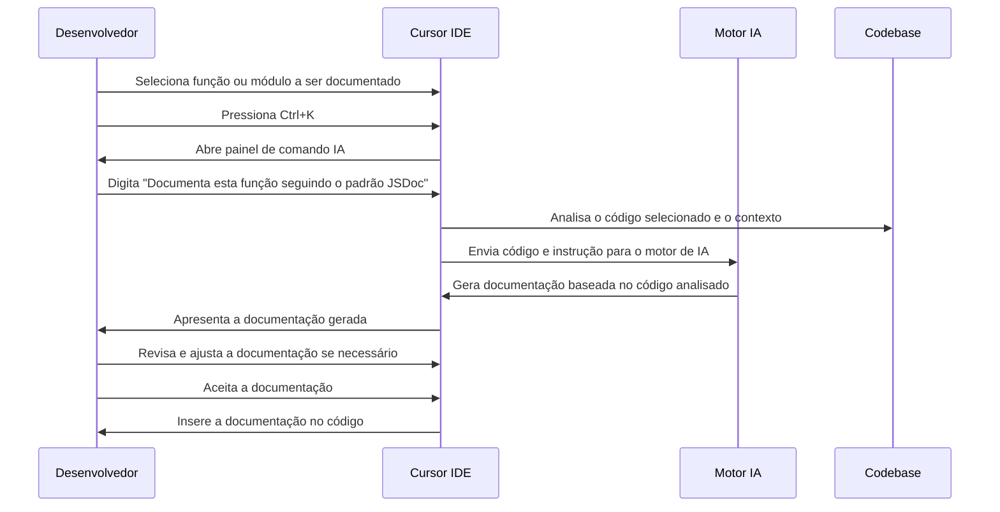

# 📚 Caso de Uso 5: Documentação Automática de Código

## 📋 Descrição

A criação e manutenção de documentação de código é frequentemente negligenciada devido ao tempo e esforço necessários, apesar de sua importância crítica. O Cursor IDE transforma esta tarefa com recursos de documentação automática assistida por IA, gerando documentação de alta qualidade para funções, classes e módulos com mínimo esforço do desenvolvedor.

## 🎯 Cenário

Um desenvolvedor está trabalhando em uma API em Node.js e precisa documentar todas as funções e endpoints para facilitar o uso por outros desenvolvedores da equipe e gerar documentação para os consumidores da API. Em vez de escrever manualmente toda a documentação, o desenvolvedor utiliza o Cursor IDE para gerar automaticamente comentários de documentação detalhados.

## 🔄 Fluxo de Trabalho



## 💻 Exemplo de Implementação

### Código Original:

```javascript
const bcrypt = require('bcrypt');
const jwt = require('jsonwebtoken');
const User = require('../models/User');
const { JWT_SECRET, JWT_EXPIRY } = require('../config');

async function authenticateUser(email, password) {
  try {
    const user = await User.findOne({ email });
    
    if (!user) {
      return { success: false, message: 'User not found' };
    }
    
    const passwordMatch = await bcrypt.compare(password, user.password);
    
    if (!passwordMatch) {
      return { success: false, message: 'Invalid password' };
    }
    
    const token = jwt.sign(
      { 
        userId: user._id,
        email: user.email,
        role: user.role
      }, 
      JWT_SECRET, 
      { expiresIn: JWT_EXPIRY }
    );
    
    return {
      success: true,
      user: {
        id: user._id,
        name: user.name,
        email: user.email,
        role: user.role
      },
      token
    };
  } catch (error) {
    console.error('Authentication error:', error);
    return { success: false, message: 'Authentication failed' };
  }
}

async function registerUser(userData) {
  try {
    const { name, email, password, role = 'user' } = userData;
    
    const existingUser = await User.findOne({ email });
    if (existingUser) {
      return { success: false, message: 'Email already in use' };
    }
    
    const salt = await bcrypt.genSalt(10);
    const hashedPassword = await bcrypt.hash(password, salt);
    
    const newUser = new User({
      name,
      email,
      password: hashedPassword,
      role
    });
    
    await newUser.save();
    
    return {
      success: true,
      user: {
        id: newUser._id,
        name: newUser.name,
        email: newUser.email,
        role: newUser.role
      }
    };
  } catch (error) {
    console.error('Registration error:', error);
    return { success: false, message: 'Registration failed' };
  }
}

module.exports = {
  authenticateUser,
  registerUser
};
```

### Solicitação do Desenvolvedor:
```
Documenta estas funções usando JSDoc com descrições detalhadas, parâmetros, valores de retorno e exemplos.
```

### Código com Documentação Gerada:

```javascript
const bcrypt = require('bcrypt');
const jwt = require('jsonwebtoken');
const User = require('../models/User');
const { JWT_SECRET, JWT_EXPIRY } = require('../config');

/**
 * Autentica um usuário com email e senha
 * 
 * @async
 * @function authenticateUser
 * @description Verifica as credenciais de um usuário, comparando o email e senha fornecidos
 * com os dados armazenados no banco de dados. Se as credenciais forem válidas, gera um token JWT.
 * 
 * @param {string} email - O endereço de email do usuário
 * @param {string} password - A senha do usuário (não criptografada)
 * 
 * @returns {Promise<Object>} Um objeto contendo o resultado da autenticação
 * @returns {boolean} Object.success - Indica se a autenticação foi bem-sucedida
 * @returns {string} [Object.message] - Mensagem de erro em caso de falha na autenticação
 * @returns {Object} [Object.user] - Informações do usuário autenticado
 * @returns {string} Object.user.id - ID do usuário
 * @returns {string} Object.user.name - Nome do usuário
 * @returns {string} Object.user.email - Email do usuário
 * @returns {string} Object.user.role - Função/papel do usuário
 * @returns {string} [Object.token] - Token JWT gerado para o usuário autenticado
 * 
 * @example
 * // Autenticação bem-sucedida
 * const result = await authenticateUser('user@example.com', 'password123');
 * // {
 * //   success: true,
 * //   user: {
 * //     id: '60d5ec9af682fbd12a8932db',
 * //     name: 'John Doe',
 * //     email: 'user@example.com',
 * //     role: 'user'
 * //   },
 * //   token: 'eyJhbGciOiJIUzI1NiIsInR5cCI6IkpXVCJ9...'
 * // }
 * 
 * @example
 * // Autenticação falhou
 * const result = await authenticateUser('user@example.com', 'wrongpassword');
 * // { success: false, message: 'Invalid password' }
 * 
 * @throws {Error} Se ocorrer algum erro durante o processo de autenticação
 */
async function authenticateUser(email, password) {
  try {
    const user = await User.findOne({ email });
    
    if (!user) {
      return { success: false, message: 'User not found' };
    }
    
    const passwordMatch = await bcrypt.compare(password, user.password);
    
    if (!passwordMatch) {
      return { success: false, message: 'Invalid password' };
    }
    
    const token = jwt.sign(
      { 
        userId: user._id,
        email: user.email,
        role: user.role
      }, 
      JWT_SECRET, 
      { expiresIn: JWT_EXPIRY }
    );
    
    return {
      success: true,
      user: {
        id: user._id,
        name: user.name,
        email: user.email,
        role: user.role
      },
      token
    };
  } catch (error) {
    console.error('Authentication error:', error);
    return { success: false, message: 'Authentication failed' };
  }
}

/**
 * Registra um novo usuário no sistema
 * 
 * @async
 * @function registerUser
 * @description Cria um novo usuário no banco de dados após verificar se o email não está em uso.
 * A senha é criptografada antes de ser armazenada.
 * 
 * @param {Object} userData - Dados do usuário a ser registrado
 * @param {string} userData.name - Nome completo do usuário
 * @param {string} userData.email - Endereço de email do usuário (deve ser único)
 * @param {string} userData.password - Senha do usuário (será criptografada)
 * @param {string} [userData.role='user'] - Função/papel do usuário no sistema
 * 
 * @returns {Promise<Object>} Um objeto contendo o resultado do registro
 * @returns {boolean} Object.success - Indica se o registro foi bem-sucedido
 * @returns {string} [Object.message] - Mensagem de erro em caso de falha no registro
 * @returns {Object} [Object.user] - Informações do usuário registrado
 * @returns {string} Object.user.id - ID do usuário
 * @returns {string} Object.user.name - Nome do usuário
 * @returns {string} Object.user.email - Email do usuário
 * @returns {string} Object.user.role - Função/papel do usuário
 * 
 * @example
 * // Registro bem-sucedido
 * const result = await registerUser({
 *   name: 'John Doe',
 *   email: 'john@example.com',
 *   password: 'securePassword123'
 * });
 * // {
 * //   success: true,
 * //   user: {
 * //     id: '60d5ec9af682fbd12a8932db',
 * //     name: 'John Doe',
 * //     email: 'john@example.com',
 * //     role: 'user'
 * //   }
 * // }
 * 
 * @example
 * // Registro falhou - email já em uso
 * const result = await registerUser({
 *   name: 'Jane Doe',
 *   email: 'existing@example.com',
 *   password: 'password456'
 * });
 * // { success: false, message: 'Email already in use' }
 * 
 * @throws {Error} Se ocorrer algum erro durante o processo de registro
 */
async function registerUser(userData) {
  try {
    const { name, email, password, role = 'user' } = userData;
    
    const existingUser = await User.findOne({ email });
    if (existingUser) {
      return { success: false, message: 'Email already in use' };
    }
    
    const salt = await bcrypt.genSalt(10);
    const hashedPassword = await bcrypt.hash(password, salt);
    
    const newUser = new User({
      name,
      email,
      password: hashedPassword,
      role
    });
    
    await newUser.save();
    
    return {
      success: true,
      user: {
        id: newUser._id,
        name: newUser.name,
        email: newUser.email,
        role: newUser.role
      }
    };
  } catch (error) {
    console.error('Registration error:', error);
    return { success: false, message: 'Registration failed' };
  }
}

module.exports = {
  authenticateUser,
  registerUser
};
```

## 💡 Dicas

1. **Especifique o padrão de documentação**: Indique o padrão de documentação que você deseja seguir (JSDoc, Docstrings, etc.) para obter resultados mais precisos.

2. **Documente em fases**: Para bases de código grandes, documente módulo por módulo ou arquivo por arquivo para manter a consistência.

3. **Revise a documentação gerada**: Sempre revise a documentação gerada pela IA para garantir precisão e adicionar informações específicas do domínio que a IA pode não conhecer.

4. **Use a função em massa**: Para documentar várias funções de uma vez, selecione um arquivo inteiro e peça ao Cursor para documentar todas as funções.

5. **Mantenha a documentação atualizada**: Ao modificar funções, peça ao Cursor para atualizar a documentação existente para refletir as mudanças.

## 🔗 Recursos Adicionais

- [Guia de documentação com Cursor IDE](https://cursor.sh/docs/documentation)
- [Padrões de documentação para diferentes linguagens](https://cursor.sh/blog/documentation-standards)
- [Como gerar documentação de API a partir de comentários](https://cursor.sh/tutorials/api-docs-generation)


