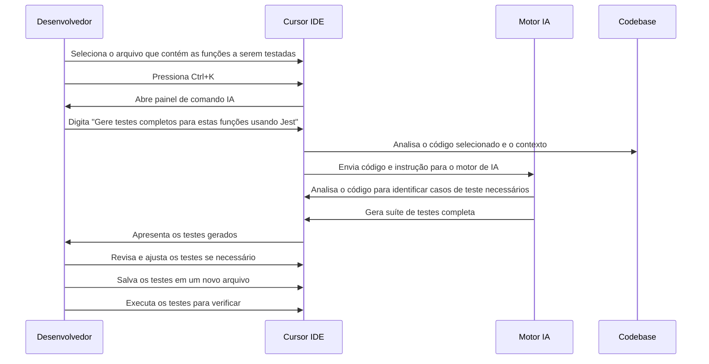

# 🧪 Caso de Uso 6: Geração de Testes Automatizados

## 📋 Descrição

A escrita de testes automatizados é fundamental para garantir a qualidade e manutenibilidade do código, mas frequentemente é vista como uma tarefa tediosa e demorada. O Cursor IDE revoluciona este processo ao gerar automaticamente testes abrangentes a partir do código existente, economizando tempo dos desenvolvedores e aumentando a cobertura de testes.

## 🎯 Cenário

Um desenvolvedor implementou várias funções de utilidade em um projeto NodeJS, mas ainda não criou testes para elas. Em vez de escrever manualmente todos os testes, cobrindo diferentes casos e cenários, o desenvolvedor usa o Cursor IDE para gerar automaticamente suítes de testes completas.

## 🔄 Fluxo de Trabalho



## 💻 Exemplo de Implementação

### Código Original (utils.js):

```javascript
/**
 * Utilitários de manipulação de strings e validação
 */

/**
 * Formata um número de telefone para o padrão (XX) XXXXX-XXXX
 * @param {string} phone - Número de telefone a ser formatado
 * @returns {string} Telefone formatado ou string vazia se inválido
 */
function formatPhoneNumber(phone) {
  if (!phone) return '';
  
  // Remove todos os caracteres não numéricos
  const numbers = phone.replace(/\D/g, '');
  
  // Verifica se tem a quantidade correta de dígitos (10 ou 11)
  if (numbers.length < 10 || numbers.length > 11) {
    return '';
  }
  
  // Formata de acordo com o padrão brasileiro
  if (numbers.length === 11) {
    return `(${numbers.slice(0, 2)}) ${numbers.slice(2, 7)}-${numbers.slice(7)}`;
  } else {
    return `(${numbers.slice(0, 2)}) ${numbers.slice(2, 6)}-${numbers.slice(6)}`;
  }
}

/**
 * Valida um endereço de e-mail
 * @param {string} email - E-mail a ser validado
 * @returns {boolean} True se o e-mail for válido, false caso contrário
 */
function isValidEmail(email) {
  if (!email) return false;
  
  // Regex para validação básica de e-mail
  const emailRegex = /^[^\s@]+@[^\s@]+\.[^\s@]+$/;
  return emailRegex.test(email);
}

/**
 * Trunca um texto para o tamanho máximo especificado, adicionando reticências se necessário
 * @param {string} text - Texto a ser truncado
 * @param {number} maxLength - Tamanho máximo do texto
 * @returns {string} Texto truncado
 */
function truncateText(text, maxLength) {
  if (!text) return '';
  if (!maxLength || maxLength <= 0) return text;
  
  if (text.length <= maxLength) {
    return text;
  }
  
  return text.slice(0, maxLength) + '...';
}

/**
 * Calcula a idade a partir da data de nascimento
 * @param {string|Date} birthDate - Data de nascimento
 * @returns {number} Idade calculada ou -1 se a data for inválida
 */
function calculateAge(birthDate) {
  if (!birthDate) return -1;
  
  const birth = new Date(birthDate);
  
  // Verifica se a data é válida
  if (isNaN(birth.getTime())) {
    return -1;
  }
  
  const today = new Date();
  let age = today.getFullYear() - birth.getFullYear();
  
  // Ajusta a idade se ainda não fez aniversário este ano
  const monthDiff = today.getMonth() - birth.getMonth();
  if (monthDiff < 0 || (monthDiff === 0 && today.getDate() < birth.getDate())) {
    age--;
  }
  
  return age;
}

module.exports = {
  formatPhoneNumber,
  isValidEmail,
  truncateText,
  calculateAge
};
```

### Solicitação do Desenvolvedor:
```
Gere uma suíte de testes completa usando Jest para estas funções de utilidade, cobrindo todos os casos possíveis, incluindo casos de borda e entradas inválidas.
```

### Testes Gerados pelo Cursor IDE (utils.test.js):

```javascript
const { 
  formatPhoneNumber, 
  isValidEmail, 
  truncateText, 
  calculateAge 
} = require('./utils');

describe('formatPhoneNumber', () => {
  test('deve formatar um número de telefone com 11 dígitos corretamente', () => {
    expect(formatPhoneNumber('11987654321')).toBe('(11) 98765-4321');
  });

  test('deve formatar um número de telefone com 10 dígitos corretamente', () => {
    expect(formatPhoneNumber('1187654321')).toBe('(11) 8765-4321');
  });

  test('deve remover caracteres não numéricos antes de formatar', () => {
    expect(formatPhoneNumber('(11) 98765-4321')).toBe('(11) 98765-4321');
    expect(formatPhoneNumber('11.98765-4321')).toBe('(11) 98765-4321');
    expect(formatPhoneNumber('11 98765 4321')).toBe('(11) 98765-4321');
  });

  test('deve retornar string vazia para entradas inválidas', () => {
    expect(formatPhoneNumber('')).toBe('');
    expect(formatPhoneNumber(null)).toBe('');
    expect(formatPhoneNumber(undefined)).toBe('');
    expect(formatPhoneNumber('123')).toBe(''); // Menos de 10 dígitos
    expect(formatPhoneNumber('123456789012')).toBe(''); // Mais de 11 dígitos
  });
});

describe('isValidEmail', () => {
  test('deve validar emails corretos', () => {
    expect(isValidEmail('usuario@exemplo.com')).toBe(true);
    expect(isValidEmail('nome.sobrenome@dominio.com.br')).toBe(true);
    expect(isValidEmail('email_com_underscore@dominio.net')).toBe(true);
    expect(isValidEmail('email+comcaracterespecial@dominio.org')).toBe(true);
  });

  test('deve rejeitar emails inválidos', () => {
    expect(isValidEmail('')).toBe(false);
    expect(isValidEmail(null)).toBe(false);
    expect(isValidEmail(undefined)).toBe(false);
    expect(isValidEmail('emailsemarrobadominio.com')).toBe(false);
    expect(isValidEmail('usuario@')).toBe(false);
    expect(isValidEmail('@dominio.com')).toBe(false);
    expect(isValidEmail('usuario@dominio')).toBe(false);
    expect(isValidEmail('usuario@.com')).toBe(false);
    expect(isValidEmail('usuario com espaço@dominio.com')).toBe(false);
  });
});

describe('truncateText', () => {
  test('deve truncar texto que excede o tamanho máximo', () => {
    expect(truncateText('Este é um texto longo', 10)).toBe('Este é um ...');
    expect(truncateText('Abcdefghij', 5)).toBe('Abcde...');
  });

  test('não deve truncar texto que não excede o tamanho máximo', () => {
    expect(truncateText('Texto curto', 20)).toBe('Texto curto');
    expect(truncateText('Exato', 5)).toBe('Exato');
  });

  test('deve lidar com casos de borda e entradas inválidas', () => {
    expect(truncateText('', 10)).toBe('');
    expect(truncateText(null, 10)).toBe('');
    expect(truncateText(undefined, 10)).toBe('');
    expect(truncateText('Texto', null)).toBe('Texto');
    expect(truncateText('Texto', undefined)).toBe('Texto');
    expect(truncateText('Texto', 0)).toBe('Texto');
    expect(truncateText('Texto', -5)).toBe('Texto');
  });
});

describe('calculateAge', () => {
  // Mockar a data atual para testes consistentes
  const mockDate = new Date('2025-04-22'); // Data fixa para testes
  const originalDate = global.Date;
  
  beforeAll(() => {
    global.Date = class extends Date {
      constructor(...args) {
        if (args.length === 0) {
          return mockDate;
        }
        return new originalDate(...args);
      }
    };
  });

  afterAll(() => {
    global.Date = originalDate;
  });

  test('deve calcular idade corretamente', () => {
    // Para mockDate = 2025-04-22
    expect(calculateAge('1990-01-01')).toBe(35);
    expect(calculateAge(new Date('1990-01-01'))).toBe(35);
  });

  test('deve ajustar idade se ainda não fez aniversário no ano atual', () => {
    expect(calculateAge('1990-05-01')).toBe(34); // Não fez aniversário ainda (abril < maio)
    expect(calculateAge('1990-04-23')).toBe(34); // Não fez aniversário ainda (dia 22 < dia 23)
    expect(calculateAge('1990-04-22')).toBe(35); // Fez aniversário hoje
    expect(calculateAge('1990-04-21')).toBe(35); // Já fez aniversário (dia 21 < dia 22)
    expect(calculateAge('1990-03-01')).toBe(35); // Já fez aniversário (março < abril)
  });

  test('deve lidar com entradas inválidas', () => {
    expect(calculateAge('')).toBe(-1);
    expect(calculateAge(null)).toBe(-1);
    expect(calculateAge(undefined)).toBe(-1);
    expect(calculateAge('texto-invalido')).toBe(-1);
    expect(calculateAge('2025-13-32')).toBe(-1); // Data inválida
  });
});
```

## 💡 Dicas

1. **Seja específico sobre o framework de teste**: Especifique qual framework de teste você está usando (Jest, Mocha, Chai, etc.) para obter testes mais precisos e apropriados.

2. **Solicite testes para casos específicos**: Se houver cenários específicos que você quer garantir que sejam testados, mencione-os explicitamente.

3. **Combine com mocks automatizados**: Peça ao Cursor para gerar mocks para dependências externas, como no exemplo acima onde mockamos a classe Date.

4. **Use testes gerados como base**: Os testes gerados são um excelente ponto de partida, mas revise-os cuidadosamente e ajuste conforme necessário para suas necessidades específicas.

5. **Incremente com novos testes**: À medida que você adiciona novas funcionalidades, peça ao Cursor para gerar testes adicionais que se integrem com sua suíte existente.

## 🔗 Recursos Adicionais

- [Guia de testes automatizados com Cursor IDE](https://cursor.sh/docs/testing)
- [Melhores práticas para testes unitários em JavaScript](https://cursor.sh/blog/js-testing-best-practices)
- [Como usar mocks efetivamente em testes](https://cursor.sh/tutorials/effective-mocking)


