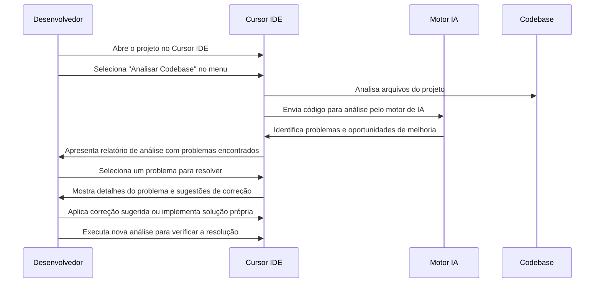

# 🔍 Caso de Uso 7: Análise de Código e Detecção de Problemas

## 📋 Descrição

A análise estática de código é uma prática essencial para garantir a qualidade e a segurança do software. O Cursor IDE eleva esta capacidade ao oferecer análise de código assistida por IA, que não apenas identifica problemas sintáticos, mas também detecta padrões problemáticos, vulnerabilidades de segurança e oportunidades de melhoria que ferramentas tradicionais não conseguiriam encontrar.

## 🎯 Cenário

Um desenvolvedor precisa revisar uma base de código grande antes de uma implantação importante. Em vez de revisar manualmente cada arquivo ou depender apenas de linters tradicionais, o desenvolvedor utiliza o Cursor IDE para analisar o código de forma abrangente, identificar problemas potenciais e sugerir melhorias.

## 🔄 Fluxo de Trabalho



## 💻 Exemplo de Implementação

### Código com Problemas:

```javascript
// authController.js
const User = require('../models/User');
const jwt = require('jsonwebtoken');

// Configuração do JWT
const JWT_SECRET = "minha_chave_secreta_muito_importante";
const JWT_EXPIRY = '24h';

// Login de usuário
async function login(req, res) {
  try {
    const { email, password } = req.body;
    
    var user = await User.findOne({ email: email });
    if (!user) {
      return res.status(401).send({ message: 'Credenciais inválidas' });
    }
    
    // Verificação de senha simples - apenas para demonstração
    if (password != user.password) {
      return res.status(401).send({ message: 'Credenciais inválidas' });
    }
    
    // Gera token JWT com todas as informações do usuário
    const token = jwt.sign(user.toJSON(), JWT_SECRET, { expiresIn: JWT_EXPIRY });
    
    return res.status(200).send({ token });
  } catch (error) {
    console.log('Erro no login:', error);
    return res.status(500).send({ message: 'Erro interno do servidor' });
  }
}

// Middleware para verificar autenticação
function authMiddleware(req, res, next) {
  const token = req.headers.authorization;
  
  if (!token) {
    return res.status(401).send({ message: 'Token não fornecido' });
  }
  
  try {
    const decoded = jwt.verify(token, JWT_SECRET);
    req.user = decoded;
    next();
  } catch (error) {
    return res.status(401).send({ message: 'Token inválido' });
  }
}

// Rota protegida - retorna dados do usuário
function getUserData(req, res) {
  // Usuário já está disponível no objeto req
  res.send({ user: req.user });
}

// Alterar senha do usuário
async function changePassword(req, res) {
  try {
    const { oldPassword, newPassword } = req.body;
    const userId = req.user._id;
    
    const user = await User.findById(userId);
    
    if (oldPassword != user.password) {
      return res.status(401).send({ message: 'Senha atual incorreta' });
    }
    
    user.password = newPassword;
    await user.save();
    
    res.send({ message: 'Senha alterada com sucesso' });
  } catch (error) {
    console.log('Erro ao alterar senha:', error);
    res.status(500).send({ message: 'Erro ao alterar senha' });
  }
}

module.exports = {
  login,
  authMiddleware,
  getUserData,
  changePassword
};
```

### Relatório de Análise do Cursor IDE:

```
# Relatório de Análise de Código - authController.js

## Problemas Críticos de Segurança:

1. **⚠️ Credenciais Hardcoded**
   - Linha 6: JWT_SECRET está hardcoded no código
   - Impacto: Alto - Expõe segredos críticos que podem levar à falsificação de tokens
   - Solução: Mova para variáveis de ambiente

2. **⚠️ Comparação direta de senhas**
   - Linhas 20 e 52: Comparação direta de senhas (password != user.password)
   - Impacto: Alto - As senhas devem ser armazenadas usando hash, não em texto plano
   - Solução: Implemente bcrypt ou outra biblioteca de hash para senhas

3. **⚠️ Vazamento de informações sensíveis**
   - Linha 24: Todo o objeto user (incluindo senha) está sendo codificado no token
   - Impacto: Alto - Expõe dados sensíveis do usuário
   - Solução: Apenas inclua dados essenciais (id, email, roles) no token 

## Problemas de Implementação:

4. **🔶 Uso incorreto do token de autorização**
   - Linha 35: Extração incorreta do token (espera-se 'Bearer [token]')
   - Impacto: Médio - Pode causar falhas na autenticação
   - Solução: Extrair o token do formato padrão 'Bearer [token]'

5. **🔶 Manipulação de erros inconsistente**
   - Algumas funções retornam res.send(), outras res.status().send()
   - Impacto: Baixo - Código inconsistente dificulta manutenção
   - Solução: Padronize o formato de resposta em toda a aplicação

6. **🔶 Variáveis declaradas com var**
   - Linha 16: Uso de 'var' em vez de 'const' ou 'let'
   - Impacto: Baixo - Problemas potenciais com escopo de variáveis
   - Solução: Use 'const' ou 'let' para declaração de variáveis

## Melhores Práticas Recomendadas:

7. **ℹ️ Logs de erro inadequados**
   - Linhas 27 e 60: console.log para erros de produção
   - Impacto: Médio - Logs inadequados dificultam depuração em produção
   - Solução: Implemente um sistema de logging adequado (como winston ou pino)

8. **ℹ️ Falta de validação de entrada**
   - Não há validação para campos de entrada em req.body
   - Impacto: Médio - Vulnerável a entradas maliciosas
   - Solução: Adicione middleware de validação (como Joi ou express-validator)

9. **ℹ️ Mensagens de erro não específicas**
   - Respostas de erro genéricas não ajudam a identificar o problema
   - Impacto: Baixo - Dificulta depuração pelo cliente
   - Solução: Forneça mensagens de erro mais específicas (sem expor informações sensíveis)
```

### Código Corrigido com a Ajuda do Cursor IDE:

```javascript
// authController.js
const User = require('../models/User');
const jwt = require('jsonwebtoken');
const bcrypt = require('bcrypt');
require('dotenv').config();

// Configuração do JWT a partir de variáveis de ambiente
const JWT_SECRET = process.env.JWT_SECRET;
const JWT_EXPIRY = process.env.JWT_EXPIRY || '24h';

// Login de usuário
async function login(req, res) {
  try {
    const { email, password } = req.body;
    
    const user = await User.findOne({ email });
    if (!user) {
      return res.status(401).json({ message: 'Credenciais inválidas' });
    }
    
    // Verificação de senha usando bcrypt
    const isPasswordValid = await bcrypt.compare(password, user.password);
    if (!isPasswordValid) {
      return res.status(401).json({ message: 'Credenciais inválidas' });
    }
    
    // Gera token JWT apenas com informações necessárias
    const token = jwt.sign(
      { 
        id: user._id,
        email: user.email,
        role: user.role
      }, 
      JWT_SECRET, 
      { expiresIn: JWT_EXPIRY }
    );
    
    return res.status(200).json({ token });
  } catch (error) {
    console.error('Erro no login:', error);
    return res.status(500).json({ message: 'Erro interno do servidor' });
  }
}

// Middleware para verificar autenticação
function authMiddleware(req, res, next) {
  const authHeader = req.headers.authorization;
  
  if (!authHeader || !authHeader.startsWith('Bearer ')) {
    return res.status(401).json({ message: 'Token não fornecido ou formato inválido' });
  }
  
  const token = authHeader.split(' ')[1];
  
  try {
    const decoded = jwt.verify(token, JWT_SECRET);
    req.user = decoded;
    next();
  } catch (error) {
    if (error.name === 'TokenExpiredError') {
      return res.status(401).json({ message: 'Token expirado' });
    }
    return res.status(401).json({ message: 'Token inválido' });
  }
}

// Rota protegida - retorna dados do usuário
function getUserData(req, res) {
  // Usuário já está disponível no objeto req
  return res.status(200).json({ user: {
    id: req.user.id,
    email: req.user.email,
    role: req.user.role
  }});
}

// Alterar senha do usuário
async function changePassword(req, res) {
  try {
    const { oldPassword, newPassword } = req.body;
    const userId = req.user.id;
    
    // Validação básica
    if (!oldPassword || !newPassword) {
      return res.status(400).json({ message: 'Ambas as senhas são obrigatórias' });
    }
    
    if (newPassword.length < 8) {
      return res.status(400).json({ message: 'A nova senha deve ter pelo menos 8 caracteres' });
    }
    
    const user = await User.findById(userId);
    if (!user) {
      return res.status(404).json({ message: 'Usuário não encontrado' });
    }
    
    // Verifica a senha atual usando bcrypt
    const isPasswordValid = await bcrypt.compare(oldPassword, user.password);
    if (!isPasswordValid) {
      return res.status(401).json({ message: 'Senha atual incorreta' });
    }
    
    // Hash da nova senha
    const salt = await bcrypt.genSalt(10);
    user.password = await bcrypt.hash(newPassword, salt);
    await user.save();
    
    return res.status(200).json({ message: 'Senha alterada com sucesso' });
  } catch (error) {
    console.error('Erro ao alterar senha:', error);
    return res.status(500).json({ message: 'Erro ao alterar senha' });
  }
}

module.exports = {
  login,
  authMiddleware,
  getUserData,
  changePassword
};
```

## 💡 Dicas

1. **Execute análises regularmente**: Faça da análise de código uma parte do seu fluxo de trabalho regular, não apenas antes de implantações.

2. **Foque em problemas críticos primeiro**: Comece corrigindo os problemas de segurança e desempenho críticos antes de abordar questões menores.

3. **Use análise de código para aprendizado**: Aproveite as sugestões do Cursor IDE para entender melhores práticas e padrões de codificação.

4. **Combine com revisões humanas**: Use a análise automatizada como complemento, não substituto, para revisões de código por outros desenvolvedores.

5. **Defina padrões de equipe**: Use o Cursor IDE para ajudar a padronizar práticas de codificação em toda a equipe.

## 🔗 Recursos Adicionais

- [Guia de análise de código com Cursor IDE](https://cursor.sh/docs/code-analysis)
- [Checklists de segurança para diferentes frameworks](https://cursor.sh/blog/security-checklists)
- [Como configurar regras personalizadas de análise](https://cursor.sh/tutorials/custom-analysis-rules)


