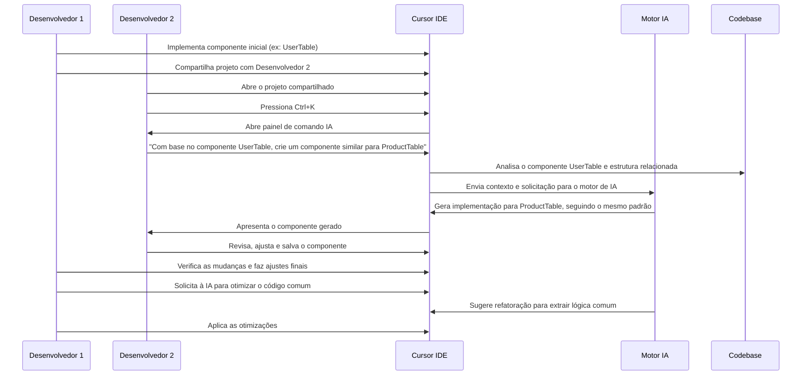

# 👥 Caso de Uso 8: Edição Colaborativa com IA

## 📋 Descrição

A programação é frequentemente um esforço colaborativo, envolvendo múltiplos desenvolvedores trabalhando no mesmo codebase. O Cursor IDE eleva esta colaboração a um novo nível, permitindo que desenvolvedores trabalhem junto com a IA como um par de programação, onde a IA pode entender o contexto do projeto, fazer sugestões inteligentes e até mesmo implementar funcionalidades com base nas diretrizes dos desenvolvedores.

## 🎯 Cenário

Uma equipe de desenvolvedores está trabalhando em uma aplicação web que precisa implementar várias funcionalidades semelhantes em diferentes módulos. Em vez de copiar e adaptar código manualmente, ou criar abstrações complexas desde o início, os desenvolvedores utilizam o Cursor IDE para colaborar com a IA, explicando a estrutura existente e pedindo à IA para ajudar a implementar padrões similares em diferentes partes do aplicativo.

## 🔄 Fluxo de Trabalho



## 💻 Exemplo de Implementação

### Componente original (UserTable.js) implementado pelo Desenvolvedor 1:

```jsx
import React, { useState, useEffect } from 'react';
import axios from 'axios';
import { Table, Button, Modal, Form, Input, message, Popconfirm } from 'antd';

const UserTable = () => {
  const [users, setUsers] = useState([]);
  const [loading, setLoading] = useState(false);
  const [modalVisible, setModalVisible] = useState(false);
  const [editingUser, setEditingUser] = useState(null);
  const [form] = Form.useForm();

  useEffect(() => {
    fetchUsers();
  }, []);

  const fetchUsers = async () => {
    setLoading(true);
    try {
      const response = await axios.get('/api/users');
      setUsers(response.data);
    } catch (error) {
      message.error('Erro ao carregar usuários');
      console.error(error);
    } finally {
      setLoading(false);
    }
  };

  const handleAdd = () => {
    setEditingUser(null);
    form.resetFields();
    setModalVisible(true);
  };

  const handleEdit = (user) => {
    setEditingUser(user);
    form.setFieldsValue(user);
    setModalVisible(true);
  };

  const handleDelete = async (userId) => {
    try {
      await axios.delete(`/api/users/${userId}`);
      message.success('Usuário excluído com sucesso');
      fetchUsers();
    } catch (error) {
      message.error('Erro ao excluir usuário');
      console.error(error);
    }
  };

  const handleModalOk = async () => {
    try {
      const values = await form.validateFields();
      if (editingUser) {
        await axios.put(`/api/users/${editingUser.id}`, values);
        message.success('Usuário atualizado com sucesso');
      } else {
        await axios.post('/api/users', values);
        message.success('Usuário adicionado com sucesso');
      }
      setModalVisible(false);
      fetchUsers();
    } catch (error) {
      message.error('Erro ao salvar usuário');
      console.error(error);
    }
  };

  const columns = [
    {
      title: 'Nome',
      dataIndex: 'name',
      key: 'name',
      sorter: (a, b) => a.name.localeCompare(b.name)
    },
    {
      title: 'Email',
      dataIndex: 'email',
      key: 'email'
    },
    {
      title: 'Departamento',
      dataIndex: 'department',
      key: 'department',
      filters: [
        { text: 'TI', value: 'TI' },
        { text: 'RH', value: 'RH' },
        { text: 'Vendas', value: 'Vendas' }
      ],
      onFilter: (value, record) => record.department === value
    },
    {
      title: 'Cargo',
      dataIndex: 'role',
      key: 'role'
    },
    {
      title: 'Ações',
      key: 'actions',
      render: (_, record) => (
        <>
          <Button type="link" onClick={() => handleEdit(record)}>
            Editar
          </Button>
          <Popconfirm
            title="Tem certeza que deseja excluir?"
            onConfirm={() => handleDelete(record.id)}
            okText="Sim"
            cancelText="Não"
          >
            <Button type="link" danger>
              Excluir
            </Button>
          </Popconfirm>
        </>
      )
    }
  ];

  return (
    <div className="user-table-container">
      <div className="table-header">
        <h2>Gerenciamento de Usuários</h2>
        <Button type="primary" onClick={handleAdd}>
          Adicionar Usuário
        </Button>
      </div>
      
      <Table
        dataSource={users}
        columns={columns}
        rowKey="id"
        loading={loading}
        pagination={{ pageSize: 10 }}
      />
      
      <Modal
        title={editingUser ? 'Editar Usuário' : 'Adicionar Usuário'}
        open={modalVisible}
        onOk={handleModalOk}
        onCancel={() => setModalVisible(false)}
        destroyOnClose
      >
        <Form
          form={form}
          layout="vertical"
        >
          <Form.Item
            name="name"
            label="Nome"
            rules={[{ required: true, message: 'Por favor, informe o nome' }]}
          >
            <Input />
          </Form.Item>
          <Form.Item
            name="email"
            label="Email"
            rules={[
              { required: true, message: 'Por favor, informe o email' },
              { type: 'email', message: 'Email inválido' }
            ]}
          >
            <Input />
          </Form.Item>
          <Form.Item
            name="department"
            label="Departamento"
            rules={[{ required: true, message: 'Por favor, informe o departamento' }]}
          >
            <Input />
          </Form.Item>
          <Form.Item
            name="role"
            label="Cargo"
            rules={[{ required: true, message: 'Por favor, informe o cargo' }]}
          >
            <Input />
          </Form.Item>
        </Form>
      </Modal>
    </div>
  );
};

export default UserTable;
```

### Solicitação do Desenvolvedor 2 ao Cursor IDE:
```
Com base no componente UserTable, crie um componente similar chamado ProductTable para gerenciar produtos. Os produtos devem ter os campos: nome, descrição, preço, categoria e estoque. Mantenha o mesmo estilo e funcionalidades, mas adapte para o gerenciamento de produtos.
```

### Componente gerado pelo Cursor IDE (ProductTable.js):

```jsx
import React, { useState, useEffect } from 'react';
import axios from 'axios';
import { Table, Button, Modal, Form, Input, InputNumber, message, Popconfirm, Select } from 'antd';

const { Option } = Select;

const ProductTable = () => {
  const [products, setProducts] = useState([]);
  const [loading, setLoading] = useState(false);
  const [modalVisible, setModalVisible] = useState(false);
  const [editingProduct, setEditingProduct] = useState(null);
  const [form] = Form.useForm();

  useEffect(() => {
    fetchProducts();
  }, []);

  const fetchProducts = async () => {
    setLoading(true);
    try {
      const response = await axios.get('/api/products');
      setProducts(response.data);
    } catch (error) {
      message.error('Erro ao carregar produtos');
      console.error(error);
    } finally {
      setLoading(false);
    }
  };

  const handleAdd = () => {
    setEditingProduct(null);
    form.resetFields();
    setModalVisible(true);
  };

  const handleEdit = (product) => {
    setEditingProduct(product);
    form.setFieldsValue(product);
    setModalVisible(true);
  };

  const handleDelete = async (productId) => {
    try {
      await axios.delete(`/api/products/${productId}`);
      message.success('Produto excluído com sucesso');
      fetchProducts();
    } catch (error) {
      message.error('Erro ao excluir produto');
      console.error(error);
    }
  };

  const handleModalOk = async () => {
    try {
      const values = await form.validateFields();
      if (editingProduct) {
        await axios.put(`/api/products/${editingProduct.id}`, values);
        message.success('Produto atualizado com sucesso');
      } else {
        await axios.post('/api/products', values);
        message.success('Produto adicionado com sucesso');
      }
      setModalVisible(false);
      fetchProducts();
    } catch (error) {
      message.error('Erro ao salvar produto');
      console.error(error);
    }
  };

  const columns = [
    {
      title: 'Nome',
      dataIndex: 'name',
      key: 'name',
      sorter: (a, b) => a.name.localeCompare(b.name)
    },
    {
      title: 'Descrição',
      dataIndex: 'description',
      key: 'description',
      ellipsis: true
    },
    {
      title: 'Preço',
      dataIndex: 'price',
      key: 'price',
      render: (price) => `R$ ${price.toFixed(2)}`,
      sorter: (a, b) => a.price - b.price
    },
    {
      title: 'Categoria',
      dataIndex: 'category',
      key: 'category',
      filters: [
        { text: 'Eletrônicos', value: 'Eletrônicos' },
        { text: 'Vestuário', value: 'Vestuário' },
        { text: 'Alimentos', value: 'Alimentos' },
        { text: 'Casa', value: 'Casa' }
      ],
      onFilter: (value, record) => record.category === value
    },
    {
      title: 'Estoque',
      dataIndex: 'stock',
      key: 'stock',
      sorter: (a, b) => a.stock - b.stock,
      render: (stock) => (
        <span style={{ color: stock < 10 ? 'red' : stock < 20 ? 'orange' : 'green' }}>
          {stock}
        </span>
      )
    },
    {
      title: 'Ações',
      key: 'actions',
      render: (_, record) => (
        <>
          <Button type="link" onClick={() => handleEdit(record)}>
            Editar
          </Button>
          <Popconfirm
            title="Tem certeza que deseja excluir?"
            onConfirm={() => handleDelete(record.id)}
            okText="Sim"
            cancelText="Não"
          >
            <Button type="link" danger>
              Excluir
            </Button>
          </Popconfirm>
        </>
      )
    }
  ];

  const categories = ['Eletrônicos', 'Vestuário', 'Alimentos', 'Casa', 'Outros'];

  return (
    <div className="product-table-container">
      <div className="table-header">
        <h2>Gerenciamento de Produtos</h2>
        <Button type="primary" onClick={handleAdd}>
          Adicionar Produto
        </Button>
      </div>
      
      <Table
        dataSource={products}
        columns={columns}
        rowKey="id"
        loading={loading}
        pagination={{ pageSize: 10 }}
      />
      
      <Modal
        title={editingProduct ? 'Editar Produto' : 'Adicionar Produto'}
        open={modalVisible}
        onOk={handleModalOk}
        onCancel={() => setModalVisible(false)}
        destroyOnClose
      >
        <Form
          form={form}
          layout="vertical"
        >
          <Form.Item
            name="name"
            label="Nome"
            rules={[{ required: true, message: 'Por favor, informe o nome' }]}
          >
            <Input />
          </Form.Item>
          <Form.Item
            name="description"
            label="Descrição"
            rules={[{ required: true, message: 'Por favor, informe a descrição' }]}
          >
            <Input.TextArea rows={3} />
          </Form.Item>
          <Form.Item
            name="price"
            label="Preço"
            rules={[{ required: true, message: 'Por favor, informe o preço' }]}
          >
            <InputNumber
              min={0}
              step={0.01}
              formatter={value => `R$ ${value}`}
              parser={value => value.replace('R$ ', '')}
              style={{ width: '100%' }}
            />
          </Form.Item>
          <Form.Item
            name="category"
            label="Categoria"
            rules={[{ required: true, message: 'Por favor, selecione a categoria' }]}
          >
            <Select>
              {categories.map(category => (
                <Option key={category} value={category}>{category}</Option>
              ))}
            </Select>
          </Form.Item>
          <Form.Item
            name="stock"
            label="Estoque"
            rules={[{ required: true, message: 'Por favor, informe o estoque' }]}
          >
            <InputNumber min={0} style={{ width: '100%' }} />
          </Form.Item>
        </Form>
      </Modal>
    </div>
  );
};

export default ProductTable;
```

### Solicitação do Desenvolvedor 1 ao Cursor IDE para otimização:
```
Analisando os componentes UserTable e ProductTable, sugira uma refatoração para extrair a lógica comum em um componente TableCRUD genérico que possa ser reutilizado.
```

### Componente refatorado sugerido pelo Cursor IDE (TableCRUD.js):

```jsx
import React, { useState, useEffect } from 'react';
import axios from 'axios';
import { Table, Button, Modal, Form, message, Popconfirm } from 'antd';

const TableCRUD = ({
  title,
  endpoint,
  columns,
  FormContent,
  transformBeforeSave,
  successMessages = {
    add: 'Item adicionado com sucesso',
    update: 'Item atualizado com sucesso',
    delete: 'Item excluído com sucesso'
  },
  errorMessages = {
    fetch: 'Erro ao carregar itens',
    save: 'Erro ao salvar item',
    delete: 'Erro ao excluir item'
  }
}) => {
  const [dataSource, setDataSource] = useState([]);
  const [loading, setLoading] = useState(false);
  const [modalVisible, setModalVisible] = useState(false);
  const [editingItem, setEditingItem] = useState(null);
  const [form] = Form.useForm();

  useEffect(() => {
    fetchData();
  }, [endpoint]);

  const fetchData = async () => {
    setLoading(true);
    try {
      const response = await axios.get(`/api/${endpoint}`);
      setDataSource(response.data);
    } catch (error) {
      message.error(errorMessages.fetch);
      console.error(error);
    } finally {
      setLoading(false);
    }
  };

  const handleAdd = () => {
    setEditingItem(null);
    form.resetFields();
    setModalVisible(true);
  };

  const handleEdit = (item) => {
    setEditingItem(item);
    form.setFieldsValue(item);
    setModalVisible(true);
  };

  const handleDelete = async (itemId) => {
    try {
      await axios.delete(`/api/${endpoint}/${itemId}`);
      message.success(successMessages.delete);
      fetchData();
    } catch (error) {
      message.error(errorMessages.delete);
      console.error(error);
    }
  };

  const handleModalOk = async () => {
    try {
      const values = await form.validateFields();
      const dataToSave = transformBeforeSave ? transformBeforeSave(values) : values;
      
      if (editingItem) {
        await axios.put(`/api/${endpoint}/${editingItem.id}`, dataToSave);
        message.success(successMessages.update);
      } else {
        await axios.post(`/api/${endpoint}`, dataToSave);
        message.success(successMessages.add);
      }
      setModalVisible(false);
      fetchData();
    } catch (error) {
      message.error(errorMessages.save);
      console.error(error);
    }
  };

  // Adiciona coluna de ações automaticamente se não fornecida
  const columnsWithActions = [...columns];
  if (!columns.find(col => col.key === 'actions')) {
    columnsWithActions.push({
      title: 'Ações',
      key: 'actions',
      render: (_, record) => (
        <>
          <Button type="link" onClick={() => handleEdit(record)}>
            Editar
          </Button>
          <Popconfirm
            title="Tem certeza que deseja excluir?"
            onConfirm={() => handleDelete(record.id)}
            okText="Sim"
            cancelText="Não"
          >
            <Button type="link" danger>
              Excluir
            </Button>
          </Popconfirm>
        </>
      )
    });
  }

  return (
    <div className="table-crud-container">
      <div className="table-header">
        <h2>{title}</h2>
        <Button type="primary" onClick={handleAdd}>
          Adicionar
        </Button>
      </div>
      
      <Table
        dataSource={dataSource}
        columns={columnsWithActions}
        rowKey="id"
        loading={loading}
        pagination={{ pageSize: 10 }}
      />
      
      <Modal
        title={editingItem ? `Editar ${title}` : `Adicionar ${title}`}
        open={modalVisible}
        onOk={handleModalOk}
        onCancel={() => setModalVisible(false)}
        destroyOnClose
      >
        <Form
          form={form}
          layout="vertical"
        >
          {FormContent && <FormContent />}
        </Form>
      </Modal>
    </div>
  );
};

export default TableCRUD;
```

### Implementação do UserTable utilizando o componente refatorado:

```jsx
import React from 'react';
import { Form, Input } from 'antd';
import TableCRUD from './TableCRUD';

const UserTable = () => {
  const columns = [
    {
      title: 'Nome',
      dataIndex: 'name',
      key: 'name',
      sorter: (a, b) => a.name.localeCompare(b.name)
    },
    {
      title: 'Email',
      dataIndex: 'email',
      key: 'email'
    },
    {
      title: 'Departamento',
      dataIndex: 'department',
      key: 'department',
      filters: [
        { text: 'TI', value: 'TI' },
        { text: 'RH', value: 'RH' },
        { text: 'Vendas', value: 'Vendas' }
      ],
      onFilter: (value, record) => record.department === value
    },
    {
      title: 'Cargo',
      dataIndex: 'role',
      key: 'role'
    }
  ];

  const UserFormContent = () => (
    <>
      <Form.Item
        name="name"
        label="Nome"
        rules={[{ required: true, message: 'Por favor, informe o nome' }]}
      >
        <Input />
      </Form.Item>
      <Form.Item
        name="email"
        label="Email"
        rules={[
          { required: true, message: 'Por favor, informe o email' },
          { type: 'email', message: 'Email inválido' }
        ]}
      >
        <Input />
      </Form.Item>
      <Form.Item
        name="department"
        label="Departamento"
        rules={[{ required: true, message: 'Por favor, informe o departamento' }]}
      >
        <Input />
      </Form.Item>
      <Form.Item
        name="role"
        label="Cargo"
        rules={[{ required: true, message: 'Por favor, informe o cargo' }]}
      >
        <Input />
      </Form.Item>
    </>
  );

  return (
    <TableCRUD
      title="Usuários"
      endpoint="users"
      columns={columns}
      FormContent={UserFormContent}
      successMessages={{
        add: 'Usuário adicionado com sucesso',
        update: 'Usuário atualizado com sucesso',
        delete: 'Usuário excluído com sucesso'
      }}
    />
  );
};

export default UserTable;
```

## 💡 Dicas

1. **Comunique o contexto claramente**: Ao solicitar à IA que crie componentes similares, forneça contexto suficiente sobre o design e padrões existentes.

2. **Trabalhe em iterações**: Comece com uma versão básica e, em seguida, peça à IA para adicionar funcionalidades incrementalmente.

3. **Combine expertise humana com IA**: Use o Cursor IDE para tarefas repetitivas ou boilerplate, enquanto mantém o controle sobre decisões arquiteturais importantes.

4. **Aproveite a consistência**: A IA é excelente em manter consistência entre componentes similares, aproveitando esse ponto forte para padronizar seu código.

5. **Documente padrões**: Ao refatorar código comum, documente os padrões para que outros membros da equipe possam usar o componente de forma eficaz.

## 🔗 Recursos Adicionais

- [Guia de colaboração com IA no Cursor IDE](https://cursor.sh/docs/collaboration)
- [Melhores práticas para abstrações compartilhadas](https://cursor.sh/blog/shared-abstractions)
- [Como estruturar prompts para reutilização de componentes](https://cursor.sh/tutorials/component-reuse)


