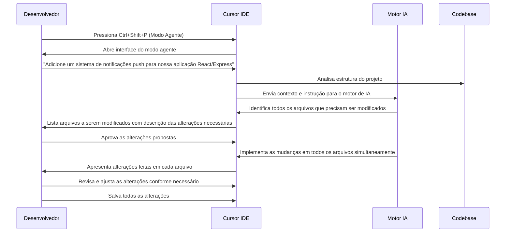

# 🧩 Caso de Uso 9: Edição Simultânea de Múltiplos Arquivos

## 📋 Descrição

Uma das características mais poderosas do Cursor IDE é sua capacidade de editar múltiplos arquivos simultaneamente com assistência de IA. Essa funcionalidade permite que desenvolvedores implementem mudanças que atravessam várias partes do codebase sem precisar navegar manualmente entre arquivos, reduzindo significativamente o tempo e o esforço necessários para modificações que afetam várias partes do projeto.

## 🎯 Cenário

Um desenvolvedor precisa implementar uma nova funcionalidade que requer alterações em vários arquivos do projeto: um componente de interface, um serviço de API, um modelo de dados e um arquivo de configuração. Em vez de modificar cada arquivo separadamente, o desenvolvedor utiliza o Cursor IDE para descrever a mudança que deseja fazer e deixa a IA identificar e modificar todos os arquivos relevantes de uma só vez.

## 🔄 Fluxo de Trabalho



## 💻 Exemplo de Implementação

### Solicitação do Desenvolvedor:
```
Adicione um sistema de notificações push à nossa aplicação React/Express. 
Precisamos:
1. Criar um novo modelo de Notificação no backend
2. Adicionar endpoints de API para gerenciar notificações
3. Criar um componente NotificationBell na interface
4. Implementar um sistema de subscrição ao service worker
5. Atualizar as configurações necessárias
```

### Análise do Cursor IDE:

```
Analisando seu projeto, precisarei modificar os seguintes arquivos:

📄 Backend:
- models/Notification.js (novo arquivo)
- routes/notifications.js (novo arquivo)
- controllers/notificationController.js (novo arquivo)
- services/pushService.js (novo arquivo)
- app.js (atualizar para incluir novas rotas)

📄 Frontend:
- src/components/NotificationBell.jsx (novo arquivo)
- src/services/notificationService.js (novo arquivo)
- src/context/NotificationContext.jsx (novo arquivo)
- src/App.jsx (atualizar para incluir o componente e contexto)
- public/service-worker.js (atualizar para suportar notificações push)
- public/manifest.json (atualizar com permissões)

Deseja prosseguir com essas alterações?
```

### Resultado Final

Após aprovar as alterações propostas, o Cursor IDE implementa as mudanças em todos os arquivos simultaneamente, criando novos arquivos e modificando os existentes conforme necessário. O sistema completo de notificações push é adicionado ao projeto com apenas uma única solicitação ao assistente de IA.

Este processo que normalmente exigiria horas de trabalho navegando entre arquivos, consultando documentação e garantindo coerência entre os componentes, é concluído em minutos com o Cursor IDE.

## 💡 Dicas

1. **Seja específico nas suas solicitações**: Descreva claramente a funcionalidade que deseja implementar, incluindo todas as partes do sistema que precisam ser modificadas.

2. **Revise as mudanças propostas**: Antes de aprovar as alterações, revise a lista de arquivos que serão afetados para garantir que todas as partes do sistema serão abordadas.

3. **Entenda o contexto do projeto**: O Cursor IDE funciona melhor quando tem um bom entendimento da estrutura do seu projeto. Forneça contexto adicional se necessário.

4. **Combine com conhecimento humano**: Após a implementação automatizada, revise as alterações e faça ajustes finos para garantir que estão alinhadas com as práticas específicas do seu projeto.

5. **Use para tarefas repetitivas ou padronizadas**: O modo multi-arquivo é especialmente útil para implementar padrões que se repetem em diferentes partes do sistema.

## 🔗 Recursos Adicionais

- [Documentação do Modo Agente do Cursor IDE](https://cursor.sh/docs/agent-mode)
- [Melhores práticas para edição multi-arquivo](https://cursor.sh/blog/multi-file-editing)
- [Estudo de caso: Implementação de sistema complexo com Cursor IDE](https://cursor.sh/case-studies/multi-file-implementation)


