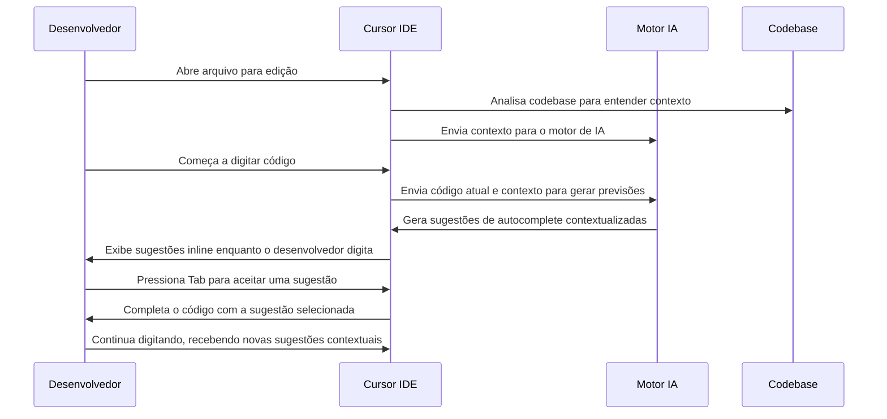

# 🔍 Caso de Uso 10: Autocomplete Avançado com Inteligência Contextual

## 📋 Descrição

O Cursor IDE oferece um sistema de autocomplete que vai muito além dos tradicionais sistemas baseados em regras ou análise sintática. Utilizando modelos de linguagem avançados, o Cursor consegue entender profundamente o contexto do código, incluindo a estrutura do projeto, padrões de design utilizados, e até mesmo a intenção do desenvolvedor, proporcionando sugestões de código que são não apenas sintaticamente corretas, mas semanticamente relevantes e alinhadas com o estilo e padrões do projeto.

## 🎯 Cenário

Um desenvolvedor está trabalhando em um projeto complexo e precisa implementar novas funcionalidades que seguem padrões e convenções específicas já estabelecidas no codebase. Em vez de ter que memorizar todos os detalhes da implementação ou consultar constantemente outras partes do código, o desenvolvedor utiliza o recurso de autocomplete avançado do Cursor para receber sugestões contextuais que respeitam as convenções do projeto.

## 🔄 Fluxo de Trabalho



## 💻 Exemplo de Implementação

### Cenário 1: Desenvolvimento com React Hooks

Um desenvolvedor está trabalhando em um componente React e precisa implementar um hook de estado e efeito:

```jsx
// O desenvolvedor começa digitando apenas isto:
import React from 'react';

function UserProfile({ userId }) {
  // O cursor está aqui
```

### Sugestão do Cursor IDE:

```jsx
import React, { useState, useEffect } from 'react';

function UserProfile({ userId }) {
  const [user, setUser] = useState(null);
  const [loading, setLoading] = useState(true);
  const [error, setError] = useState(null);

  useEffect(() => {
    const fetchUserProfile = async () => {
      try {
        setLoading(true);
        setError(null);
        
        const response = await fetch(`/api/users/${userId}`);
        
        if (!response.ok) {
          throw new Error('Failed to fetch user profile');
        }
        
        const userData = await response.json();
        setUser(userData);
      } catch (err) {
        console.error('Error fetching user profile:', err);
        setError(err.message);
      } finally {
        setLoading(false);
      }
    };

    if (userId) {
      fetchUserProfile();
    }
    
    return () => {
      // Cleanup function if needed
    };
  }, [userId]);

  // Render component based on state
}
```

O desenvolvedor pode aceitar toda a sugestão ou apenas partes dela, e o Cursor continuará oferecendo sugestões contextuais à medida que o desenvolvedor continua digitando.

### Cenário 2: Padrões Específicos da Base de Código

Considere um projeto com padrões específicos para criação de serviços:

```javascript
// Padrão existente no projeto:
// services/userService.js
export const userService = {
  async getAll() {
    const response = await api.get('/users');
    return response.data;
  },
  
  async getById(id) {
    const response = await api.get(`/users/${id}`);
    return response.data;
  },
  
  async create(userData) {
    const response = await api.post('/users', userData);
    return response.data;
  },
  
  async update(id, userData) {
    const response = await api.put(`/users/${id}`, userData);
    return response.data;
  },
  
  async delete(id) {
    await api.delete(`/users/${id}`);
  }
};
```

Agora, o desenvolvedor começa a criar um novo serviço para produtos:

```javascript
// O desenvolvedor começa digitando apenas isto:
import { api } from '../config/api';

export const productService = {
  // O cursor está aqui
```

### Sugestão do Cursor IDE:

```javascript
import { api } from '../config/api';

export const productService = {
  async getAll() {
    const response = await api.get('/products');
    return response.data;
  },
  
  async getById(id) {
    const response = await api.get(`/products/${id}`);
    return response.data;
  },
  
  async create(productData) {
    const response = await api.post('/products', productData);
    return response.data;
  },
  
  async update(id, productData) {
    const response = await api.put(`/products/${id}`, productData);
    return response.data;
  },
  
  async delete(id) {
    await api.delete(`/products/${id}`);
  },
  
  async getByCategory(categoryId) {
    const response = await api.get(`/products/category/${categoryId}`);
    return response.data;
  }
};
```

O Cursor identificou o padrão de serviço usado no projeto e criou automaticamente métodos similares para o novo serviço de produtos, inclusive adaptando nomes de variáveis e endpoints.

## 💡 Dicas

1. **Aproveite o conhecimento contextual**: O autocomplete do Cursor entende não apenas o arquivo atual, mas também a estrutura do projeto e outros arquivos relacionados.

2. **Use sugestões como ponto de partida**: Mesmo que a sugestão não seja exatamente o que você precisa, frequentemente é mais rápido aceitar a sugestão e editá-la do que escrever tudo do zero.

3. **Aprenda com as sugestões**: As sugestões do Cursor frequentemente incorporam boas práticas e padrões, o que pode ser educativo para desenvolvedores menos experientes.

4. **Combine com escrita manual**: Para código mais especializado ou único, você pode combinar sugestões automáticas com escrita manual para obter o resultado desejado.

5. **Verifique as importações**: O Cursor frequentemente adiciona importações necessárias automaticamente, mas sempre confira se todas as dependências foram corretamente importadas.

## 🔗 Recursos Adicionais

- [Documentação do autocomplete do Cursor IDE](https://cursor.sh/docs/autocomplete)
- [Como personalizar as sugestões de autocomplete](https://cursor.sh/blog/custom-autocomplete)
- [Comparação entre o autocomplete do Cursor e outras IDEs](https://cursor.sh/blog/autocomplete-comparison)


