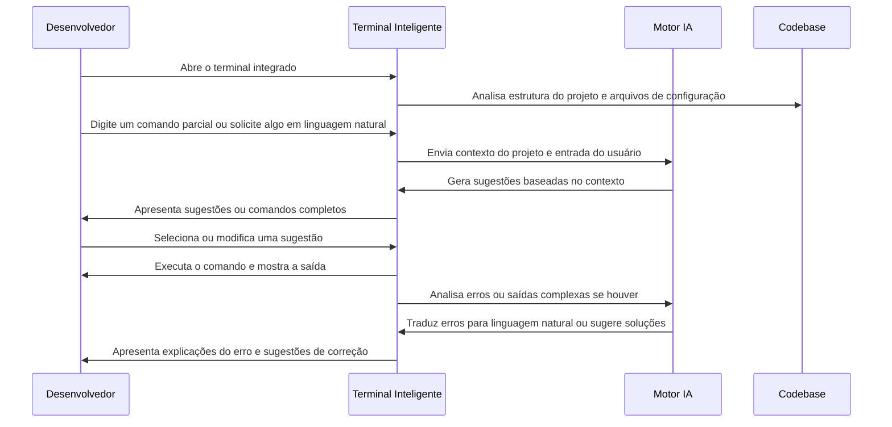

# 🖥️ Caso de Uso 11: Terminal Inteligente com Sugestões Contextuais

## 📋 Descrição

O Terminal Inteligente do Cursor IDE representa uma evolução significativa na interação entre desenvolvedores e a linha de comando. Combinando o poder do terminal tradicional com assistência de IA, o Cursor oferece sugestões contextuais de comandos, auxilia na correção de erros e permite uma interação em linguagem natural com o ambiente de desenvolvimento, tornando o terminal mais acessível e produtivo.

## 🎯 Cenário

Um desenvolvedor está trabalhando em um projeto com um conjunto complexo de scripts e comandos personalizados, além de ferramentas de linha de comando para diferentes aspectos do desenvolvimento, como Docker, Git, ferramentas de build e testes. Em vez de precisar memorizar ou consultar documentação para todos esses comandos, o desenvolvedor utiliza o Terminal Inteligente do Cursor para receber sugestões contextuais e até mesmo solicitar comandos em linguagem natural.

## 🔄 Fluxo de Trabalho



## 💻 Exemplo de Implementação

### Cenário 1: Sugestões de Comandos Git Contextuais

```bash
# O desenvolvedor começa digitando:
$ git
```

### Sugestões do Terminal Inteligente:

```bash
$ git status                     # Verificar arquivos modificados (recomendado)
$ git checkout feature/user-auth # Mudar para a branch em que você estava trabalhando antes
$ git pull origin main           # Atualizar sua branch com alterações recentes
$ git add src/components/        # Adicionar os arquivos que você modificou recentemente
$ git commit -m "                # Criar um novo commit com suas alterações
```

O Terminal Inteligente prioriza sugestões baseadas no histórico do desenvolvedor, padrões de trabalho e estado atual do repositório.

### Cenário 2: Depuração e Explicação de Erros

O desenvolvedor recebe um erro ao executar um comando:

```bash
$ npm run build

> my-project@1.0.0 build
> webpack --config webpack.config.js

ERROR in ./src/components/UserProfile.jsx
Module not found: Error: Can't resolve '@material-ui/core' in '/home/user/projects/my-project/src/components'
```

### Resposta do Terminal Inteligente:

```
📋 Análise do Erro:
O webpack não consegue encontrar o pacote '@material-ui/core' que é importado no arquivo UserProfile.jsx.

🛠️ Possíveis Soluções:
1. Instalar o pacote @material-ui/core:
   $ npm install @material-ui/core

2. Se você estiver migrando para MUI v5, use o novo pacote:
   $ npm install @mui/material @emotion/react @emotion/styled

3. Verificar seu package.json para ver se o pacote já está declarado mas não instalado:
   $ cat package.json | grep material

⚡ Executar solução (digite o número):
```

### Cenário 3: Comandos em Linguagem Natural

```bash
# O desenvolvedor digita:
$ #? como faço para iniciar o ambiente de desenvolvimento docker deste projeto
```

### Resposta do Terminal Inteligente:

```
Baseado no seu docker-compose.yml, você pode iniciar o ambiente de desenvolvimento com:

$ docker-compose up -d

Este comando irá iniciar os seguintes serviços:
- app: Aplicação Node.js na porta 3000
- db: MongoDB na porta 27017
- redis: Redis na porta 6379

Para ver os logs da aplicação em tempo real após iniciar:
$ docker-compose logs -f app

Para parar todos os serviços depois:
$ docker-compose down

Deseja executar o comando 'docker-compose up -d' agora? [S/n]
```

### Cenário 4: Ajuda com Comandos Complexos

```bash
# O desenvolvedor precisa executar um find complexo
$ #? encontrar todos os arquivos JavaScript modificados na última semana que contêm a palavra "authenticate"
```

### Resposta do Terminal Inteligente:

```
Aqui está o comando para encontrar arquivos JavaScript modificados na última semana que contêm "authenticate":

$ find . -name "*.js" -type f -mtime -7 -exec grep -l "authenticate" {} \;

Explicação do comando:
- find . → Procurar a partir do diretório atual
- -name "*.js" → Apenas arquivos JavaScript
- -type f → Apenas arquivos (não diretórios)
- -mtime -7 → Modificados nos últimos 7 dias
- -exec grep -l "authenticate" {} \; → Executar grep para encontrar o texto

Deseja executar este comando? [S/n]
```

## 💡 Dicas

1. **Use a sintaxe especial (#?)**: Para perguntas em linguagem natural, inicie sua entrada com #? para indicar que está perguntando algo ao invés de executar um comando.

2. **Aproveite as sugestões contextuais**: O Terminal Inteligente analisa seu projeto para oferecer sugestões relevantes para seu ambiente específico.

3. **Peça explicações de erros**: Quando encontrar erros, pergunte ao terminal o que está acontecendo e como resolver, em vez de pesquisar na web.

4. **Combine com comandos tradicionais**: Você não precisa usar apenas a funcionalidade de IA - o Terminal Inteligente funciona como um terminal normal com recursos adicionais.

5. **Aprenda com as sugestões**: Observe os comandos sugeridos para aprender práticas e atalhos que você pode não conhecer.

## 🔗 Recursos Adicionais

- [Documentação do Terminal Inteligente](https://cursor.sh/docs/terminal)
- [Comandos especiais do Terminal Inteligente](https://cursor.sh/blog/terminal-special-commands)
- [Como personalizar o comportamento do Terminal Inteligente](https://cursor.sh/tutorials/custom-terminal)


