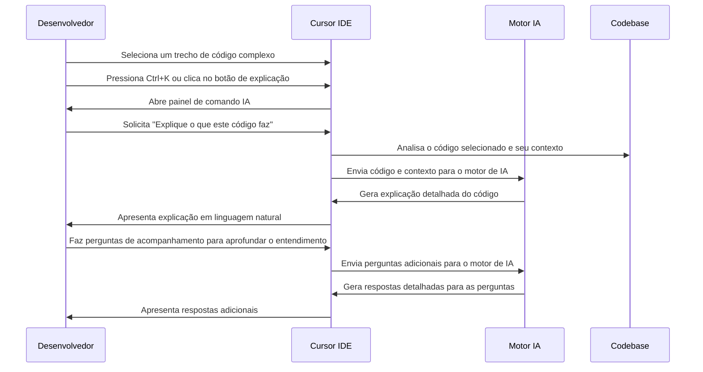

# 📚 Caso de Uso 12: Explicação de Código Inteligente

## 📋 Descrição

Compreender código complexo, especialmente em uma base de código extensa ou ao trabalhar com tecnologias desconhecidas, pode ser um desafio significativo para desenvolvedores. O Cursor IDE oferece um recurso de explicação de código que vai além de simples comentários, fornecendo insights detalhados sobre a funcionalidade, a lógica e a intenção por trás do código, ajudando desenvolvedores a entender rapidamente código complexo e acelerar a integração em novos projetos.

## 🎯 Cenário

Um desenvolvedor começou a trabalhar em um projeto existente com uma base de código substancial e encontrou seções de código que utilizam padrões, bibliotecas ou algoritmos com os quais não está familiarizado. Em vez de passar horas tentando decifrar a lógica por tentativa e erro ou pesquisar extensivamente, o desenvolvedor utiliza o recurso de explicação de código do Cursor para rapidamente entender o propósito e o funcionamento do código.

## 🔄 Fluxo de Trabalho



## 💻 Exemplo de Implementação

### Código Complexo a ser Explicado:

```javascript
const memoize = (fn) => {
  const cache = new Map();
  return (...args) => {
    const key = JSON.stringify(args);
    if (cache.has(key)) {
      return cache.get(key);
    }
    const result = fn(...args);
    cache.set(key, result);
    return result;
  };
};

const fibonacci = memoize((n) => {
  if (n <= 1) return n;
  return fibonacci(n - 1) + fibonacci(n - 2);
});

// Calculando fibonacci(100)
console.time('fibonacci');
const result = fibonacci(100);
console.timeEnd('fibonacci');
console.log(`fibonacci(100) = ${result}`);
```

### Solicitação do Desenvolvedor:
```
Explique o que este código faz e por que ele foi estruturado desta forma.
```

### Explicação do Cursor IDE:

```
# Explicação do Código: Fibonacci Memoizado

## Visão Geral
Este código calcula o 100º número da sequência de Fibonacci utilizando uma técnica de otimização chamada "memoização", que torna o cálculo exponencialmente mais rápido.

## Componentes Principais

### 1️⃣ Função `memoize`
```javascript
const memoize = (fn) => {
  const cache = new Map();
  return (...args) => {
    const key = JSON.stringify(args);
    if (cache.has(key)) {
      return cache.get(key);
    }
    const result = fn(...args);
    cache.set(key, result);
    return result;
  };
};
```

Esta é uma função de ordem superior (higher-order function) que implementa a técnica de memoização:

- Ela recebe uma função `fn` como argumento
- Cria um cache (usando `Map`) para armazenar resultados de chamadas anteriores
- Retorna uma nova função que:
  - Converte os argumentos em uma string para usar como chave de cache
  - Verifica se o resultado já está em cache e o retorna se estiver
  - Se não estiver em cache, executa a função original, armazena o resultado e o retorna

### 2️⃣ Função `fibonacci` Memoizada
```javascript
const fibonacci = memoize((n) => {
  if (n <= 1) return n;
  return fibonacci(n - 1) + fibonacci(n - 2);
});
```

- Define a função recursiva de Fibonacci clássica, que retorna:
  - `n` se for 0 ou 1
  - A soma de `fibonacci(n-1)` e `fibonacci(n-2)` para outros valores
- A função é passada para `memoize` para criar uma versão otimizada

### 3️⃣ Execução e Medição de Desempenho
```javascript
console.time('fibonacci');
const result = fibonacci(100);
console.timeEnd('fibonacci');
console.log(`fibonacci(100) = ${result}`);
```

- Mede o tempo de execução usando `console.time/timeEnd`
- Calcula `fibonacci(100)` e exibe o resultado

## Por que esta estrutura é importante

1. **Eficiência Computacional**: Sem memoização, o cálculo de Fibonacci recursivo teria complexidade O(2^n), tornando `fibonacci(100)` computacionalmente inviável (levaria eras).

2. **Com memoização**, a complexidade é reduzida para O(n), permitindo calcular valores altos como 100 em milissegundos.

3. **Padrão de Design**: Esta implementação demonstra o padrão "Decorator", onde `memoize` adiciona funcionalidade (cache) à função original sem modificá-la.

4. **Reutilização**: A função `memoize` é genérica e pode ser aplicada a qualquer função para melhorar seu desempenho em cálculos repetitivos.

## Observações

- O resultado de `fibonacci(100)` será um número muito grande, que pode exceder o limite de precisão do JavaScript para inteiros (causa imprecisões após 2^53 - 1).

- Para valores ainda maiores, seria necessário usar uma biblioteca de matemática de precisão arbitrária.
```

### Pergunta de Acompanhamento do Desenvolvedor:
```
Por que o código usa JSON.stringify() para criar a chave de cache?
```

### Resposta do Cursor IDE:

```
# Por que usar JSON.stringify() para chaves de cache

`JSON.stringify()` é usado para criar chaves para o Map de cache por várias razões importantes:

## 1️⃣ Conversão de Argumentos Complexos para Strings

O método `Map.set()` em JavaScript precisa de uma chave que possa ser comparada por igualdade. Quando lidamos com múltiplos argumentos ou argumentos complexos (como objetos ou arrays), precisamos de uma forma consistente de transformá-los em uma string única.

```javascript
const key = JSON.stringify(args);
```

Aqui, `args` é um array de todos os argumentos passados para a função memoizada. `JSON.stringify()` converte esse array (e todos os objetos/arrays aninhados) em uma representação de string.

## 2️⃣ Uniformidade nas Comparações

Ao usar `JSON.stringify()`:

- `memoize((a, b) => a + b)(1, 2)` gera a chave `"[1,2]"`
- `memoize((a, b) => a + b)(1, 2)` em uma segunda chamada gera a mesma chave
- Isso permite recuperar valores do cache consistentemente

## 3️⃣ Alternativas e Suas Limitações

Alternativas a `JSON.stringify()` teriam problemas:

- **Usando o array diretamente**: Não funcionaria porque `[1,2] === [1,2]` é `false` em JavaScript (comparação de referência)
- **Usando `toString()`**: `[1,2].toString()` produz `"1,2"`, que é ambíguo (não distingue entre `[1,2]` e `["1,2"]`)
- **Concatenação simples**: `1 + "," + 2` não capturaria a estrutura de objetos complexos

## 4️⃣ Limitações da Abordagem

Esta abordagem tem algumas limitações:

- **Funções como Argumentos**: `JSON.stringify()` não serializa funções, então `memoize` não funcionaria corretamente se a função recebesse funções como argumentos
- **Objetos Circulares**: `JSON.stringify()` falha com objetos que têm referências circulares
- **Objetos com Métodos**: Métodos em objetos são perdidos durante a serialização

## 5️⃣ Alternativas Mais Robustas

Em sistemas mais complexos, podem ser usadas alternativas como:

- Bibliotecas de hashing para criar chaves mais robustas
- WeakMap para permitir que objetos sejam coletados pelo garbage collector
- Cache com capacidade limitada (LRU) para evitar vazamentos de memória em aplicações de longa duração
```

## 💡 Dicas

1. **Use para código não familiar**: Quando trabalhar com código-fonte de terceiros ou em projetos grandes, use a explicação para entender rapidamente componentes complexos.

2. **Aprenda novos padrões e técnicas**: Solicite explicações de código que implementam técnicas avançadas para expandir seu conhecimento.

3. **Solicite explicações específicas**: Em vez de pedir apenas "explique este código", faça perguntas específicas como "como este algoritmo de ordenação funciona?" ou "quais padrões de design estão sendo aplicados aqui?".

4. **Use para onboarding de desenvolvedores**: Novos membros da equipe podem usar as explicações para se familiarizarem com a base de código mais rapidamente.

5. **Combine com refatoração**: Após entender o código através das explicações, você pode usar outros recursos do Cursor para refatorá-lo e melhorá-lo.

## 🔗 Recursos Adicionais

- [Documentação do recurso de explicação de código](https://cursor.sh/docs/code-explanation)
- [Como entender código legado com ajuda da IA](https://cursor.sh/blog/understanding-legacy-code)
- [Guia para onboarding com Cursor IDE](https://cursor.sh/tutorials/onboarding-with-cursor)


