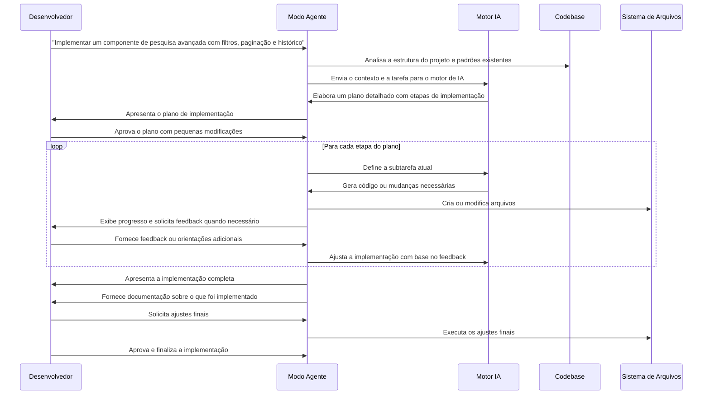

# 🤖 Caso de Uso 13: Modo Agente para Tarefas Complexas

## 📋 Descrição

O Modo Agente do Cursor IDE representa um avanço significativo na forma como desenvolvedores interagem com ferramentas de programação. Em vez de apenas sugerir ou completar código, o Modo Agente permite que a IA aja como um verdadeiro assistente de desenvolvimento, capaz de executar tarefas complexas de forma autônoma enquanto mantém o desenvolvedor no controle. Este recurso permite delegar tarefas completas ao IDE, que pode analisar requisitos, planejar uma abordagem, executar as alterações necessárias e explicar suas decisões.

## 🎯 Cenário

Um desenvolvedor precisa implementar uma funcionalidade complexa que envolve diversos componentes e etapas. Em vez de implementar manualmente cada parte da funcionalidade, o desenvolvedor descreve em alto nível o que precisa ser feito e utiliza o Modo Agente do Cursor IDE para planejar e executar a implementação, intervindo apenas quando necessário para orientar ou ajustar o trabalho da IA.

## 🔄 Fluxo de Trabalho



## 💻 Exemplo de Implementação

### Solicitação do Desenvolvedor:
```
Desenvolva um sistema de autenticação completo para nossa aplicação React/Node.js, incluindo:
1. Registro de usuário com validação
2. Login com JWT
3. Reset de senha por email
4. Proteção de rotas no frontend
5. Middleware de autenticação no backend

Siga nosso padrão atual de projeto e pasta src/features para organizar os componentes.
```

### Resposta Inicial do Modo Agente:

```
# Plano de Implementação: Sistema de Autenticação

Vou implementar um sistema de autenticação completo seguindo a arquitetura atual do projeto e organizando os componentes na pasta `src/features`. Aqui está o plano detalhado:

## 1. Estrutura de Arquivos

### Backend (Node.js/Express)
```
src/
  features/
    auth/
      controllers/
        authController.js       # Lógica de autenticação
      middleware/
        authMiddleware.js       # Middleware de proteção de rotas
      models/
        User.js                 # Modelo de usuário
      services/
        emailService.js         # Serviço para envio de emails
        tokenService.js         # Serviço para gerenciamento de tokens
      validations/
        authValidation.js       # Regras de validação
      routes.js                 # Definição de rotas
```

### Frontend (React)
```
src/
  features/
    auth/
      components/
        LoginForm.jsx
        RegisterForm.jsx
        ForgotPasswordForm.jsx
        ResetPasswordForm.jsx
      hooks/
        useAuth.js              # Hook personalizado para autenticação
      context/
        AuthContext.jsx         # Contexto de autenticação
      services/
        authService.js          # Serviço para chamadas de API
      utils/
        authUtils.js            # Utilitários para autenticação
      routes/
        ProtectedRoute.jsx      # Componente para proteção de rotas
```

## 2. Plano de Execução

1. **Backend**:
   - Criar modelo de usuário com campos para email, senha (hash), status
   - Implementar controladores para registro, login, reset de senha
   - Desenvolver middleware de autenticação usando JWT
   - Configurar serviço de email para recuperação de senha
   - Implementar validações para entrada de usuário

2. **Frontend**:
   - Criar contexto de autenticação para gerenciamento de estado
   - Desenvolver formulários para registro, login e recuperação de senha
   - Implementar proteção de rotas com redirecionamento
   - Configurar interceptores para anexar tokens JWT às requisições

## 3. Fluxos de Autenticação

- **Registro**: Validação -> Hash de senha -> Persistência -> Envio de email de confirmação
- **Login**: Validação -> Verificação de credenciais -> Geração de JWT -> Armazenamento em localStorage
- **Reset de Senha**: Solicitação -> Envio de email com token -> Validação de token -> Atualização de senha

## 4. Dependências Necessárias

- **Backend**: jsonwebtoken, bcrypt, nodemailer, express-validator
- **Frontend**: axios, react-hook-form, yup ou zod para validação

Devo prosseguir com esta implementação ou gostaria de ajustar algo no plano?
```

### Resposta do Desenvolvedor:
```
O plano parece bom, mas tenha em mente que já usamos bcryptjs em vez de bcrypt no projeto e para validação no frontend usamos Formik com Yup. Também preferimos Context API para gerenciamento de estado. Pode prosseguir com essas considerações.
```

### Implementação do Modo Agente (exemplo parcial):

O Modo Agente começa a implementar o sistema de autenticação seguindo o plano e as considerações do desenvolvedor. Aqui está uma parte da implementação para o modelo de usuário e o controlador de autenticação:

#### models/User.js
```javascript
const mongoose = require('mongoose');
const bcryptjs = require('bcryptjs');

const UserSchema = new mongoose.Schema({
  name: {
    type: String,
    required: [true, 'Por favor informe seu nome'],
    trim: true,
    maxlength: [50, 'Nome não pode ter mais que 50 caracteres']
  },
  email: {
    type: String,
    required: [true, 'Por favor informe seu email'],
    unique: true,
    match: [
      /^([\w-\.]+@([\w-]+\.)+[\w-]{2,4})?$/,
      'Por favor informe um email válido'
    ]
  },
  password: {
    type: String,
    required: [true, 'Por favor informe uma senha'],
    minlength: [6, 'Senha deve ter pelo menos 6 caracteres'],
    select: false
  },
  resetPasswordToken: String,
  resetPasswordExpire: Date,
  emailVerificationToken: String,
  isEmailVerified: {
    type: Boolean,
    default: false
  },
  createdAt: {
    type: Date,
    default: Date.now
  }
});

// Criptografar senha antes de salvar
UserSchema.pre('save', async function(next) {
  // Só executa se a senha foi modificada
  if (!this.isModified('password')) {
    next();
  }

  const salt = await bcryptjs.genSalt(10);
  this.password = await bcryptjs.hash(this.password, salt);
  next();
});

// Método para comparar senha
UserSchema.methods.matchPassword = async function(enteredPassword) {
  return await bcryptjs.compare(enteredPassword, this.password);
};

// Método para gerar token de reset de senha
UserSchema.methods.getResetPasswordToken = function() {
  // Implementação do token...
};

module.exports = mongoose.model('User', UserSchema);
```

#### controllers/authController.js
```javascript
const crypto = require('crypto');
const User = require('../models/User');
const tokenService = require('../services/tokenService');
const emailService = require('../services/emailService');
const ErrorResponse = require('../../utils/errorResponse');
const asyncHandler = require('../../middleware/asyncHandler');

// @desc    Registrar usuário
// @route   POST /api/auth/register
// @access  Public
exports.register = asyncHandler(async (req, res, next) => {
  const { name, email, password } = req.body;

  // Verificar se o usuário já existe
  const userExists = await User.findOne({ email });
  
  if (userExists) {
    return next(new ErrorResponse('Email já está em uso', 400));
  }

  // Criar token de verificação de email
  const emailVerificationToken = crypto
    .randomBytes(20)
    .toString('hex');

  // Criar usuário
  const user = await User.create({
    name,
    email,
    password,
    emailVerificationToken
  });

  // Enviar email de verificação
  await emailService.sendVerificationEmail(user, emailVerificationToken);

  // Gerar token JWT
  sendTokenResponse(user, 201, res);
});

// @desc    Login de usuário
// @route   POST /api/auth/login
// @access  Public
exports.login = asyncHandler(async (req, res, next) => {
  const { email, password } = req.body;

  // Validar email e senha
  if (!email || !password) {
    return next(new ErrorResponse('Por favor informe email e senha', 400));
  }

  // Verificar usuário
  const user = await User.findOne({ email }).select('+password');

  if (!user) {
    return next(new ErrorResponse('Credenciais inválidas', 401));
  }

  // Verificar se a senha corresponde
  const isMatch = await user.matchPassword(password);

  if (!isMatch) {
    return next(new ErrorResponse('Credenciais inválidas', 401));
  }

  // Gerar token JWT
  sendTokenResponse(user, 200, res);
});

// ... implementações de logout, reset de senha, etc.

// Helper para enviar resposta com token
const sendTokenResponse = (user, statusCode, res) => {
  // Criar token
  const token = tokenService.generateJWT(user);

  res.status(statusCode).json({
    success: true,
    token
  });
};
```

E assim por diante, o Modo Agente continua implementando todos os componentes necessários, criando arquivos e atualizando o código existente, interagindo com o desenvolvedor quando necessário para esclarecimentos ou feedback sobre decisões de implementação.

## 💡 Dicas

1. **Seja específico nos requisitos**: Quanto mais detalhada for sua solicitação, incluindo padrões de projeto e considerações específicas, melhor será o resultado do Modo Agente.

2. **Revise o plano cuidadosamente**: Sempre revise o plano proposto pelo agente antes de autorizar a implementação, garantindo que ele está alinhado com suas expectativas.

3. **Forneça feedback iterativo**: Em vez de esperar até o final da implementação, forneça feedback durante o processo para ajustar o curso conforme necessário.

4. **Combine com conhecimento humano**: O Modo Agente é mais eficaz quando trabalhando em conjunto com desenvolvedores que conhecem bem o domínio do problema.

5. **Use para tarefas repetitivas**: O Modo Agente é especialmente útil para implementar padrões recorrentes ou boilerplate, permitindo que você foque em problemas mais complexos e criativos.

## 🔗 Recursos Adicionais

- [Documentação completa do Modo Agente](https://cursor.sh/docs/agent-mode)
- [Melhores práticas para prompts de engenharia com o Modo Agente](https://cursor.sh/blog/agent-mode-prompts)
- [Estudos de caso: Implementações complexas com o Modo Agente](https://cursor.sh/case-studies/agent-mode)


