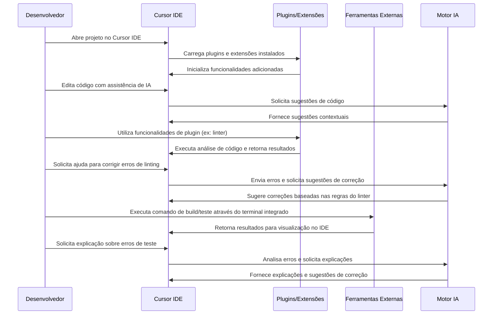

# 🔌 Caso de Uso 14: Integração com Ferramentas e Plugins

## 📋 Descrição

O Cursor IDE não é apenas um editor de código poderoso, mas também uma plataforma extensível que se integra perfeitamente com uma ampla gama de ferramentas, frameworks e plugins. Essa capacidade de integração permite que desenvolvedores personalizem seu ambiente de trabalho de acordo com suas necessidades específicas, mantendo a produtividade e a familiaridade com suas ferramentas favoritas, enquanto ainda aproveitam os recursos avançados de IA do Cursor.

## 🎯 Cenário

Um desenvolvedor está trabalhando em um projeto que utiliza várias ferramentas e extensões específicas, como linters, formatadores, sistemas de controle de versão, testadores, frameworks e plugins que já fazem parte de seu fluxo de trabalho. Em vez de abandonar essas ferramentas ou alternar entre diferentes ambientes, o desenvolvedor utiliza o Cursor IDE como plataforma central, aproveitando suas integrações nativas e compatibilidade com plugins existentes.

## 🔄 Fluxo de Trabalho



## 💻 Exemplo de Implementação

### Cenário 1: Integração com ESLint e Prettier

Um desenvolvedor trabalha em um projeto React que utiliza ESLint para linting e Prettier para formatação de código. O Cursor IDE se integra perfeitamente com essas ferramentas, permitindo tanto o uso tradicional quanto aprimoramentos com IA.

#### Configuração no Cursor IDE:

1. Instalar extensões do ESLint e Prettier (compatível com VS Code)
2. Configurar arquivos `.eslintrc.js` e `.prettierrc` no projeto
3. Habilitar formatação automática ao salvar (como no VS Code)

```javascript
// .eslintrc.js
module.exports = {
  "env": {
    "browser": true,
    "es2021": true,
    "node": true
  },
  "extends": [
    "eslint:recommended",
    "plugin:react/recommended",
    "plugin:react-hooks/recommended",
    "prettier"
  ],
  "parserOptions": {
    "ecmaFeatures": {
      "jsx": true
    },
    "ecmaVersion": 12,
    "sourceType": "module"
  },
  "plugins": [
    "react",
    "react-hooks"
  ],
  "rules": {
    "react/prop-types": "off",
    "react-hooks/rules-of-hooks": "error",
    "react-hooks/exhaustive-deps": "warn"
  }
};
```

```json
// .prettierrc
{
  "semi": true,
  "singleQuote": true,
  "tabWidth": 2,
  "trailingComma": "es5",
  "printWidth": 80,
  "bracketSpacing": true,
  "arrowParens": "avoid"
}
```

#### Interação aprimorada com IA:

```
// Código com problemas de linting
const Component = (props) => {
  const [state, setState] = React.useState()
  
  React.useEffect(() => {
    // Este hook tem dependências ausentes
    const fetchData = async() => {
      const response = await fetch('/api/data/' + props.id)
      const data = await response.json()
      setState(data)
    }
    
    fetchData()
  }, [])
  
  return <div>{state && state.name}</div>
}
```

#### Fluxo de Trabalho no Cursor IDE:

1. O ESLint detecta e sublinha problemas no código
2. O desenvolvedor pode clicar no erro e solicitar à IA uma explicação detalhada:

```
Erro: React Hook useEffect has a missing dependency: 'props.id'. Either include it or remove the dependency array. (react-hooks/exhaustive-deps)
```

3. Resposta do Cursor IDE:

```
Este erro ocorre porque você está usando `props.id` dentro do seu hook useEffect, mas não o incluiu no array de dependências.

O hook useEffect deve listar todas as variáveis externas que são usadas dentro dele. Quando essas dependências mudam, o efeito é executado novamente.

No seu caso:
1. Você está usando `props.id` na URL da requisição
2. Se props.id mudar, você provavelmente quer buscar novos dados
3. Mas como props.id não está no array de dependências, o efeito não será executado quando props.id mudar

Correção recomendada:
```javascript
React.useEffect(() => {
  const fetchData = async() => {
    const response = await fetch('/api/data/' + props.id)
    const data = await response.json()
    setState(data)
  }
  
  fetchData()
}, [props.id]) // Adicionado props.id como dependência
```

Esta correção garante que seu componente busque dados novamente sempre que props.id mudar.
```

4. O desenvolvedor pode aplicar a correção com um clique ou solicitar mais explicações

### Cenário 2: Integração com Jest para Testes

O Cursor IDE se integra com o Jest, permitindo executar e depurar testes diretamente no editor, além de fornecer assistência específica para testes.

#### Código de teste com falha:

```javascript
// Button.test.js
import React from 'react';
import { render, fireEvent } from '@testing-library/react';
import Button from './Button';

describe('Button component', () => {
  test('should call onClick when clicked', () => {
    const handleClick = jest.fn();
    
    const { getByText } = render(
      <Button onClick={handleClick}>Click Me</Button>
    );
    
    const button = getByText('Click me');
    fireEvent.click(button);
    
    expect(handleClick).toHaveBeenCalledTimes(1);
  });
});
```

#### Terminal integrado no Cursor IDE:

```
FAIL  src/components/Button.test.js
  Button component
    ✕ should call onClick when clicked (39ms)

  ● Button component › should call onClick when clicked

    TestingLibraryElementError: Unable to find an element with the text: Click me. This could be because the text is broken up by multiple elements. In this case, you can provide a function for your text matcher to make your matcher more flexible.

    > 14 |     const button = getByText('Click me');
         |                    ^
```

#### Assistência IA do Cursor:

```
O teste está falhando porque há uma diferença de capitalização entre o texto do botão no componente e o texto procurado no teste.

No seu componente Button, você renderizou:
```jsx
<Button onClick={handleClick}>Click Me</Button>
```

Mas no teste, você está procurando por:
```javascript
const button = getByText('Click me');
```

Note que 'Click Me' (com 'M' maiúsculo) é diferente de 'Click me' (com 'm' minúsculo).

Você tem duas opções para corrigir isso:

1. Mudar o teste para corresponder ao componente:
```javascript
const button = getByText('Click Me');
```

2. Usar uma opção mais flexível para ignorar capitalização:
```javascript
const button = getByText('Click me', { exact: false });
```

A segunda opção é geralmente mais robusta contra pequenas variações de texto.
```

### Cenário 3: Integração com Git e GitHub

O Cursor IDE se integra nativamente com Git e oferece extensões para GitHub, GitLab e outros provedores. Além das funcionalidades tradicionais, o Cursor oferece assistência de IA para fluxos de trabalho Git.

#### Assistência para resolução de conflitos de merge:

Quando um desenvolvedor encontra conflitos de merge, o Cursor IDE não apenas destaca os conflitos, mas também oferece:

1. **Explicação do conflito**: Análise das alterações de ambos os lados
2. **Sugestões de resolução**: Código proposto para resolver o conflito
3. **Contextualização**: Explicação das implicações de cada escolha

```
<<<<<<<< HEAD
function calculateTotal(items) {
  return items.reduce((total, item) => {
    return total + (item.price * item.quantity);
  }, 0);
}
========
function calculateTotal(items, discount = 0) {
  const subtotal = items.reduce((total, item) => {
    return total + (item.price * item.quantity);
  }, 0);
  return subtotal * (1 - discount);
}
>>>>>>>> feature/discounts
```

#### Assistência do Cursor:

```
# Análise do Conflito de Merge

## O que mudou:
- Versão atual (HEAD): Implementa um cálculo básico de total, somando price * quantity para todos os itens
- Versão do feature/discounts: Adiciona suporte para um parâmetro de desconto opcional e aplica o desconto ao subtotal

## Recomendação de resolução:
A versão do branch feature/discounts é uma extensão da funcionalidade existente, adicionando suporte para descontos sem quebrar a funcionalidade existente (quando discount=0, o comportamento é o mesmo).

Sugestão de código resolvido:
```javascript
function calculateTotal(items, discount = 0) {
  const subtotal = items.reduce((total, item) => {
    return total + (item.price * item.quantity);
  }, 0);
  return subtotal * (1 - discount);
}
```

Isso mantém a nova funcionalidade de desconto enquanto preserva a compatibilidade com código existente que não passa um parâmetro de desconto.
```

#### Assistência para mensagens de commit:

O Cursor IDE pode gerar automaticamente mensagens de commit significativas analisando as alterações feitas:

```
# Alterações detectadas:
- 3 arquivos modificados em src/components/checkout/
- Adicionados campos para entrada de cupom de desconto
- Adicionada lógica para validar e aplicar descontos
- Adicionados testes para a nova funcionalidade

# Mensagem de commit sugerida:
feat(checkout): add discount coupon functionality

- Add discount input field to checkout form
- Implement coupon validation and discount calculation
- Update price display to show original and discounted prices
- Add unit tests for coupon validation and price calculation
```

## 💡 Dicas

1. **Migre suas extensões**: O Cursor IDE é compatível com a maioria das extensões do VS Code, facilitando a migração sem perder suas ferramentas favoritas.

2. **Aproveite as integrações nativas**: Muitas ferramentas populares como ESLint, Prettier, Jest, Git já têm integrações otimizadas no Cursor.

3. **Combine ferramentas tradicionais com IA**: Use o Cursor para obter explicações sobre erros, sugestões de resolução e otimizações de código produzidas por suas ferramentas.

4. **Personalize seu ambiente**: Utilize os mesmos atalhos de teclado, temas e configurações que você já está acostumado em outras IDEs.

5. **Explore extensões específicas de IA**: Procure por extensões que foram desenvolvidas especificamente para aproveitar os recursos de IA do Cursor para melhorar ainda mais sua produtividade.

## 🔗 Recursos Adicionais

- [Documentação de extensões compatíveis](https://cursor.sh/docs/extensions)
- [Guia de migração do VS Code para o Cursor](https://cursor.sh/blog/vscode-migration)
- [Integrações de ferramentas recomendadas](https://cursor.sh/blog/recommended-integrations)


