# 🔄 Caso de Uso 15: Tradução e Migração de Código

## 📋 Descrição

Migrar código entre linguagens de programação ou frameworks é uma tarefa desafiadora que normalmente exige conhecimento profundo de ambas as tecnologias e tempo considerável para reescrever manualmente o código. O Cursor IDE transforma esse processo com sua capacidade de traduzir código entre diferentes linguagens, frameworks e bibliotecas, mantendo a lógica e funcionalidade originais enquanto adapta o código para as convenções e padrões da tecnologia de destino.

## 🎯 Cenário

Uma empresa precisa migrar uma aplicação legada escrita em PHP para uma nova arquitetura baseada em Node.js/Express, ou transformar componentes de classe React em componentes funcionais com hooks. Em vez de reescrever todo o código manualmente, os desenvolvedores utilizam o Cursor IDE para traduzir e adaptar o código existente para a nova tecnologia, economizando tempo e reduzindo a possibilidade de erros.

## 🔄 Fluxo de Trabalho

```mermaid
sequenceDiagram
    participant D as Desenvolvedor
    participant C as Cursor IDE
    participant AI as Motor IA
    participant CB as Codebase

    D->>C: Seleciona código a ser traduzido
    D->>C: Pressiona Ctrl+K
    C->>D: Abre painel de comando IA
    D->>C: "Traduza este código PHP para Node.js/Express"
    C->>CB: Analisa o código selecionado e seu contexto
    C->>AI: Envia código e instrução para o motor de IA
    AI->>C: Analisa a estrutura e lógica do código original
    AI->>C: Gera código equivalente na linguagem/framework de destino
    C->>D: Apresenta código traduzido com explicações
    D->>C: Revisa e ajusta o código traduzido
    D->>C: Solicita explicações sobre partes específicas da tradução
    C->>AI: Envia dúvidas para o motor de IA
    AI->>C: Fornece explicações detalhadas das decisões de tradução
    D->>C: Aplica o código traduzido ao projeto
```



## 💻 Exemplo de Implementação

### Cenário 1: Tradução de PHP para Node.js/Express

#### Código Original (PHP):

```php
<?php
// produto_controller.php
class ProdutoController {
    private $produtoModel;
    
    public function __construct() {
        $this->produtoModel = new ProdutoModel();
    }
    
    public function listarTodos() {
        $produtos = $this->produtoModel->buscarTodos();
        
        if (empty($produtos)) {
            http_response_code(404);
            echo json_encode(['mensagem' => 'Nenhum produto encontrado']);
            return;
        }
        
        echo json_encode(['produtos' => $produtos]);
    }
    
    public function buscarPorId($id) {
        $produto = $this->produtoModel->buscarPorId($id);
        
        if (!$produto) {
            http_response_code(404);
            echo json_encode(['mensagem' => 'Produto não encontrado']);
            return;
        }
        
        echo json_encode(['produto' => $produto]);
    }
    
    public function criar() {
        $dados = json_decode(file_get_contents('php://input'), true);
        
        if (!isset($dados['nome']) || !isset($dados['preco']) || !isset($dados['descricao'])) {
            http_response_code(400);
            echo json_encode(['mensagem' => 'Dados incompletos']);
            return;
        }
        
        $produto = [
            'nome' => $dados['nome'],
            'preco' => $dados['preco'],
            'descricao' => $dados['descricao'],
            'estoque' => $dados['estoque'] ?? 0
        ];
        
        $id = $this->produtoModel->criar($produto);
        
        if (!$id) {
            http_response_code(500);
            echo json_encode(['mensagem' => 'Erro ao criar produto']);
            return;
        }
        
        http_response_code(201);
        echo json_encode([
            'mensagem' => 'Produto criado com sucesso',
            'id' => $id
        ]);
    }
    
    public function atualizar($id) {
        $dados = json_decode(file_get_contents('php://input'), true);
        
        $produto = $this->produtoModel->buscarPorId($id);
        
        if (!$produto) {
            http_response_code(404);
            echo json_encode(['mensagem' => 'Produto não encontrado']);
            return;
        }
        
        $dadosAtualizados = [
            'nome' => $dados['nome'] ?? $produto['nome'],
            'preco' => $dados['preco'] ?? $produto['preco'],
            'descricao' => $dados['descricao'] ?? $produto['descricao'],
            'estoque' => $dados['estoque'] ?? $produto['estoque']
        ];
        
        $sucesso = $this->produtoModel->atualizar($id, $dadosAtualizados);
        
        if (!$sucesso) {
            http_response_code(500);
            echo json_encode(['mensagem' => 'Erro ao atualizar produto']);
            return;
        }
        
        echo json_encode([
            'mensagem' => 'Produto atualizado com sucesso'
        ]);
    }
    
    public function deletar($id) {
        $produto = $this->produtoModel->buscarPorId($id);
        
        if (!$produto) {
            http_response_code(404);
            echo json_encode(['mensagem' => 'Produto não encontrado']);
            return;
        }
        
        $sucesso = $this->produtoModel->deletar($id);
        
        if (!$sucesso) {
            http_response_code(500);
            echo json_encode(['mensagem' => 'Erro ao deletar produto']);
            return;
        }
        
        echo json_encode([
            'mensagem' => 'Produto deletado com sucesso'
        ]);
    }
}
?>
```

#### Solicitação do Desenvolvedor:
```
Traduza este código PHP para Node.js usando Express e seguindo o padrão MVC.
```

#### Código Traduzido (Node.js/Express):

```javascript
// productController.js
const ProductModel = require('../models/productModel');

class ProductController {
  constructor() {
    this.productModel = new ProductModel();
  }

  async listAll(req, res) {
    try {
      const products = await this.productModel.findAll();

      if (!products || products.length === 0) {
        return res.status(404).json({ message: 'No products found' });
      }

      return res.json({ products });
    } catch (error) {
      console.error('Error listing products:', error);
      return res.status(500).json({ message: 'Server error' });
    }
  }

  async findById(req, res) {
    try {
      const product = await this.productModel.findById(req.params.id);

      if (!product) {
        return res.status(404).json({ message: 'Product not found' });
      }

      return res.json({ product });
    } catch (error) {
      console.error('Error finding product:', error);
      return res.status(500).json({ message: 'Server error' });
    }
  }

  async create(req, res) {
    try {
      const { nome, preco, descricao, estoque = 0 } = req.body;

      if (!nome || !preco || !descricao) {
        return res.status(400).json({ message: 'Incomplete data' });
      }

      const product = {
        nome,
        preco,
        descricao,
        estoque
      };

      const id = await this.productModel.create(product);

      if (!id) {
        return res.status(500).json({ message: 'Error creating product' });
      }

      return res.status(201).json({
        message: 'Product created successfully',
        id
      });
    } catch (error) {
      console.error('Error creating product:', error);
      return res.status(500).json({ message: 'Server error' });
    }
  }

  async update(req, res) {
    try {
      const { id } = req.params;
      const updateData = req.body;

      const existingProduct = await this.productModel.findById(id);

      if (!existingProduct) {
        return res.status(404).json({ message: 'Product not found' });
      }

      const updatedData = {
        nome: updateData.nome || existingProduct.nome,
        preco: updateData.preco || existingProduct.preco,
        descricao: updateData.descricao || existingProduct.descricao,
        estoque: updateData.estoque !== undefined ? updateData.estoque : existingProduct.estoque
      };

      const success = await this.productModel.update(id, updatedData);

      if (!success) {
        return res.status(500).json({ message: 'Error updating product' });
      }

      return res.json({ message: 'Product updated successfully' });
    } catch (error) {
      console.error('Error updating product:', error);
      return res.status(500).json({ message: 'Server error' });
    }
  }

  async delete(req, res) {
    try {
      const { id } = req.params;

      const existingProduct = await this.productModel.findById(id);

      if (!existingProduct) {
        return res.status(404).json({ message: 'Product not found' });
      }

      const success = await this.productModel.delete(id);

      if (!success) {
        return res.status(500).json({ message: 'Error deleting product' });
      }

      return res.json({ message: 'Product deleted successfully' });
    } catch (error) {
      console.error('Error deleting product:', error);
      return res.status(500).json({ message: 'Server error' });
    }
  }
}

module.exports = ProductController;
```

#### Configuração de Rotas (adicional)

```javascript
// routes/productRoutes.js
const express = require('express');
const router = express.Router();
const ProductController = require('../controllers/productController');

const productController = new ProductController();

router.get('/', (req, res) => productController.listAll(req, res));
router.get('/:id', (req, res) => productController.findById(req, res));
router.post('/', (req, res) => productController.create(req, res));
router.put('/:id', (req, res) => productController.update(req, res));
router.delete('/:id', (req, res) => productController.delete(req, res));

module.exports = router;
```

### Cenário 2: Migração de Componente React de Classe para Funcional com Hooks

#### Código Original (Componente de Classe):

```jsx
// UserProfile.jsx
import React, { Component } from 'react';
import axios from 'axios';
import { connect } from 'react-redux';
import { updateUserProfile } from '../actions/userActions';
import ProfileForm from './ProfileForm';
import LoadingSpinner from './LoadingSpinner';
import ErrorMessage from './ErrorMessage';

class UserProfile extends Component {
  constructor(props) {
    super(props);
    this.state = {
      loading: true,
      error: null,
      userData: null
    };
  }

  componentDidMount() {
    this.fetchUserData();
  }

  componentDidUpdate(prevProps) {
    if (prevProps.userId !== this.props.userId) {
      this.fetchUserData();
    }
  }

  fetchUserData = async () => {
    try {
      this.setState({ loading: true, error: null });
      const response = await axios.get(`/api/users/${this.props.userId}`);
      this.setState({ userData: response.data, loading: false });
    } catch (error) {
      this.setState({ 
        error: 'Failed to load user profile', 
        loading: false 
      });
      console.error('Error fetching user data:', error);
    }
  }

  handleSubmit = async (formData) => {
    try {
      this.setState({ loading: true, error: null });
      await this.props.updateUserProfile(this.props.userId, formData);
      this.setState({ loading: false });
      this.props.onProfileUpdate && this.props.onProfileUpdate();
    } catch (error) {
      this.setState({ 
        error: 'Failed to update profile', 
        loading: false 
      });
      console.error('Error updating profile:', error);
    }
  }

  render() {
    const { loading, error, userData } = this.state;
    const { isAdmin } = this.props;

    if (loading && !userData) {
      return <LoadingSpinner />;
    }

    if (error && !userData) {
      return <ErrorMessage message={error} onRetry={this.fetchUserData} />;
    }

    return (
      <div className="user-profile-container">
        <h2>User Profile</h2>
        {userData && (
          <ProfileForm 
            initialData={userData}
            onSubmit={this.handleSubmit}
            isLoading={loading}
            isAdmin={isAdmin}
            error={error}
          />
        )}
      </div>
    );
  }
}

const mapStateToProps = (state) => ({
  isAdmin: state.auth.user?.role === 'admin'
});

const mapDispatchToProps = {
  updateUserProfile
};

export default connect(mapStateToProps, mapDispatchToProps)(UserProfile);
```

#### Solicitação do Desenvolvedor:
```
Converta este componente React de classe para um componente funcional usando hooks, e atualize a integração Redux para usar hooks também.
```

#### Código Convertido (Componente Funcional com Hooks):

```jsx
// UserProfile.jsx
import React, { useState, useEffect } from 'react';
import axios from 'axios';
import { useSelector, useDispatch } from 'react-redux';
import { updateUserProfile } from '../actions/userActions';
import ProfileForm from './ProfileForm';
import LoadingSpinner from './LoadingSpinner';
import ErrorMessage from './ErrorMessage';

const UserProfile = ({ userId, onProfileUpdate }) => {
  const [loading, setLoading] = useState(true);
  const [error, setError] = useState(null);
  const [userData, setUserData] = useState(null);
  
  const isAdmin = useSelector(state => state.auth.user?.role === 'admin');
  const dispatch = useDispatch();

  const fetchUserData = async () => {
    try {
      setLoading(true);
      setError(null);
      
      const response = await axios.get(`/api/users/${userId}`);
      setUserData(response.data);
      setLoading(false);
    } catch (error) {
      setError('Failed to load user profile');
      setLoading(false);
      console.error('Error fetching user data:', error);
    }
  };

  useEffect(() => {
    fetchUserData();
  }, [userId]); // Re-fetch when userId changes

  const handleSubmit = async (formData) => {
    try {
      setLoading(true);
      setError(null);
      
      await dispatch(updateUserProfile(userId, formData));
      setLoading(false);
      onProfileUpdate && onProfileUpdate();
    } catch (error) {
      setError('Failed to update profile');
      setLoading(false);
      console.error('Error updating profile:', error);
    }
  };

  if (loading && !userData) {
    return <LoadingSpinner />;
  }

  if (error && !userData) {
    return <ErrorMessage message={error} onRetry={fetchUserData} />;
  }

  return (
    <div className="user-profile-container">
      <h2>User Profile</h2>
      {userData && (
        <ProfileForm 
          initialData={userData}
          onSubmit={handleSubmit}
          isLoading={loading}
          isAdmin={isAdmin}
          error={error}
        />
      )}
    </div>
  );
};

export default UserProfile;
```

## 💡 Dicas

1. **Entenda as diferenças fundamentais**: Antes de traduzir, familiarize-se com as diferenças conceituais entre as linguagens ou frameworks para entender o contexto das transformações.

2. **Forneça exemplos de convenções**: Quando solicitar uma tradução, mencione as convenções específicas que você gostaria de seguir na linguagem ou framework de destino.

3. **Divida código complexo**: Para bases de código grandes, traduza módulo por módulo, começando pelos componentes mais independentes.

4. **Verifique dependências**: Algumas bibliotecas ou funções podem não ter equivalentes diretos na linguagem de destino. Esteja preparado para adaptar ou usar alternativas.

5. **Faça testes comparativos**: Compare o comportamento do código original com o traduzido para garantir que a funcionalidade foi preservada.

## 🔗 Recursos Adicionais

- [Guia de tradução entre linguagens](https://cursor.sh/docs/code-translation)
- [Melhores práticas para migração de frameworks](https://cursor.sh/blog/framework-migration)
- [Estudo de caso: Migrando de PHP para Node.js](https://cursor.sh/case-studies/php-nodejs-migration)


