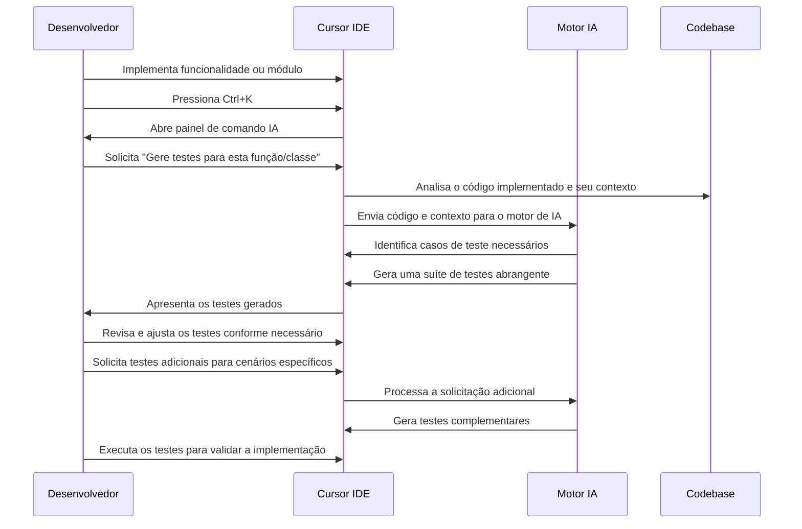

# 🧪 Caso de Uso 16: Geração de Testes com IA

## 📋 Descrição

A escrita de testes é uma parte crucial do desenvolvimento de software, mas frequentemente é negligenciada devido à pressão de prazos ou falta de experiência em técnicas de teste. O Cursor IDE resolve esse problema com recursos avançados de geração de testes que utilizam IA para analisar o código e criar automaticamente testes abrangentes, garantindo maior cobertura, identificando bugs potenciais e melhorando a qualidade geral do software.

## 🎯 Cenário

Um desenvolvedor implementou uma nova funcionalidade ou módulo e precisa escrever testes para garantir seu correto funcionamento. Em vez de escrever manualmente todos os casos de teste, o desenvolvedor utiliza o Cursor IDE para analisar o código e gerar automaticamente uma suíte de testes que cobre vários cenários, incluindo casos de borda e condições de erro.

## 🔄 Fluxo de Trabalho



## 💻 Exemplo de Implementação

### Cenário 1: Geração de Testes Unitários para uma Função de Utilitário

#### Código de Implementação:

```javascript
// src/utils/stringUtils.js

/**
 * Formata um número de CPF com pontos e traço
 * Ex: formatCPF("12345678909") retorna "123.456.789-09"
 * 
 * @param {string} cpf - String contendo apenas os dígitos do CPF
 * @returns {string} CPF formatado ou string vazia se inválido
 */
function formatCPF(cpf) {
  // Verifica se é uma string e remove caracteres não numéricos
  if (typeof cpf !== 'string') {
    return '';
  }
  
  const digitsOnly = cpf.replace(/\D/g, '');
  
  // Verifica se tem 11 dígitos
  if (digitsOnly.length !== 11) {
    return '';
  }
  
  // Aplica a formatação
  return digitsOnly.replace(/(\d{3})(\d{3})(\d{3})(\d{2})/, '$1.$2.$3-$4');
}

/**
 * Valida se um CPF é válido usando o algoritmo de verificação de dígitos
 * 
 * @param {string} cpf - String contendo o CPF (com ou sem formatação)
 * @returns {boolean} true se o CPF for válido, false caso contrário
 */
function validateCPF(cpf) {
  // Verifica se é uma string e remove caracteres não numéricos
  if (typeof cpf !== 'string') {
    return false;
  }
  
  const digitsOnly = cpf.replace(/\D/g, '');
  
  // Verifica se tem 11 dígitos
  if (digitsOnly.length !== 11) {
    return false;
  }
  
  // Verifica se todos os dígitos são iguais (caso inválido)
  if (/^(\d)\1{10}$/.test(digitsOnly)) {
    return false;
  }
  
  // Algoritmo de validação dos dígitos verificadores
  let sum = 0;
  let remainder;
  
  // Primeiro dígito verificador
  for (let i = 1; i <= 9; i++) {
    sum += parseInt(digitsOnly.substring(i - 1, i)) * (11 - i);
  }
  
  remainder = (sum * 10) % 11;
  if (remainder === 10 || remainder === 11) {
    remainder = 0;
  }
  
  if (remainder !== parseInt(digitsOnly.substring(9, 10))) {
    return false;
  }
  
  // Segundo dígito verificador
  sum = 0;
  for (let i = 1; i <= 10; i++) {
    sum += parseInt(digitsOnly.substring(i - 1, i)) * (12 - i);
  }
  
  remainder = (sum * 10) % 11;
  if (remainder === 10 || remainder === 11) {
    remainder = 0;
  }
  
  if (remainder !== parseInt(digitsOnly.substring(10, 11))) {
    return false;
  }
  
  return true;
}

/**
 * Mascara parcialmente um CPF, exibindo apenas os primeiros 3 e os últimos 2 dígitos
 * Ex: maskCPF("123.456.789-09") retorna "123.XXX.XXX-09"
 * 
 * @param {string} cpf - String contendo o CPF (com ou sem formatação)
 * @returns {string} CPF mascarado ou string vazia se inválido
 */
function maskCPF(cpf) {
  // Formata o CPF primeiro
  const formattedCPF = formatCPF(cpf);
  
  if (!formattedCPF) {
    return '';
  }
  
  // Aplica a máscara
  return formattedCPF.replace(/(\d{3})\.(\d{3})\.(\d{3})-(\d{2})/, '$1.XXX.XXX-$4');
}

module.exports = {
  formatCPF,
  validateCPF,
  maskCPF
};
```

#### Solicitação do Desenvolvedor:
```
Gere testes unitários completos para este módulo de utilitários de CPF usando Jest. Inclua casos de teste para entradas válidas, inválidas e casos de borda.
```

#### Testes Gerados pelo Cursor IDE:

```javascript
// src/utils/__tests__/stringUtils.test.js

const { formatCPF, validateCPF, maskCPF } = require('../stringUtils');

describe('formatCPF', () => {
  test('deve formatar corretamente um CPF válido', () => {
    expect(formatCPF('12345678909')).toBe('123.456.789-09');
  });

  test('deve formatar corretamente um CPF já com alguns caracteres especiais', () => {
    expect(formatCPF('123.45678909')).toBe('123.456.789-09');
    expect(formatCPF('123456789-09')).toBe('123.456.789-09');
  });

  test('deve retornar string vazia para CPF com número incorreto de dígitos', () => {
    expect(formatCPF('123456789')).toBe(''); // Poucos dígitos
    expect(formatCPF('123456789099')).toBe(''); // Muitos dígitos
  });

  test('deve retornar string vazia para entradas inválidas', () => {
    expect(formatCPF(null)).toBe('');
    expect(formatCPF(undefined)).toBe('');
    expect(formatCPF(12345678909)).toBe(''); // Número em vez de string
    expect(formatCPF('')).toBe('');
    expect(formatCPF('abc')).toBe('');
  });
});

describe('validateCPF', () => {
  test('deve validar CPFs corretos sem formatação', () => {
    expect(validateCPF('12345678909')).toBe(false); // CPF inválido
    expect(validateCPF('52998224725')).toBe(true); // CPF válido
    expect(validateCPF('87173602866')).toBe(true); // CPF válido
  });

  test('deve validar CPFs corretos com formatação', () => {
    expect(validateCPF('529.982.247-25')).toBe(true);
    expect(validateCPF('871.736.028-66')).toBe(true);
  });

  test('deve rejeitar CPFs com dígitos repetidos', () => {
    expect(validateCPF('11111111111')).toBe(false);
    expect(validateCPF('22222222222')).toBe(false);
    expect(validateCPF('00000000000')).toBe(false);
  });

  test('deve rejeitar CPFs com dígitos verificadores incorretos', () => {
    expect(validateCPF('52998224726')).toBe(false); // Último dígito errado
    expect(validateCPF('52998224735')).toBe(false); // Dois últimos dígitos errados
  });

  test('deve rejeitar valores que não são CPFs', () => {
    expect(validateCPF('12345')).toBe(false); // Muito curto
    expect(validateCPF('123456789012345')).toBe(false); // Muito longo
    expect(validateCPF('abcdefghijk')).toBe(false); // Não numérico
    expect(validateCPF('')).toBe(false); // Vazio
    expect(validateCPF(null)).toBe(false); // Null
    expect(validateCPF(undefined)).toBe(false); // Undefined
    expect(validateCPF(12345678909)).toBe(false); // Número em vez de string
  });
});

describe('maskCPF', () => {
  test('deve mascarar corretamente CPFs válidos', () => {
    expect(maskCPF('12345678909')).toBe('123.XXX.XXX-09');
    expect(maskCPF('52998224725')).toBe('529.XXX.XXX-25');
  });

  test('deve mascarar corretamente CPFs já formatados', () => {
    expect(maskCPF('123.456.789-09')).toBe('123.XXX.XXX-09');
    expect(maskCPF('529.982.247-25')).toBe('529.XXX.XXX-25');
  });

  test('deve retornar string vazia para CPFs inválidos', () => {
    expect(maskCPF('1234')).toBe('');
    expect(maskCPF('')).toBe('');
    expect(maskCPF(null)).toBe('');
    expect(maskCPF(undefined)).toBe('');
  });

  test('deve funcionar com CPFs contendo caracteres especiais misturados', () => {
    expect(maskCPF('529-98224725')).toBe('529.XXX.XXX-25');
    expect(maskCPF('529.982/247-25')).toBe('529.XXX.XXX-25');
  });
});
```

### Cenário 2: Geração de Testes de Integração para API REST

#### Código da Rota da API:

```javascript
// src/routes/userRoutes.js
const express = require('express');
const router = express.Router();
const UserController = require('../controllers/userController');
const authMiddleware = require('../middleware/authMiddleware');

// Public routes
router.post('/register', UserController.register);
router.post('/login', UserController.login);
router.post('/forgot-password', UserController.forgotPassword);
router.post('/reset-password/:token', UserController.resetPassword);

// Protected routes
router.use(authMiddleware);
router.get('/profile', UserController.getProfile);
router.put('/profile', UserController.updateProfile);
router.get('/users', UserController.getAllUsers);
router.get('/users/:id', UserController.getUserById);
router.put('/users/:id', UserController.updateUser);
router.delete('/users/:id', UserController.deleteUser);

module.exports = router;
```

#### Solicitação do Desenvolvedor:
```
Gere testes de integração para essas rotas de API de usuário usando Jest e Supertest. Certifique-se de incluir casos para autenticação, validação de dados e erros.
```

#### Testes Gerados pelo Cursor IDE:

```javascript
// tests/integration/userRoutes.test.js
const request = require('supertest');
const mongoose = require('mongoose');
const app = require('../../src/app');
const User = require('../../src/models/User');
const { generateToken } = require('../../src/utils/tokenUtils');

describe('User API Routes', () => {
  let authToken;
  let testUserId;
  let adminToken;
  
  // Configuração antes de todos os testes
  beforeAll(async () => {
    // Conectar ao banco de dados de teste
    await mongoose.connect(process.env.MONGO_URI_TEST, {
      useNewUrlParser: true,
      useUnifiedTopology: true,
    });
    
    // Limpar coleções de usuários
    await User.deleteMany({});
    
    // Criar um usuário administrador para testes
    const adminUser = await User.create({
      name: 'Admin User',
      email: 'admin@test.com',
      password: 'Password@123',
      role: 'admin'
    });
    
    adminToken = generateToken(adminUser);
  });
  
  // Limpeza após todos os testes
  afterAll(async () => {
    await User.deleteMany({});
    await mongoose.connection.close();
  });
  
  // Testes para rotas públicas
  describe('Public Routes', () => {
    const testUser = {
      name: 'Test User',
      email: 'test@example.com',
      password: 'Password@123'
    };
    
    test('POST /register - deve registrar um novo usuário', async () => {
      const response = await request(app)
        .post('/api/register')
        .send(testUser);
      
      expect(response.status).toBe(201);
      expect(response.body).toHaveProperty('token');
      expect(response.body.user).toHaveProperty('name', testUser.name);
      expect(response.body.user).toHaveProperty('email', testUser.email);
      expect(response.body.user).not.toHaveProperty('password');
      
      // Guardar ID para testes futuros
      testUserId = response.body.user.id;
    });
    
    test('POST /register - deve falhar com dados inválidos', async () => {
      const invalidUser = {
        name: 'Invalid',
        email: 'invalid-email',
        password: '123' // Senha muito curta
      };
      
      const response = await request(app)
        .post('/api/register')
        .send(invalidUser);
      
      expect(response.status).toBe(400);
      expect(response.body).toHaveProperty('errors');
    });
    
    test('POST /login - deve fazer login com credenciais corretas', async () => {
      const response = await request(app)
        .post('/api/login')
        .send({
          email: testUser.email,
          password: testUser.password
        });
      
      expect(response.status).toBe(200);
      expect(response.body).toHaveProperty('token');
      
      // Guardar token para testes de rotas protegidas
      authToken = response.body.token;
    });
    
    test('POST /login - deve falhar com credenciais incorretas', async () => {
      const response = await request(app)
        .post('/api/login')
        .send({
          email: testUser.email,
          password: 'WrongPassword'
        });
      
      expect(response.status).toBe(401);
      expect(response.body).toHaveProperty('message');
    });
    
    test('POST /forgot-password - deve enviar email de recuperação', async () => {
      const response = await request(app)
        .post('/api/forgot-password')
        .send({
          email: testUser.email
        });
      
      expect(response.status).toBe(200);
      expect(response.body).toHaveProperty('message');
    });
    
    test('POST /forgot-password - deve lidar com email inexistente', async () => {
      const response = await request(app)
        .post('/api/forgot-password')
        .send({
          email: 'nonexistent@example.com'
        });
      
      // Mesmo que o email não exista, não revelamos isso por segurança
      expect(response.status).toBe(200);
      expect(response.body).toHaveProperty('message');
    });
  });
  
  // Testes para rotas protegidas
  describe('Protected Routes', () => {
    test('GET /profile - deve retornar perfil do usuário autenticado', async () => {
      const response = await request(app)
        .get('/api/profile')
        .set('Authorization', `Bearer ${authToken}`);
      
      expect(response.status).toBe(200);
      expect(response.body).toHaveProperty('user');
      expect(response.body.user).toHaveProperty('email');
    });
    
    test('GET /profile - deve falhar sem token', async () => {
      const response = await request(app)
        .get('/api/profile');
      
      expect(response.status).toBe(401);
    });
    
    test('PUT /profile - deve atualizar perfil do usuário', async () => {
      const updateData = {
        name: 'Updated Name'
      };
      
      const response = await request(app)
        .put('/api/profile')
        .set('Authorization', `Bearer ${authToken}`)
        .send(updateData);
      
      expect(response.status).toBe(200);
      expect(response.body.user).toHaveProperty('name', updateData.name);
    });
    
    test('GET /users - admin deve poder listar todos os usuários', async () => {
      const response = await request(app)
        .get('/api/users')
        .set('Authorization', `Bearer ${adminToken}`);
      
      expect(response.status).toBe(200);
      expect(response.body).toHaveProperty('users');
      expect(Array.isArray(response.body.users)).toBe(true);
    });
    
    test('GET /users - usuário normal não deve poder listar todos os usuários', async () => {
      const response = await request(app)
        .get('/api/users')
        .set('Authorization', `Bearer ${authToken}`);
      
      expect(response.status).toBe(403);
    });
    
    test('GET /users/:id - deve retornar um usuário específico', async () => {
      const response = await request(app)
        .get(`/api/users/${testUserId}`)
        .set('Authorization', `Bearer ${adminToken}`);
      
      expect(response.status).toBe(200);
      expect(response.body).toHaveProperty('user');
      expect(response.body.user).toHaveProperty('id', testUserId);
    });
    
    test('PUT /users/:id - admin deve poder atualizar qualquer usuário', async () => {
      const updateData = {
        role: 'editor'
      };
      
      const response = await request(app)
        .put(`/api/users/${testUserId}`)
        .set('Authorization', `Bearer ${adminToken}`)
        .send(updateData);
      
      expect(response.status).toBe(200);
      expect(response.body.user).toHaveProperty('role', updateData.role);
    });
    
    test('DELETE /users/:id - admin deve poder excluir um usuário', async () => {
      const response = await request(app)
        .delete(`/api/users/${testUserId}`)
        .set('Authorization', `Bearer ${adminToken}`);
      
      expect(response.status).toBe(200);
      
      // Verificar se o usuário foi realmente excluído
      const checkUser = await request(app)
        .get(`/api/users/${testUserId}`)
        .set('Authorization', `Bearer ${adminToken}`);
      
      expect(checkUser.status).toBe(404);
    });
  });
});
```

## 💡 Dicas

1. **Seja específico sobre o framework de teste**: Mencione qual framework de teste você está usando (Jest, Mocha, Pytest, etc.) para que o Cursor gere testes no formato correto.

2. **Forneça contexto suficiente**: Para testes de integração ou de componentes, forneça também os arquivos relacionados para que o Cursor entenda melhor o comportamento esperado.

3. **Solicite casos de teste específicos**: Se você sabe que precisa testar cenários específicos, mencione-os explicitamente na sua solicitação.

4. **Itere e refine**: Após a geração inicial de testes, revise e solicite ajustes ou testes adicionais para cenários não cobertos.

5. **Combine com ferramentas de cobertura**: Use os testes gerados com ferramentas de cobertura de código para identificar áreas que ainda precisam de mais testes.

## 🔗 Recursos Adicionais

- [Guia de melhores práticas de teste com Cursor IDE](https://cursor.sh/docs/testing-best-practices)
- [Padrões de teste para diferentes tipos de aplicações](https://cursor.sh/blog/testing-patterns)
- [Integração do Cursor com ferramentas de CI/CD para testes](https://cursor.sh/tutorials/cursor-ci-cd)


