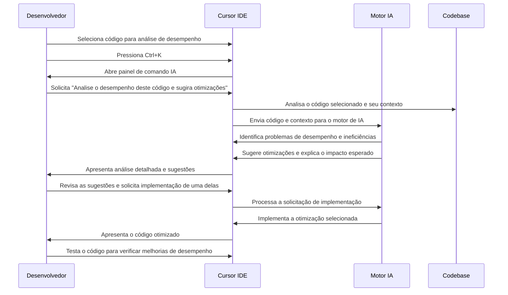

# ⚡ Caso de Uso 17: Análise de Desempenho de Código

## 📋 Descrição

Otimizar o desempenho do código é crucial para aplicações modernas, mas identificar gargalos e ineficiências pode ser uma tarefa desafiadora. O Cursor IDE facilita esse processo com recursos avançados de análise de desempenho que utilizam IA para identificar problemas potenciais, sugerir otimizações e explicar o impacto das mudanças propostas.

## 🎯 Cenário

Um desenvolvedor está trabalhando em um componente ou função que está apresentando problemas de desempenho, ou simplesmente quer garantir que seu código seja o mais eficiente possível. Em vez de investigar manualmente cada linha de código ou usar ferramentas de profiling complexas, o desenvolvedor utiliza o Cursor IDE para analisar o código, identificar problemas e implementar otimizações recomendadas.

## 🔄 Fluxo de Trabalho



## 💻 Exemplo de Implementação

### Cenário 1: Otimização de Operações com Arrays

#### Código Original:

```javascript
// Função que encontra pares de números em um array cuja soma é igual a um valor alvo
function findPairs(arr, targetSum) {
  const result = [];
  
  // Encontrar todos os pares com a soma alvo
  for (let i = 0; i < arr.length; i++) {
    for (let j = i + 1; j < arr.length; j++) {
      if (arr[i] + arr[j] === targetSum) {
        result.push([arr[i], arr[j]]);
      }
    }
  }
  
  return result;
}

// Função que remove duplicatas de um array
function removeDuplicates(arr) {
  const result = [];
  
  for (let i = 0; i < arr.length; i++) {
    let isDuplicate = false;
    
    for (let j = 0; j < result.length; j++) {
      if (arr[i] === result[j]) {
        isDuplicate = true;
        break;
      }
    }
    
    if (!isDuplicate) {
      result.push(arr[i]);
    }
  }
  
  return result;
}

// Função que encontra a interseção de dois arrays
function findIntersection(arr1, arr2) {
  const result = [];
  
  for (let i = 0; i < arr1.length; i++) {
    for (let j = 0; j < arr2.length; j++) {
      if (arr1[i] === arr2[j]) {
        result.push(arr1[i]);
        break;
      }
    }
  }
  
  return removeDuplicates(result);
}

// Função principal que processa uma grande quantidade de dados
function processArrayData(data, targetValue) {
  const uniqueData = removeDuplicates(data);
  const pairs = findPairs(uniqueData, targetValue);
  const commonElements = findIntersection(data, uniqueData.filter(item => item > targetValue / 2));
  
  return {
    uniqueElements: uniqueData,
    sumPairs: pairs,
    commonElements: commonElements
  };
}

// Teste com array grande
const testArray = [];
for (let i = 0; i < 10000; i++) {
  testArray.push(Math.floor(Math.random() * 1000));
}

console.time('processArrayData');
const result = processArrayData(testArray, 1000);
console.timeEnd('processArrayData');
console.log(`Found ${result.uniqueElements.length} unique elements`);
console.log(`Found ${result.sumPairs.length} pairs with target sum`);
console.log(`Found ${result.commonElements.length} common elements`);
```

#### Solicitação do Desenvolvedor:
```
Analise este código JavaScript para operações com arrays e sugira otimizações de desempenho. O código está demorando muito para processar arrays grandes.
```

#### Análise e Sugestões do Cursor IDE:

```
# Análise de Desempenho: Operações com Arrays

## 🔍 Problemas Identificados

Analisei o código e identifiquei vários problemas de desempenho que estão causando lentidão com arrays grandes:

### 1️⃣ Complexidade Algorítmica Elevada
- `removeDuplicates`: O(n²) - loop aninhado desnecessário
- `findPairs`: O(n²) - inevitável para o problema, mas pode ser otimizado
- `findIntersection`: O(n²) - loop aninhado ineficiente
- `processArrayData`: Operações redundantes e ineficientes

### 2️⃣ Estruturas de Dados Inadequadas
- Uso de arrays e loops aninhados onde estruturas como Set e Map seriam mais eficientes

### 3️⃣ Operações Redundantes
- `uniqueData` é calculado separadamente e depois utilizado para filtrar novamente
- Várias iterações pelo mesmo conjunto de dados

## 💡 Sugestões de Otimização

### 1️⃣ Usar Set para remover duplicatas
```javascript
function removeDuplicates(arr) {
  return [...new Set(arr)];
}
```
**Impacto**: Reduz a complexidade de O(n²) para O(n), uma melhoria dramática para arrays grandes.

### 2️⃣ Otimizar findPairs com um Map
```javascript
function findPairs(arr, targetSum) {
  const result = [];
  const seen = new Map();
  
  for (const num of arr) {
    const complement = targetSum - num;
    
    if (seen.has(complement)) {
      result.push([complement, num]);
    }
    
    seen.set(num, true);
  }
  
  return result;
}
```
**Impacto**: Reduz a complexidade de O(n²) para O(n), utilizando busca em hash.

### 3️⃣ Otimizar findIntersection com Set
```javascript
function findIntersection(arr1, arr2) {
  const set2 = new Set(arr2);
  return [...new Set(arr1.filter(item => set2.has(item)))];
}
```
**Impacto**: Reduz a complexidade de O(n²) para O(n).

### 4️⃣ Reorganizar o fluxo para evitar trabalho redundante
```javascript
function processArrayData(data, targetValue) {
  const uniqueData = [...new Set(data)];
  const threshold = targetValue / 2;
  const filteredData = uniqueData.filter(item => item > threshold);
  
  return {
    uniqueElements: uniqueData,
    sumPairs: findPairs(uniqueData, targetValue),
    commonElements: findIntersection(data, filteredData)
  };
}
```
**Impacto**: Elimina cálculos redundantes e aproveita as otimizações anteriores.

## 📊 Impacto Esperado

Com estas otimizações, o processamento de um array de 10.000 elementos deve ser significativamente mais rápido:

- **Original**: Provavelmente O(n²) ou pior, resultando em segundos de processamento
- **Otimizado**: Principalmente O(n), resultando em milissegundos de processamento

Gostaria que eu implemente alguma dessas otimizações específicas?
```

#### Solicitação de Implementação:
```
Por favor, implemente todas as otimizações sugeridas e refatore o código completo.
```

#### Código Otimizado pelo Cursor IDE:

```javascript
// Função otimizada que encontra pares de números em um array cuja soma é igual a um valor alvo
// Complexidade: O(n) usando um Map para busca em tempo constante
function findPairs(arr, targetSum) {
  const result = [];
  const seen = new Map();
  
  for (const num of arr) {
    const complement = targetSum - num;
    
    if (seen.has(complement)) {
      result.push([complement, num]);
    }
    
    seen.set(num, true);
  }
  
  return result;
}

// Função otimizada que remove duplicatas de um array
// Complexidade: O(n) usando Set para remoção eficiente de duplicatas
function removeDuplicates(arr) {
  return [...new Set(arr)];
}

// Função otimizada que encontra a interseção de dois arrays
// Complexidade: O(n) usando Set para busca eficiente
function findIntersection(arr1, arr2) {
  const set2 = new Set(arr2);
  return [...new Set(arr1.filter(item => set2.has(item)))];
}

// Função principal otimizada que processa uma grande quantidade de dados
function processArrayData(data, targetValue) {
  // Removemos duplicatas uma única vez para reutilização
  const uniqueData = removeDuplicates(data);
  
  // Calculamos o threshold uma única vez
  const threshold = targetValue / 2;
  
  // Filtramos dados uma única vez para reutilização
  const filteredData = uniqueData.filter(item => item > threshold);
  
  return {
    uniqueElements: uniqueData,
    sumPairs: findPairs(uniqueData, targetValue),
    commonElements: findIntersection(data, filteredData)
  };
}

// Teste com array grande
const testArray = [];
for (let i = 0; i < 10000; i++) {
  testArray.push(Math.floor(Math.random() * 1000));
}

// Medição de desempenho do código otimizado
console.time('processArrayData (otimizado)');
const result = processArrayData(testArray, 1000);
console.timeEnd('processArrayData (otimizado)');
console.log(`Found ${result.uniqueElements.length} unique elements`);
console.log(`Found ${result.sumPairs.length} pairs with target sum`);
console.log(`Found ${result.commonElements.length} common elements`);

// Exemplo de comparação de desempenho (opcional)
function comparePerformance() {
  // Implementações originais para comparação
  function originalRemoveDuplicates(arr) {
    const result = [];
    for (let i = 0; i < arr.length; i++) {
      let isDuplicate = false;
      for (let j = 0; j < result.length; j++) {
        if (arr[i] === result[j]) {
          isDuplicate = true;
          break;
        }
      }
      if (!isDuplicate) {
        result.push(arr[i]);
      }
    }
    return result;
  }
  
  function originalFindPairs(arr, targetSum) {
    const result = [];
    for (let i = 0; i < arr.length; i++) {
      for (let j = i + 1; j < arr.length; j++) {
        if (arr[i] + arr[j] === targetSum) {
          result.push([arr[i], arr[j]]);
        }
      }
    }
    return result;
  }
  
  const smallArray = testArray.slice(0, 1000); // Usando array menor para comparação justa
  
  console.log("\nComparação de desempenho:");
  
  console.time('original removeDuplicates');
  originalRemoveDuplicates(smallArray);
  console.timeEnd('original removeDuplicates');
  
  console.time('otimizado removeDuplicates');
  removeDuplicates(smallArray);
  console.timeEnd('otimizado removeDuplicates');
  
  console.time('original findPairs');
  originalFindPairs(smallArray, 1000);
  console.timeEnd('original findPairs');
  
  console.time('otimizado findPairs');
  findPairs(smallArray, 1000);
  console.timeEnd('otimizado findPairs');
}

// Descomente para executar a comparação de desempenho
// comparePerformance();
```

### Cenário 2: Otimização de Requisições de API e Manipulação de Dados

#### Código Original:

```javascript
// Componente React que busca e exibe dados de usuários
import React, { useState, useEffect } from 'react';
import axios from 'axios';

function UserDashboard() {
  const [users, setUsers] = useState([]);
  const [loading, setLoading] = useState(false);
  const [error, setError] = useState(null);
  const [searchTerm, setSearchTerm] = useState('');
  const [sortField, setSortField] = useState('name');
  const [sortDirection, setSortDirection] = useState('asc');
  const [page, setPage] = useState(1);
  const [selectedDepartment, setSelectedDepartment] = useState('');

  // Busca usuários da API
  useEffect(() => {
    const fetchUsers = async () => {
      setLoading(true);
      try {
        const response = await axios.get('/api/users');
        setUsers(response.data);
        setLoading(false);
      } catch (err) {
        setError('Failed to fetch users');
        setLoading(false);
      }
    };

    fetchUsers();
  }, []);

  // Filtra usuários pelo termo de busca
  const filteredUsers = users.filter(user => {
    return (
      user.name.toLowerCase().includes(searchTerm.toLowerCase()) ||
      user.email.toLowerCase().includes(searchTerm.toLowerCase()) ||
      user.department.toLowerCase().includes(searchTerm.toLowerCase())
    );
  });

  // Filtra por departamento se um estiver selecionado
  const departmentFilteredUsers = selectedDepartment
    ? filteredUsers.filter(user => user.department === selectedDepartment)
    : filteredUsers;

  // Ordena os usuários
  const sortedUsers = [...departmentFilteredUsers].sort((a, b) => {
    if (sortDirection === 'asc') {
      return a[sortField] > b[sortField] ? 1 : -1;
    } else {
      return a[sortField] < b[sortField] ? 1 : -1;
    }
  });

  // Paginação
  const usersPerPage = 10;
  const indexOfLastUser = page * usersPerPage;
  const indexOfFirstUser = indexOfLastUser - usersPerPage;
  const currentUsers = sortedUsers.slice(indexOfFirstUser, indexOfLastUser);

  // Busca departamentos únicos para o filtro
  const departments = [];
  users.forEach(user => {
    if (!departments.includes(user.department)) {
      departments.push(user.department);
    }
  });

  // Manipuladores de eventos
  const handleSearchChange = e => {
    setSearchTerm(e.target.value);
    setPage(1); // Reset para primeira página ao buscar
  };

  const handleSortChange = field => {
    if (field === sortField) {
      setSortDirection(sortDirection === 'asc' ? 'desc' : 'asc');
    } else {
      setSortField(field);
      setSortDirection('asc');
    }
  };

  const handleDepartmentChange = e => {
    setSelectedDepartment(e.target.value);
    setPage(1); // Reset para primeira página ao filtrar
  };

  const handlePageChange = newPage => {
    setPage(newPage);
  };

  if (loading && users.length === 0) {
    return <div>Loading...</div>;
  }

  if (error) {
    return <div>Error: {error}</div>;
  }

  return (
    <div className="user-dashboard">
      <h1>User Dashboard</h1>
      
      <div className="filters">
        <input
          type="text"
          placeholder="Search users..."
          value={searchTerm}
          onChange={handleSearchChange}
        />
        
        <select value={selectedDepartment} onChange={handleDepartmentChange}>
          <option value="">All Departments</option>
          {departments.map(dept => (
            <option key={dept} value={dept}>{dept}</option>
          ))}
        </select>
      </div>
      
      <table className="user-table">
        <thead>
          <tr>
            <th onClick={() => handleSortChange('name')}>
              Name {sortField === 'name' && (sortDirection === 'asc' ? '↑' : '↓')}
            </th>
            <th onClick={() => handleSortChange('email')}>
              Email {sortField === 'email' && (sortDirection === 'asc' ? '↑' : '↓')}
            </th>
            <th onClick={() => handleSortChange('department')}>
              Department {sortField === 'department' && (sortDirection === 'asc' ? '↑' : '↓')}
            </th>
            <th onClick={() => handleSortChange('role')}>
              Role {sortField === 'role' && (sortDirection === 'asc' ? '↑' : '↓')}
            </th>
          </tr>
        </thead>
        <tbody>
          {currentUsers.map(user => (
            <tr key={user.id}>
              <td>{user.name}</td>
              <td>{user.email}</td>
              <td>{user.department}</td>
              <td>{user.role}</td>
            </tr>
          ))}
        </tbody>
      </table>
      
      <div className="pagination">
        <button
          disabled={page === 1}
          onClick={() => handlePageChange(page - 1)}
        >
          Previous
        </button>
        <span>Page {page} of {Math.ceil(sortedUsers.length / usersPerPage)}</span>
        <button
          disabled={page >= Math.ceil(sortedUsers.length / usersPerPage)}
          onClick={() => handlePageChange(page + 1)}
        >
          Next
        </button>
      </div>
    </div>
  );
}

export default UserDashboard;
```

#### Solicitação do Desenvolvedor:
```
Este componente React está ficando lento com grandes conjuntos de dados. Por favor, analise o desempenho e sugira otimizações.
```

#### Análise e Sugestões do Cursor IDE:

```
# Análise de Desempenho: Componente UserDashboard

## 🔍 Problemas Identificados

Após analisar o componente, identifiquei vários problemas de desempenho que afetam o carregamento e a renderização com grandes conjuntos de dados:

### 1️⃣ Operações Caras em Cada Renderização
- Múltiplas operações de filtragem e ordenação sendo recalculadas em cada renderização
- Recriação de arrays completos (via spread operator) em cada ciclo de renderização
- Cálculo repetido de departamentos únicos

### 2️⃣ Problemas de Busca de Dados
- Falta de paginação no lado do servidor (carrega todos os usuários de uma vez)
- Não implementa busca no servidor ou filtragem de dados

### 3️⃣ Ineficiências de Renderização React
- Não utiliza memoização para evitar cálculos e renderizações desnecessários
- Falta de otimização em operações que dependem de estado (useEffect)

## 💡 Sugestões de Otimização

### 1️⃣ Implementar paginação no servidor
```javascript
useEffect(() => {
  const fetchUsers = async () => {
    setLoading(true);
    try {
      const response = await axios.get('/api/users', {
        params: {
          page,
          limit: usersPerPage,
          sort: sortField,
          order: sortDirection,
          search: searchTerm,
          department: selectedDepartment
        }
      });
      setUsers(response.data.users);
      setTotalUsers(response.data.total);
      setLoading(false);
    } catch (err) {
      setError('Failed to fetch users');
      setLoading(false);
    }
  };

  fetchUsers();
}, [page, usersPerPage, sortField, sortDirection, searchTerm, selectedDepartment]);
```
**Impacto**: Reduz drasticamente o volume de dados carregados e processados pelo cliente.

### 2️⃣ Utilizar useMemo para operações caras
```javascript
const departments = useMemo(() => {
  const depts = new Set();
  users.forEach(user => depts.add(user.department));
  return [...depts];
}, [users]);

const currentUsers = useMemo(() => {
  // Filtragem e ordenação aqui (se ainda necessário com API paginada)
}, [relevantDependencies]);
```
**Impacto**: Evita recálculos desnecessários quando estados não relacionados mudam.

### 3️⃣ Aplicar debounce na busca
```javascript
const debouncedSearchTerm = useDebounce(searchTerm, 300);

useEffect(() => {
  // Fetch users using debouncedSearchTerm
}, [debouncedSearchTerm, ...otherDependencies]);
```
**Impacto**: Reduz o número de requisições durante digitação ativa.

### 4️⃣ Utilizar virtualização para renderização eficiente
```javascript
import { FixedSizeList } from 'react-window';

// No render:
<FixedSizeList
  height={500}
  width="100%"
  itemCount={currentUsers.length}
  itemSize={50}
>
  {({ index, style }) => (
    <div style={style}>
      {/* Renderizar item do usuário aqui */}
    </div>
  )}
</FixedSizeList>
```
**Impacto**: Renderiza apenas os itens visíveis, ideal para longas listas.

### 5️⃣ Otimizar estruturas de dados
```javascript
// Usar Map/Set em vez de arrays para pesquisas mais rápidas
const departmentsSet = new Set(users.map(user => user.department));
```
**Impacto**: Reduz complexidade de operações de busca.

## 📊 Impacto Esperado

Com estas otimizações, o componente deve ter melhorias significativas:

- **Tempo de Carregamento**: Redução de segundos para milissegundos com paginação no servidor
- **Responsividade da UI**: Melhorias drásticas em interações do usuário (filtragem, ordenação)
- **Uso de Memória**: Redução significativa ao processar apenas os dados necessários

Gostaria que eu implemente alguma dessas otimizações específicas?
```

## 💡 Dicas

1. **Seja específico sobre os problemas de desempenho**: Quando solicitar análises, mencione quaisquer sintomas específicos (como lentidão em determinadas operações) para receber sugestões mais direcionadas.

2. **Forneça contexto de uso**: Mencione o tamanho dos dados ou a frequência de operações para que a análise possa levar em consideração o contexto real de uso.

3. **Solicite explicações das otimizações**: Além de sugerir mudanças, o Cursor pode explicar a razão por trás de cada otimização e seu impacto esperado.

4. **Combine com profiling real**: Quando possível, utilize as sugestões do Cursor em conjunto com ferramentas de profiling reais para medir os ganhos de desempenho.

5. **Implemente incrementalmente**: Para bases de código grandes, implemente as otimizações uma por uma para isolar o impacto de cada mudança.

## 🔗 Recursos Adicionais

- [Guia de otimização de desempenho com Cursor IDE](https://cursor.sh/docs/performance-optimization)
- [Padrões comuns de otimização para JavaScript](https://cursor.sh/blog/js-optimization-patterns)
- [Análise comparativa de técnicas de otimização](https://cursor.sh/tutorials/optimization-benchmarks)


