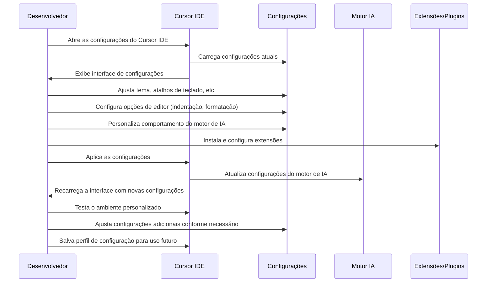

# 🎨 Caso de Uso 18: Personalização e Configuração Avançada

## 📋 Descrição

Cada desenvolvedor tem suas próprias preferências e necessidades quando se trata de ambientes de desenvolvimento. O Cursor IDE oferece amplas opções de personalização e configuração que permitem adaptar a ferramenta às necessidades específicas de cada usuário, desde a aparência e comportamento da interface até as configurações do motor de IA e integração com ferramentas externas.

## 🎯 Cenário

Um desenvolvedor quer configurar o Cursor IDE para se adequar ao seu fluxo de trabalho específico, que envolve um framework particular, convenções de codificação específicas da empresa, e preferências pessoais em termos de aparência e comportamento. Em vez de se adaptar às configurações padrão, o desenvolvedor personaliza o Cursor para otimizar sua produtividade e conforto.

## 🔄 Fluxo de Trabalho



## 💻 Exemplo de Implementação

### Cenário 1: Configuração para Desenvolvimento React com TypeScript

Um desenvolvedor trabalha principalmente com React e TypeScript e quer configurar o Cursor IDE para otimizar este fluxo de trabalho específico.

#### Configurações de Editor e Tema:

```json
// settings.json
{
  // Tema e aparência
  "workbench.colorTheme": "GitHub Dark",
  "editor.fontFamily": "Fira Code, monospace",
  "editor.fontLigatures": true,
  "editor.fontSize": 14,
  "editor.lineHeight": 24,
  
  // Comportamento do editor
  "editor.formatOnSave": true,
  "editor.defaultFormatter": "esbenp.prettier-vscode",
  "editor.codeActionsOnSave": {
    "source.fixAll.eslint": true,
    "source.organizeImports": true
  },
  
  // Configurações específicas para TypeScript
  "typescript.updateImportsOnFileMove.enabled": "always",
  "typescript.preferences.importModuleSpecifier": "relative",
  "typescript.suggest.autoImports": true,
  
  // Configurações específicas para React
  "emmet.includeLanguages": {
    "javascript": "javascriptreact",
    "typescript": "typescriptreact"
  },
  "emmet.triggerExpansionOnTab": true,
  
  // Configurações de terminal
  "terminal.integrated.defaultProfile.windows": "PowerShell",
  "terminal.integrated.fontFamily": "Cascadia Code, monospace",
  
  // Configurações do AI Assistant
  "ai.assistant.defaultModel": "claude-3-opus",
  "ai.assistant.suggestionsEnabled": true,
  "ai.assistant.inlineCompletionFrequency": "medium",
  "ai.assistant.contextualizeFilesOnChatOpen": true,
  "ai.assistant.customInstructions": "Prefira TypeScript sobre JavaScript. Siga os princípios de React Hooks. Use padrões funcionais. Priorize a imutabilidade de dados.",
  
  // Atalhos de teclado personalizados
  "keybindings": [
    {
      "key": "ctrl+k ctrl+i",
      "command": "ai.assistant.explainCode",
      "when": "editorTextFocus"
    },
    {
      "key": "ctrl+k ctrl+t",
      "command": "ai.assistant.generateTest",
      "when": "editorTextFocus"
    },
    {
      "key": "ctrl+k ctrl+r",
      "command": "ai.assistant.refactor",
      "when": "editorTextFocus"
    }
  ]
}
```

#### Extensões Instaladas e Configuradas:

```json
// extensions.json
{
  "recommendations": [
    "dbaeumer.vscode-eslint",
    "esbenp.prettier-vscode",
    "dsznajder.es7-react-js-snippets",
    "burkeholland.simple-react-snippets",
    "formulahendry.auto-rename-tag",
    "eamodio.gitlens",
    "github.github-vscode-theme",
    "ms-vscode.vscode-typescript-next",
    "formulahendry.auto-close-tag",
    "streetsidesoftware.code-spell-checker",
    "styled-components.vscode-styled-components"
  ]
}
```

#### Snippets Personalizados para React:

```json
// react.code-snippets
{
  "React Functional Component with TypeScript": {
    "prefix": "rfc",
    "body": [
      "import React from 'react';",
      "",
      "interface ${1:ComponentName}Props {",
      "  $2",
      "}",
      "",
      "export const ${1:ComponentName}: React.FC<${1:ComponentName}Props> = ({ $3 }) => {",
      "  return (",
      "    <div>",
      "      $0",
      "    </div>",
      "  );",
      "};",
      "",
      "export default ${1:ComponentName};"
    ],
    "description": "React Functional Component with TypeScript"
  },
  
  "React Hook useState": {
    "prefix": "rhs",
    "body": [
      "const [${1:state}, set${1/(.*)/${1:/capitalize}/}] = useState<${2:type}>(${3:initialValue});"
    ],
    "description": "React Hook useState with TypeScript"
  },
  
  "React Hook useEffect": {
    "prefix": "rhe",
    "body": [
      "useEffect(() => {",
      "  $1",
      "  ",
      "  ${2:return () => {",
      "    $3",
      "  };}",
      "}, [${4:dependencies}]);"
    ],
    "description": "React Hook useEffect"
  },
  
  "React Custom Hook": {
    "prefix": "rhc",
    "body": [
      "import { useState, useEffect } from 'react';",
      "",
      "export const use${1:CustomHook} = (${2:params}) => {",
      "  const [${3:state}, set${3/(.*)/${1:/capitalize}/}] = useState<${4:type}>(${5:initialValue});",
      "",
      "  useEffect(() => {",
      "    $6",
      "  }, [${7:dependencies}]);",
      "",
      "  return ${8:state};",
      "};"
    ],
    "description": "React Custom Hook with TypeScript"
  }
}
```

#### Configuração de Instrução de IA Personalizada:

```
// Arquivo de instruções personalizadas para IA do Cursor

## Padrões de Codificação
- Sempre use TypeScript em vez de JavaScript
- Prefira componentes funcionais com hooks em vez de componentes de classe
- Use padrões de imutabilidade para gerenciamento de estado
- Siga as convenções de nomenclatura camelCase para variáveis e funções, PascalCase para componentes e interfaces
- Use async/await em vez de Promises com then/catch

## Estilo de Código
- Use desestruturação para props e variáveis de estado
- Organize imports em ordem alfabética, com React primeiro, depois bibliotecas externas, depois componentes internos
- Mantenha componentes pequenos e focados (menos de 150 linhas)

## Padrões de Projeto
- Seguir o padrão Container/Presentational quando apropriado
- Coloque lógica complexa em hooks personalizados
- Use Context API para estado global simples, Redux para aplicações maiores
- Prefira componentes controlados sobre não-controlados

## Testes
- Escreva testes usando React Testing Library
- Teste comportamento, não implementação
- Use mocks para serviços e APIs externos

## Acessibilidade
- Sempre inclua atributos de acessibilidade (aria-*, role, etc.) 
- Assegure que todos os elementos interativos são acessíveis por teclado
```

### Cenário 2: Configuração para Time de Desenvolvimento

Uma equipe de desenvolvimento quer padronizar o uso do Cursor IDE entre todos os membros para garantir consistência no código e no processo de desenvolvimento.

#### Configuração Compartilhada via Arquivo .cursorrc:

```json
// .cursorrc (na raiz do projeto compartilhado)
{
  "team": {
    "name": "FinTech Solutions",
    "codeStandards": "https://company-wiki.com/code-standards",
    "aiInstructions": "./ai-instructions.md"
  },
  
  "editor": {
    "formatOnSave": true,
    "tabSize": 2,
    "insertSpaces": true,
    "rulers": [80, 120],
    "wordWrap": "off"
  },
  
  "linting": {
    "enableESLint": true,
    "enableStylelint": true,
    "configPaths": {
      "eslint": "./.eslintrc.js",
      "stylelint": "./.stylelintrc"
    }
  },
  
  "testing": {
    "framework": "jest",
    "testMatch": "**/__tests__/**/*.test.{js,ts,jsx,tsx}",
    "coverage": {
      "enabled": true,
      "threshold": 80
    }
  },
  
  "ai": {
    "modelPreference": "claude-3-opus",
    "contextLength": "large",
    "behaviorSettings": {
      "preferFramework": "next",
      "preferTypeSafety": true,
      "codeStyle": "functional",
      "commentLevel": "moderate",
      "testGeneration": "always"
    },
    "customPrompts": [
      {
        "name": "Code Review",
        "shortcut": "ctrl+shift+r",
        "prompt": "Review this code for security issues, performance optimizations, and adherence to our team standards."
      },
      {
        "name": "Generate CRUD API",
        "shortcut": "ctrl+shift+c",
        "prompt": "Generate a CRUD API for this data model following our RESTful API standards."
      },
      {
        "name": "Document Function",
        "shortcut": "ctrl+shift+d",
        "prompt": "Document this function following our JSDoc standards with examples."
      }
    ]
  },
  
  "extensions": {
    "required": [
      "dbaeumer.vscode-eslint",
      "esbenp.prettier-vscode",
      "stylelint.vscode-stylelint",
      "orta.vscode-jest",
      "eamodio.gitlens",
      "github.vscode-pull-request-github"
    ],
    "recommended": [
      "streetsidesoftware.code-spell-checker",
      "wayou.vscode-todo-highlight",
      "gruntfuggly.todo-tree",
      "yzhang.markdown-all-in-one"
    ],
    "prohibited": [
      "hookyqr.beautify",
      "ms-vsliveshare.vsliveshare"
    ]
  },
  
  "gitWorkflow": {
    "branchNamingConvention": "type/issue-number-short-description",
    "commitMessageTemplate": "type(scope): description [issue-number]",
    "prTemplate": "./github/pull_request_template.md"
  }
}
```

## 💡 Dicas

1. **Comece com um preset e personalize**: Use uma configuração base que se aproxime do seu caso de uso e faça ajustes incrementais a partir dela.

2. **Sincronize configurações**: Use a funcionalidade de sincronização do Cursor para manter suas configurações consistentes em múltiplos dispositivos.

3. **Configure instruções de IA para seu domínio**: Adapte as instruções para o motor de IA para seu framework, biblioteca ou domínio específico para obter sugestões mais relevantes.

4. **Compartilhe configurações com a equipe**: Utilize arquivos de configuração compartilhados para manter a consistência entre todos os membros da equipe.

5. **Revise regularmente**: Ajuste suas configurações periodicamente com base em mudanças no seu fluxo de trabalho ou no surgimento de novas ferramentas e extensões.

## 🔗 Recursos Adicionais

- [Documentação completa de configuração do Cursor IDE](https://cursor.sh/docs/configuration)
- [Melhores práticas para instruções personalizadas de IA](https://cursor.sh/blog/ai-instruction-best-practices)
- [Catálogo de extensões recomendadas por domínio](https://cursor.sh/resources/extensions)


