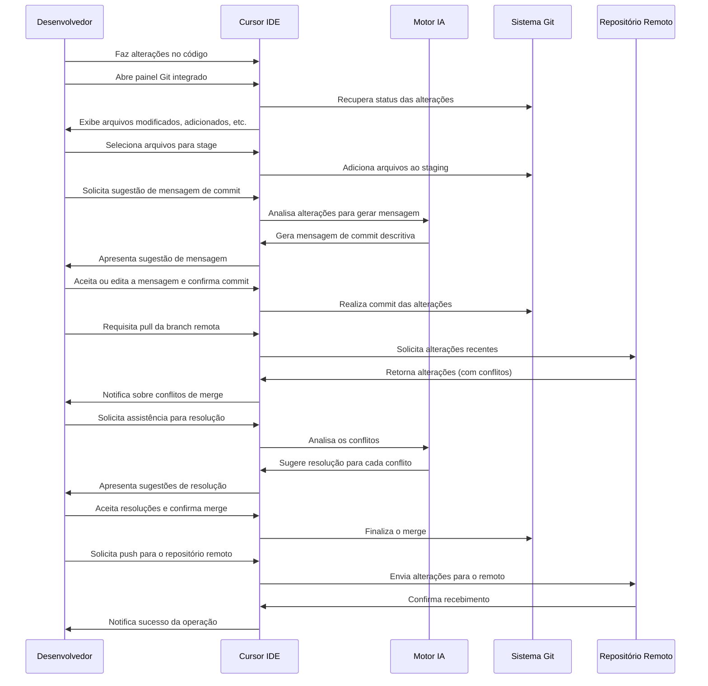

# 🔄 Caso de Uso 19: Integração Avançada com Controle de Versão

## 📋 Descrição

O controle de versão é parte fundamental do desenvolvimento de software moderno, e o Cursor IDE oferece uma integração avançada com sistemas de controle de versão como Git, facilitando operações comuns e adicionando recursos inteligentes que elevam a experiência além do que as ferramentas tradicionais oferecem. Com assistência de IA para mensagens de commit, resolução de conflitos, análise de código em pull requests e muito mais, o Cursor transforma a maneira como os desenvolvedores interagem com seus repositórios.

## 🎯 Cenário

Um desenvolvedor está trabalhando em um projeto colaborativo usando Git, e precisa realizar diversas operações de controle de versão como parte de seu fluxo de trabalho diário. Em vez de alternar entre o editor e a linha de comando ou usar ferramentas externas, o desenvolvedor utiliza a integração nativa do Cursor IDE com Git, aprimorada por recursos de IA, para tornar esse processo mais eficiente e produtivo.

## 🔄 Fluxo de Trabalho



## 💻 Exemplo de Implementação

### Cenário 1: Geração Inteligente de Mensagens de Commit

Um desenvolvedor implementou várias alterações em diferentes arquivos e quer gerar uma mensagem de commit adequada que descreva claramente as mudanças realizadas.

#### Painel de Git do Cursor mostrando alterações:

```
Changes (5 files):
 M src/components/UserProfile.jsx
 M src/services/userService.js
 M src/hooks/useAuth.js
 A src/utils/validation.js
 M src/styles/profile.css
```

#### Solicitação do Desenvolvedor:
```
Sugira uma mensagem de commit apropriada para estas alterações.
```

#### Resposta do Cursor IDE:

```
Analisando suas alterações, identifiquei que você:
1. Modificou a lógica de autenticação em useAuth.js
2. Adicionou validações de formulário em um novo arquivo validation.js
3. Atualizou o componente UserProfile e seu serviço relacionado
4. Fez ajustes estilísticos no CSS do perfil

Aqui está uma sugestão de mensagem de commit:

feat(profile): implement form validation and improve auth flow

- Add client-side validation utilities
- Update user profile component with validation
- Refactor authentication hook for better error handling
- Adjust profile page styling for form feedback states

Esta mensagem segue o formato Conventional Commits com:
- Tipo: feat (para nova funcionalidade)
- Escopo: profile (principal área afetada)
- Descrição concisa na primeira linha
- Detalhes em tópicos no corpo

Deseja usar esta mensagem ou prefere algum ajuste?
```

### Cenário 2: Assistência para Resolução de Conflitos

Durante um merge ou rebase, o desenvolvedor encontra conflitos entre as alterações locais e remotas, e utiliza a assistência do Cursor para resolvê-los.

#### Conflito identificado pelo Git:

```
<<<<<<< HEAD (Current Changes)
function validateUserData(userData) {
  if (!userData.email || !isValidEmail(userData.email)) {
    throw new ValidationError('Invalid email address');
  }
  
  if (!userData.name || userData.name.length < 2) {
    throw new ValidationError('Name is required and must be at least 2 characters');
  }
  
  return true;
}
=======
function validateUserData(userData) {
  const errors = {};
  
  if (!userData.email || !isValidEmail(userData.email)) {
    errors.email = 'Please enter a valid email address';
  }
  
  if (!userData.name || userData.name.trim().length < 2) {
    errors.name = 'Name is required and must be at least 2 characters';
  }
  
  return Object.keys(errors).length === 0 ? true : { valid: false, errors };
}
>>>>>>> feature/improve-validation (Incoming Changes)
```

#### Solicitação do Desenvolvedor:
```
Me ajude a resolver esse conflito de mesclagem na função validateUserData.
```

#### Análise e Sugestão do Cursor:

```
# Análise do Conflito de Mesclagem

Estou vendo um conflito na função `validateUserData()`. Vamos comparar as duas versões:

## Versão atual (HEAD):
- Lança exceções quando a validação falha
- Verifica email e nome
- Retorna `true` quando válido
- Abordagem mais simples baseada em exceções

## Versão da feature/improve-validation:
- Coleta erros em um objeto
- Também verifica email e nome, mas com `.trim()` adicional para o nome
- Retorna um resultado mais detalhado (objeto com erros ou `true`)
- Abordagem mais flexível para UI, permitindo mostrar múltiplos erros

## Recomendação de resolução:

A versão da feature parece ser uma melhoria intencional, mudando de uma abordagem baseada em exceções para uma baseada em objeto de erros, o que é mais adequado para validação de formulários no frontend.

Sugiro usar a versão da feature, mas incorporando o padrão de exceção como fallback para compatibilidade:

```javascript
function validateUserData(userData, throwErrors = false) {
  const errors = {};
  
  if (!userData.email || !isValidEmail(userData.email)) {
    errors.email = 'Please enter a valid email address';
  }
  
  if (!userData.name || userData.name.trim().length < 2) {
    errors.name = 'Name is required and must be at least 2 characters';
  }
  
  // Se não há erros, retorna true
  if (Object.keys(errors).length === 0) {
    return true;
  }
  
  // Se throwErrors é true, mantém comportamento original lançando exceção
  if (throwErrors) {
    const firstError = Object.values(errors)[0];
    throw new ValidationError(firstError);
  }
  
  // Caso contrário, retorna objeto com os erros (novo comportamento)
  return { valid: false, errors };
}
```

Esta solução mantém a nova funcionalidade enquanto preserva compatibilidade com código existente. Aceita?
```

### Cenário 3: Análise Inteligente de Pull Requests

O Cursor IDE pode analisar pull requests para fornecer insights sobre as alterações, sugerir revisões e destacar potenciais problemas.

#### Pull Request visualizado no Cursor:

```
Pull Request #127: Add user subscription management 
Autor: colaborador2
Branch: feature/subscription-management -> develop
Alterações: 12 arquivos alterados, +458, -72 linhas
```

#### Solicitação do Desenvolvedor:
```
Analise este PR e forneça um resumo das principais alterações e potenciais problemas.
```

#### Análise do Cursor IDE:

```
# Análise do PR #127: Add user subscription management

## 📝 Resumo das Alterações
Este PR implementa um sistema completo de gerenciamento de assinaturas de usuários, incluindo:

1. **Novos Models e Schemas**
   - `SubscriptionPlan` com níveis Basic, Pro e Enterprise
   - `UserSubscription` com status e datas de início/fim

2. **API e Endpoints**
   - Novos endpoints REST para CRUD de assinaturas
   - Integração com gateway de pagamento (Stripe)

3. **Componentes de UI**
   - Página de planos de assinatura
   - Modal de checkout e confirmação
   - Seção de gerenciamento de assinaturas no perfil

4. **Lógica de Negócio**
   - Cálculo de preços com descontos
   - Verificação de recursos baseada no plano
   - Notificações de renovação e expiração

## 🚩 Potenciais Problemas

1. **Segurança**
   - `stripe-service.js:58` - Chave API é armazenada diretamente no código
   - `subscriptionController.js:122` - Falta validação de entrada em parâmetros de preço

2. **Performance**
   - `UserSubscriptionList.jsx` - Carrega todas as assinaturas sem paginação
   - Múltiplas chamadas de API redundantes em `SubscriptionManager.jsx`

3. **Manutenção**
   - Lógica duplicada para cálculo de preços em frontend e backend
   - Falta de testes para casos críticos como falhas de pagamento

4. **UX**
   - Estados de carregamento ausentes em algumas interações de pagamento
   - Falta de feedback claro após alterações de assinatura

## 💡 Sugestões para Revisão

1. Mover chaves de API para variáveis de ambiente
2. Implementar paginação na lista de assinaturas
3. Extrair lógica de preços para um serviço compartilhado
4. Adicionar testes para fluxos de pagamento e falhas
5. Solicitar esclarecimento sobre plano de migração para usuários existentes

Deseja que eu forneça comentários específicos em algum dos arquivos alterados?
```

## 💡 Dicas

1. **Automatize tarefas repetitivas**: Use snippets de mensagens de commit para projetos específicos e configure comandos personalizados para operações Git comuns.

2. **Aproveite a análise de código inteligente**: Solicite ao Cursor que analise diferenças entre branches ou commits para entender melhor as alterações antes de fazer merge.

3. **Resolva conflitos com assistência**: Em vez de resolver conflitos manualmente, peça à IA para analisar o contexto e sugerir resoluções eficientes.

4. **Organize commits logicamente**: Use a visualização de alterações do Cursor para agrupar modificações relacionadas em commits separados e coesos.

5. **Revise PRs com IA**: Antes de submeter ou aprovar um PR, peça ao Cursor para analisar o código em busca de problemas potenciais, melhorias possíveis ou violações de padrões.

## 🔗 Recursos Adicionais

- [Documentação da integração Git do Cursor IDE](https://cursor.sh/docs/git-integration)
- [Melhores práticas para controle de versão com IA](https://cursor.sh/blog/ai-version-control)
- [Fluxos de trabalho Git para equipes usando Cursor](https://cursor.sh/tutorials/git-workflows)


