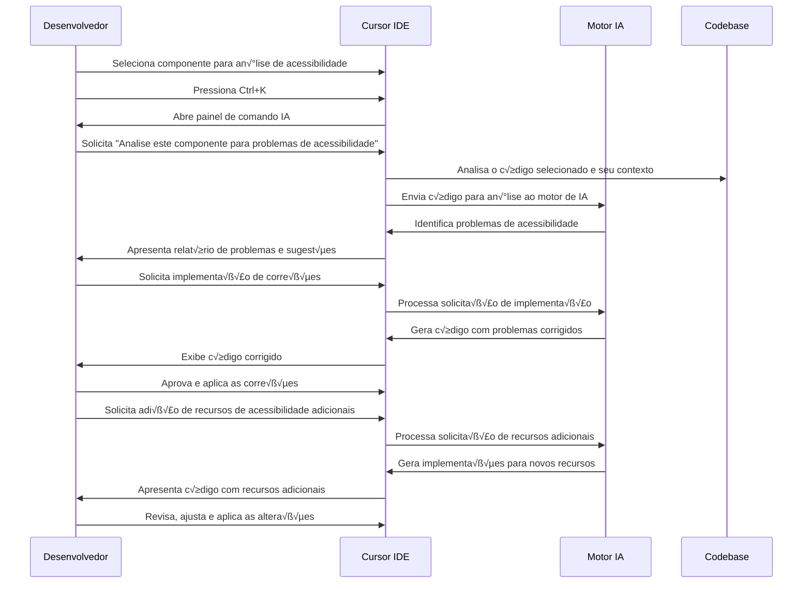

# ‚ôø Caso de Uso 20: Acessibilidade e Desenvolvimento Inclusivo

## 📋 Descrição

A acessibilidade digital é essencial para garantir que todas as pessoas, independentemente de suas habilidades ou limitações, possam utilizar softwares e aplicações web. O Cursor IDE oferece recursos avançados para auxiliar desenvolvedores a criar código acessível e inclusivo, desde a geração e análise de código com foco em acessibilidade até a criação de componentes que seguem as diretrizes WCAG (Web Content Accessibility Guidelines) e ARIA (Accessible Rich Internet Applications).

## 🎯 Cenário

Um desenvolvedor precisa garantir que uma aplicação web seja acessível para todos os usuários, incluindo pessoas com deficiências visuais, auditivas, motoras ou cognitivas. Em vez de ter que pesquisar manualmente todas as melhores práticas e padrões de acessibilidade, o desenvolvedor utiliza os recursos de acessibilidade do Cursor IDE para analisar código existente, corrigir problemas e implementar novos recursos acessíveis.

## 🔄 Fluxo de Trabalho



## 💻 Exemplo de Implementação

### Cen√°rio 1: An√°lise de Acessibilidade de um Formul√°rio

Um desenvolvedor criou um formulário de registro e quer garantir que ele seja acessível para todos os usuários.

#### Código Original:

```jsx
function RegistrationForm() {
  const [formData, setFormData] = useState({
    name: '',
    email: '',
    password: '',
    confirmPassword: '',
  });

  const [errors, setErrors] = useState({});

  const handleChange = (e) => {
    const { name, value } = e.target;
    setFormData({ ...formData, [name]: value });
  };

  const handleSubmit = (e) => {
    e.preventDefault();
    
    // Validação básica
    const newErrors = {};
    if (!formData.name) newErrors.name = 'Name is required';
    if (!formData.email) newErrors.email = 'Email is required';
    if (!formData.password) newErrors.password = 'Password is required';
    if (formData.password !== formData.confirmPassword) {
      newErrors.confirmPassword = 'Passwords do not match';
    }
    
    if (Object.keys(newErrors).length > 0) {
      setErrors(newErrors);
      return;
    }
    
    // Submeter formul√°rio
    console.log('Form submitted:', formData);
  };

  return (
    <div className="registration-form">
      <h2>Create an Account</h2>
      <form onSubmit={handleSubmit}>
        <div className="form-group">
          <label>Name</label>
          <input
            type="text"
            name="name"
            value={formData.name}
            onChange={handleChange}
            className={errors.name ? 'error' : ''}
          />
          {errors.name && <div className="error-message">{errors.name}</div>}
        </div>
        
        <div className="form-group">
          <label>Email</label>
          <input
            type="email"
            name="email"
            value={formData.email}
            onChange={handleChange}
            className={errors.email ? 'error' : ''}
          />
          {errors.email && <div className="error-message">{errors.email}</div>}
        </div>
        
        <div className="form-group">
          <label>Password</label>
          <input
            type="password"
            name="password"
            value={formData.password}
            onChange={handleChange}
            className={errors.password ? 'error' : ''}
          />
          {errors.password && <div className="error-message">{errors.password}</div>}
        </div>
        
        <div className="form-group">
          <label>Confirm Password</label>
          <input
            type="password"
            name="confirmPassword"
            value={formData.confirmPassword}
            onChange={handleChange}
            className={errors.confirmPassword ? 'error' : ''}
          />
          {errors.confirmPassword && <div className="error-message">{errors.confirmPassword}</div>}
        </div>
        
        <button type="submit">Register</button>
      </form>
    </div>
  );
}
```

#### Solicitação do Desenvolvedor:
```
Analise este formulário de registro React para problemas de acessibilidade e sugira melhorias para torná-lo mais acessível.
```

#### An√°lise do Cursor IDE:

```
# An√°lise de Acessibilidade: Formul√°rio de Registro

## üö® Problemas Identificados

Analisei seu formul√°rio de registro e identifiquei os seguintes problemas de acessibilidade:

### 1️⃣ Falta de associação explícita entre labels e inputs
As tags `<label>` não estão corretamente associadas aos inputs através do atributo `for` (ou `htmlFor` em React). Isso dificulta o uso por leitores de tela.

### 2️⃣ Ausência de atributos de acessibilidade
N√£o h√° atributos `aria-*` ou `role` para comunicar estados e erros a tecnologias assistivas.

### 3️⃣ Feedback visual apenas para erros
Os erros são comunicados apenas visualmente, sem considerar usuários com deficiência visual.

### 4️⃣ Falta de instruções claras
Não há indicações sobre requisitos de formato ou complexidade (especialmente para a senha).

### 5️⃣ Estrutura inadequada do formulário
N√£o utiliza elementos sem√¢nticos adequados como `fieldset` e `legend` para agrupar campos relacionados.

### 6️⃣ Contraste e feedback visual limitados
Não há indicações claras do estado de foco ou outras pistas visuais além das mensagens de erro.

## 💡 Sugestões de Melhorias

### Código Corrigido (visão parcial):

```jsx
// Exemplo de como associar corretamente labels e inputs
<div className="form-group">
  <label htmlFor="name-input">Nome</label>
  <input
    id="name-input"
    type="text"
    name="name"
    value={formData.name}
    onChange={handleChange}
    aria-required="true"
    aria-invalid={!!errors.name}
    aria-describedby={errors.name ? "name-error" : undefined}
  />
  {errors.name && (
    <div id="name-error" className="error-message" role="alert">
      {errors.name}
    </div>
  )}
</div>
```

Gostaria que eu implementasse todas as correções de acessibilidade para este formulário?
```

#### Solicitação de Implementação:
```
Sim, por favor implemente todas as melhorias de acessibilidade sugeridas para o formul√°rio completo.
```

#### Código Corrigido pelo Cursor IDE:

```jsx
import React, { useState } from 'react';
import './RegistrationForm.css';

function RegistrationForm() {
  const [formData, setFormData] = useState({
    name: '',
    email: '',
    password: '',
    confirmPassword: '',
  });

  const [errors, setErrors] = useState({});
  const [submitted, setSubmitted] = useState(false);

  const handleChange = (e) => {
    const { name, value } = e.target;
    setFormData({ ...formData, [name]: value });
    
    // Limpa o erro associado ao campo quando o usuário começa a digitar
    if (errors[name]) {
      setErrors(prev => ({ ...prev, [name]: undefined }));
    }
  };

  const handleSubmit = (e) => {
    e.preventDefault();
    
    // Validação mais robusta
    const newErrors = {};
    if (!formData.name.trim()) newErrors.name = 'Name is required';
    
    if (!formData.email.trim()) {
      newErrors.email = 'Email is required';
    } else if (!/^\S+@\S+\.\S+$/.test(formData.email)) {
      newErrors.email = 'Please enter a valid email address';
    }
    
    if (!formData.password) {
      newErrors.password = 'Password is required';
    } else if (formData.password.length < 8) {
      newErrors.password = 'Password must be at least 8 characters long';
    }
    
    if (formData.password !== formData.confirmPassword) {
      newErrors.confirmPassword = 'Passwords do not match';
    }
    
    setErrors(newErrors);
    setSubmitted(true);
    
    // Submeter formul√°rio se n√£o houver erros
    if (Object.keys(newErrors).length === 0) {
      console.log('Form submitted:', formData);
      
      // Aqui você enviaria os dados para seu backend
      // Para propósitos de acessibilidade, também vamos notificar o usuário do sucesso
      document.getElementById('form-status').focus();
    } else {
      // Foca o primeiro campo com erro
      const firstErrorField = Object.keys(newErrors)[0];
      document.getElementById(`${firstErrorField}-input`).focus();
    }
  };
  
  // Requisitos de senha para exibir ao usu√°rio
  const passwordRequirements = "Password must be at least 8 characters long.";

  return (
    <div className="registration-form">
      <h2 id="form-title">Create an Account</h2>
      
      {/* Status do formul√°rio para an√∫ncios de leitores de tela */}
      <div 
        id="form-status" 
        className="sr-only" 
        role="status" 
        aria-live="polite"
      >
        {submitted && Object.keys(errors).length === 0 
          ? 'Form submitted successfully' 
          : submitted 
            ? `Form has ${Object.keys(errors).length} errors` 
            : ''}
      </div>
      
      <form onSubmit={handleSubmit} noValidate aria-labelledby="form-title">
        <fieldset>
          <legend>Personal Information</legend>
          
          <div className="form-group">
            <label htmlFor="name-input">
              Name<span aria-hidden="true">*</span>:
            </label>
            <input
              id="name-input"
              type="text"
              name="name"
              value={formData.name}
              onChange={handleChange}
              className={errors.name ? 'input-error' : ''}
              aria-required="true"
              aria-invalid={!!errors.name}
              aria-describedby={errors.name ? "name-error" : undefined}
            />
            {errors.name && (
              <div id="name-error" className="error-message" role="alert">
                {errors.name}
              </div>
            )}
          </div>
          
          <div className="form-group">
            <label htmlFor="email-input">
              Email<span aria-hidden="true">*</span>:
            </label>
            <input
              id="email-input"
              type="email"
              name="email"
              value={formData.email}
              onChange={handleChange}
              className={errors.email ? 'input-error' : ''}
              aria-required="true"
              aria-invalid={!!errors.email}
              aria-describedby={errors.email ? "email-error" : undefined}
            />
            {errors.email && (
              <div id="email-error" className="error-message" role="alert">
                {errors.email}
              </div>
            )}
          </div>
        </fieldset>
        
        <fieldset>
          <legend>Security Information</legend>
          
          <div className="form-group">
            <label htmlFor="password-input">
              Password<span aria-hidden="true">*</span>:
            </label>
            <input
              id="password-input"
              type="password"
              name="password"
              value={formData.password}
              onChange={handleChange}
              className={errors.password ? 'input-error' : ''}
              aria-required="true"
              aria-invalid={!!errors.password}
              aria-describedby="password-requirements password-error"
            />
            <div id="password-requirements" className="form-hint">
              {passwordRequirements}
            </div>
            {errors.password && (
              <div id="password-error" className="error-message" role="alert">
                {errors.password}
              </div>
            )}
          </div>
          
          <div className="form-group">
            <label htmlFor="confirm-password-input">
              Confirm Password<span aria-hidden="true">*</span>:
            </label>
            <input
              id="confirm-password-input"
              type="password"
              name="confirmPassword"
              value={formData.confirmPassword}
              onChange={handleChange}
              className={errors.confirmPassword ? 'input-error' : ''}
              aria-required="true"
              aria-invalid={!!errors.confirmPassword}
              aria-describedby={errors.confirmPassword ? "confirm-password-error" : undefined}
            />
            {errors.confirmPassword && (
              <div id="confirm-password-error" className="error-message" role="alert">
                {errors.confirmPassword}
              </div>
            )}
          </div>
        </fieldset>
        
        <div className="form-actions">
          <button 
            type="submit" 
            aria-describedby="submit-description"
          >
            Register
          </button>
          <div id="submit-description" className="sr-only">
            Submit registration form. All required fields must be filled out.
          </div>
        </div>
        
        <div className="required-fields-note">
          <span aria-hidden="true">*</span> Required fields
        </div>
      </form>
    </div>
  );
}

export default RegistrationForm;
```

#### CSS Acessível Adicional:

```css
/* RegistrationForm.css */
.registration-form {
  max-width: 500px;
  margin: 0 auto;
  padding: 2rem;
  background-color: #ffffff;
  border-radius: 8px;
  box-shadow: 0 2px 10px rgba(0, 0, 0, 0.1);
}

/* Estilos de tipografia acessíveis */
body {
  font-family: -apple-system, BlinkMacSystemFont, 'Segoe UI', Roboto, Oxygen,
    Ubuntu, Cantarell, 'Open Sans', 'Helvetica Neue', sans-serif;
  line-height: 1.5;
  color: #333333;
}

h2 {
  color: #202020;
  margin-bottom: 1.5rem;
  font-size: 1.5rem;
}

/* Fieldsets e legends */
fieldset {
  border: 1px solid #d1d1d1;
  border-radius: 4px;
  padding: 1rem;
  margin-bottom: 1.5rem;
}

legend {
  padding: 0 0.5rem;
  font-weight: bold;
}

/* Grupos de formul√°rio */
.form-group {
  margin-bottom: 1.25rem;
}

.form-group label {
  display: block;
  margin-bottom: 0.5rem;
  font-weight: 500;
}

/* Inputs com foco visível e contraste adequado */
input {
  width: 100%;
  padding: 0.75rem;
  border: 2px solid #d1d1d1;
  border-radius: 4px;
  font-size: 1rem;
  transition: border-color 0.2s ease;
}

input:focus {
  outline: none;
  border-color: #4a6baf;
  box-shadow: 0 0 0 3px rgba(74, 107, 175, 0.25);
}

.input-error {
  border-color: #dc3545;
}

/* Estado de foco pronunciado */
*:focus {
  outline: 2px solid #4a6baf;
  outline-offset: 2px;
}

/* Mensagens de erro acessíveis */
.error-message {
  color: #dc3545;
  font-size: 0.875rem;
  margin-top: 0.5rem;
  padding-left: 0.5rem;
  border-left: 3px solid #dc3545;
}

/* Dica de formul√°rio */
.form-hint {
  font-size: 0.875rem;
  color: #666666;
  margin-top: 0.5rem;
}

/* Botão acessível */
button {
  background-color: #4a6baf;
  color: white;
  font-weight: bold;
  padding: 0.75rem 1.5rem;
  border: none;
  border-radius: 4px;
  cursor: pointer;
  font-size: 1rem;
  transition: background-color 0.2s ease;
}

button:hover {
  background-color: #3a5999;
}

button:focus {
  outline: 3px solid rgba(74, 107, 175, 0.5);
  outline-offset: 3px;
}

/* Nota de campos obrigatórios */
.required-fields-note {
  margin-top: 1.5rem;
  font-size: 0.875rem;
  color: #666666;
}

/* Utilit√°rio para conte√∫do apenas para leitores de tela */
.sr-only {
  position: absolute;
  width: 1px;
  height: 1px;
  padding: 0;
  margin: -1px;
  overflow: hidden;
  clip: rect(0, 0, 0, 0);
  white-space: nowrap;
  border-width: 0;
}

/* Ações do formulário */
.form-actions {
  margin-top: 1.5rem;
  display: flex;
  justify-content: flex-start;
}
```

### Cenário 2: Implementação de um Menu de Navegação Acessível

Um desenvolvedor quer criar um menu de navegação principal que seja totalmente acessível para todos os usuários, incluindo aqueles que usam teclado ou leitores de tela.

#### Solicitação do Desenvolvedor:
```
Crie um componente React para um menu de navegação principal com submenus, que seja totalmente acessível para usuários de teclado e leitores de tela.
```

#### Componente Acessível Criado pelo Cursor IDE:

```jsx
import React, { useState, useRef, useEffect } from 'react';
import './NavigationMenu.css';

const NavigationMenu = ({ items }) => {
  // Estado para controlar submenus abertos
  const [openSubmenu, setOpenSubmenu] = useState(null);
  // Referência para o menu
  const navRef = useRef(null);

  // Fecha o submenu quando o usu√°rio clica fora do menu
  useEffect(() => {
    const handleClickOutside = (event) => {
      if (navRef.current && !navRef.current.contains(event.target)) {
        setOpenSubmenu(null);
      }
    };

    document.addEventListener('mousedown', handleClickOutside);
    return () => {
      document.removeEventListener('mousedown', handleClickOutside);
    };
  }, []);

  // Gerenciamento de teclado
  const handleKeyDown = (e, index) => {
    switch (e.key) {
      case 'Escape':
        setOpenSubmenu(null);
        break;
      case 'ArrowDown':
        e.preventDefault();
        if (openSubmenu === index) {
          // Se o submenu estiver aberto, foca no primeiro item
          const submenuItems = document.querySelectorAll(`#submenu-${index} a`);
          if (submenuItems.length > 0) submenuItems[0].focus();
        } else {
          // Abre o submenu
          setOpenSubmenu(index);
        }
        break;
      case 'ArrowUp':
        e.preventDefault();
        if (openSubmenu === index) {
          // Se o submenu estiver aberto, foca no √∫ltimo item
          const submenuItems = document.querySelectorAll(`#submenu-${index} a`);
          if (submenuItems.length > 0) 
            submenuItems[submenuItems.length - 1].focus();
        }
        break;
      case 'ArrowRight':
        e.preventDefault();
        // Move para o próximo item de menu principal
        const mainItems = document.querySelectorAll('.nav-item > a, .nav-item > button');
        const currentIndex = Array.from(mainItems).findIndex(
          item => item === document.activeElement
        );
        if (currentIndex < mainItems.length - 1) {
          mainItems[currentIndex + 1].focus();
        }
        break;
      case 'ArrowLeft':
        e.preventDefault();
        // Move para o item de menu principal anterior
        const mainMenuItems = document.querySelectorAll('.nav-item > a, .nav-item > button');
        const currentIdx = Array.from(mainMenuItems).findIndex(
          item => item === document.activeElement
        );
        if (currentIdx > 0) {
          mainMenuItems[currentIdx - 1].focus();
        }
        break;
      default:
        break;
    }
  };

  // Gerenciamento de foco nos itens do submenu
  const handleSubmenuKeyDown = (e, parentIndex) => {
    switch (e.key) {
      case 'Escape':
        e.preventDefault();
        setOpenSubmenu(null);
        // Retorna o foco ao item pai
        const parentButton = document.querySelector(
          `#nav-button-${parentIndex}`
        );
        if (parentButton) parentButton.focus();
        break;
      case 'ArrowDown':
        e.preventDefault();
        // Move para o próximo item do submenu
        const submenuItems = document.querySelectorAll(`#submenu-${parentIndex} a`);
        const currentIndex = Array.from(submenuItems).findIndex(
          item => item === document.activeElement
        );
        if (currentIndex < submenuItems.length - 1) {
          submenuItems[currentIndex + 1].focus();
        }
        break;
      case 'ArrowUp':
        e.preventDefault();
        // Move para o item anterior do submenu
        const subItems = document.querySelectorAll(`#submenu-${parentIndex} a`);
        const currentIdx = Array.from(subItems).findIndex(
          item => item === document.activeElement
        );
        if (currentIdx > 0) {
          subItems[currentIdx - 1].focus();
        } else {
          // Se estiver no primeiro item, volte para o bot√£o pai
          const parentButton = document.querySelector(
            `#nav-button-${parentIndex}`
          );
          if (parentButton) parentButton.focus();
        }
        break;
      default:
        break;
    }
  };

  const toggleSubmenu = (index) => {
    setOpenSubmenu(openSubmenu === index ? null : index);
  };

  return (
    <nav 
      className="navigation-menu" 
      aria-label="Main Navigation"
      ref={navRef}
    >
      <ul className="nav-list">
        {items.map((item, index) => (
          <li 
            key={index} 
            className={`nav-item ${item.children ? 'has-submenu' : ''}`}
          >
            {item.children ? (
              <>
                <button
                  id={`nav-button-${index}`}
                  aria-expanded={openSubmenu === index}
                  aria-haspopup="true"
                  aria-controls={`submenu-${index}`}
                  onClick={() => toggleSubmenu(index)}
                  onKeyDown={(e) => handleKeyDown(e, index)}
                >
                  {item.label}
                  <span 
                    className="submenu-indicator" 
                    aria-hidden="true"
                  >
                    {openSubmenu === index ? '▲' : '▼'}
                  </span>
                </button>
                <ul
                  id={`submenu-${index}`}
                  className={`submenu ${openSubmenu === index ? 'submenu-open' : ''}`}
                  role="menu"
                  aria-hidden={openSubmenu !== index}
                >
                  {item.children.map((child, childIndex) => (
                    <li key={childIndex} role="none">
                      <a
                        href={child.url}
                        role="menuitem"
                        tabIndex={openSubmenu === index ? 0 : -1}
                        onKeyDown={(e) => handleSubmenuKeyDown(e, index)}
                      >
                        {child.label}
                      </a>
                    </li>
                  ))}
                </ul>
              </>
            ) : (
              <a
                href={item.url}
                onKeyDown={(e) => handleKeyDown(e, index)}
              >
                {item.label}
              </a>
            )}
          </li>
        ))}
      </ul>
    </nav>
  );
};

export default NavigationMenu;
```

#### Exemplo de Uso:

```jsx
import React from 'react';
import NavigationMenu from './NavigationMenu';

function App() {
  // Estrutura de dados para o menu
  const navItems = [
    {
      label: 'Home',
      url: '/'
    },
    {
      label: 'Products',
      children: [
        { label: 'Software', url: '/products/software' },
        { label: 'Hardware', url: '/products/hardware' },
        { label: 'Services', url: '/products/services' }
      ]
    },
    {
      label: 'About Us',
      url: '/about'
    },
    {
      label: 'Resources',
      children: [
        { label: 'Blog', url: '/resources/blog' },
        { label: 'Documentation', url: '/resources/docs' },
        { label: 'Support', url: '/resources/support' }
      ]
    },
    {
      label: 'Contact',
      url: '/contact'
    }
  ];

  return (
    <div className="app">
      <header>
        <NavigationMenu items={navItems} />
      </header>
      <main>
        {/* Conte√∫do da p√°gina */}
      </main>
    </div>
  );
}

export default App;
```

## üí° Dicas

1. **Automatize verificações de acessibilidade**: Use o Cursor IDE para analisar regularmente seu código em busca de problemas de acessibilidade, evitando acúmulo de dívida técnica.

2. **Aprenda enquanto desenvolve**: Aproveite as explicações detalhadas fornecidas pelo Cursor IDE para entender melhor os princípios de acessibilidade e incorporá-los em seu fluxo de trabalho.

3. **Teste com diferentes tecnologias assistivas**: Embora o Cursor IDE forneça excelentes sugestões, sempre teste seus componentes com leitores de tela reais e outras tecnologias assistivas.

4. **Considere diferentes tipos de deficiências**: Lembre-se de que acessibilidade não se trata apenas de deficiências visuais, mas também auditivas, motoras e cognitivas.

5. **Envolva usuários reais**: Sempre que possível, realize testes de usabilidade com pessoas que têm deficiências para obter feedback direto sobre suas implementações.

## üîó Recursos Adicionais

- [Guia completo de acessibilidade web com Cursor IDE](https://cursor.sh/docs/accessibility)
- [Checklists de acessibilidade para diferentes frameworks](https://cursor.sh/blog/accessibility-checklists)
- [WCAG 2.1 - Diretrizes de Acessibilidade para Conte√∫do Web](https://www.w3.org/WAI/standards-guidelines/wcag/)


